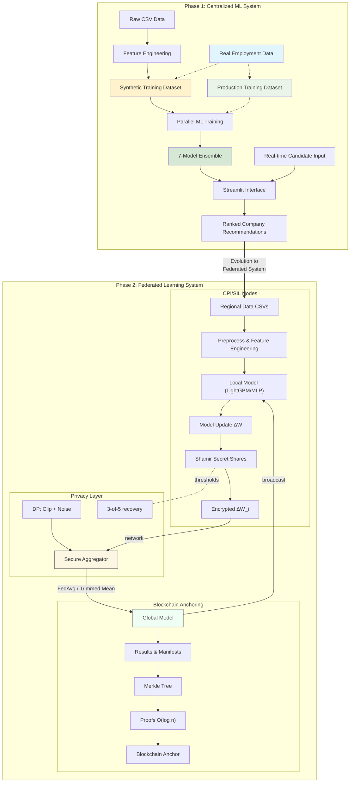

# Disability Job Matching System — Comprehensive README
_Last updated: 2025-08-24 15:00_

<p align="center">
  
  
  
  
  
</p>

> **Executive Summary.**  
> A production-oriented, privacy-preserving job-candidate matching system for CPI/SIL and public institutions.  
> It supports centralized and federated training (LightGBM/MLP), secure aggregation with Shamir secret sharing,
> differentially-private learning (RDP), and blockchain-based anchoring of model/result manifests.

## Contents
- [Highlights](#highlights)
- [System Architecture](#system-architecture)
- [Project Structure](#project-structure)
- [Installation](#installation)
- [Configuration](#configuration)
- [Quick Start](#quick-start)
- [Data & Schemas](#data--schemas)
- [Models & Training](#models--training)
- [Federated Learning](#federated-learning)
- [Privacy & Security](#privacy--security)
- [Blockchain Anchoring](#blockchain-anchoring)
- [Results & Benchmarks](#results--benchmarks)
- [Monitoring & Visualization](#monitoring--visualization)
- [API Reference](#api-reference)
- [CLI Examples](#cli-examples)
- [Deployment](#deployment)
- [Performance Tuning](#performance-tuning)
- [Troubleshooting](#troubleshooting)
- [Compliance (GDPR)](#compliance-gdpr)
- [Contributing](#contributing)
- [License](#license)
- [Acknowledgements](#acknowledgements)

## Highlights
- **Federated Learning**: LightGBM (regional ensemble) and true FedAvg MLP pipelines with robust aggregation (FedAvg, trimmed-mean, coordinate-median).
- **Privacy**: Shamir-based secure aggregation (threshold 3-of-5); Differential Privacy (ε=1.0, δ=1e-06) with RDP accountant.
- **Anchoring**: Deterministic Merkle commitments with O(log n) proofs; benchmarked on 100/1k/10k records.
- **Reproducibility**: Deterministic seeds, versioned artifacts, consolidated performance metrics.
- **Operational Fit**: Streamlit UI for demo/ops, Docker deployment, health checks.

## System Architecture
The platform comprises three layers:
1. **Data & Matching Layer** — ETL, feature engineering, matching score (compatibility, distance, readiness).
2. **Learning Layer** — centralized and federated training; robust aggregators; privacy-preserving FL.
3. **Integrity Layer** — blockchain-style anchoring for artifacts and auditability.

### Architecture Diagram


## Project Structure
```
📂 Disability Job Matching System/
├── 📄 README.md                               # This file (English)
├── 📄 README_IT.md                            # Italian version
├── ⚙️ config.yaml                             # System configuration
├── 📄 requirements.txt                        # Python dependencies
├── 🎯 streamlit_app.py                        # 🎯 MAIN APPLICATION
│
├── 📂 data/
│   ├── 📂 raw/                                # Original input data
│   │   ├── Dataset_Candidati_Aggiornato.csv
│   │   └── Dataset_Aziende_con_Stima_Assunzioni.csv
│   └── 📂 processed/                          # Generated/extended datasets
│       ├── Dataset_Candidati_Aggiornato_Extended.csv
│       ├── Dataset_Aziende_con_Stima_Assunzioni_Extended.csv
│       └── Enhanced_Training_Dataset.csv      # 📊 ML TRAINING DATA
│
├── 📂 scripts/                                # Data processing pipeline
│   ├── 01_generate_dataset.py                 # Data extension + synthetic training generation
│   ├── 02_visualize_dataset.py                # Data analysis and visualization
│   ├── 03_train_models.py                     # 🤖 ML MODEL TRAINING
│   ├── 04_analyze_results.py                  # Performance analysis and reporting
│   ├── 05_LightGBM_federated_training.py      # 🔬 FEDERATED LEARNING PIPELINE (LightGBM)
│   ├── 06_LightGBM_federated_visualization.py # 📊 FEDERATED RESULTS VISUALIZATION
│   ├── 07_mlp_federated_training.py           # 🔄 CLASSICAL FEDERATED LEARNING
│   ├── 08_mlp_federated_privacy.py            # 🔐 PRIVACY-PRESERVING FEDERATED
│   ├── 09_mlp_federated_privacy_visualization.py # 📊 FEDERATED RESULTS COMPARISON
│   ├── blockchain_data_anchoring.py           # ⛓️ BLOCKCHAIN DATA INTEGRITY PIPELINE
│   └── 10_blockchain_anchoring_bench.py       # 📈 BLOCKCHAIN PERFORMANCE BENCHMARKS
│
├── 📂 utils/                                  # Core business logic
│   ├── __init__.py
│   ├── feature_engineering.py                 # Data augmentation utilities
│   ├── scoring.py                            # 🎯 MATCHING ALGORITHM CORE
│   ├── parallel_training.py                  # ⚡ MULTI-THREADED ML TRAINING
│   ├── visualization.py                      # Chart generation utilities
│   └── enhanced_shamir_privacy.py            # 🔒 SHAMIR SECRET SHARING + DIFFERENTIAL
│
├── 📂 results/                                # Training outputs
│   ├── 📂 learning_curves/                   # Training progression charts
│   ├── 🤖 *.joblib                          # Trained ML models (7 models)
│   ├── 📊 merged_model_summary.csv          # Performance metrics
│   └── 📈 *.png                              # Analysis visualizations
│
├── 📂 results_LightGBM_federated/            # Federated learning results (LightGBM)
│   ├── 📂 regional_models/                   # Individual regional models
│   ├── 📂 federated_models/                  # Aggregated global models
│   ├── 📂 centralized_models/                # Baseline centralized models
│   ├── 📂 visualizations/                    # Analysis charts and graphs
│   ├── 📊 complete_model_comparison.csv      # Three-way performance comparison
│   └── 📋 experiment_metadata.json           # Complete experimental metadata
│
├── 📂 results_mlp_federated/                 # Classical federated learning results
├── 📂 results_mlp_federated_privacy/         # Privacy-preserving federated results
├── 📂 results_blockchain_demo/               # Blockchain anchoring demonstrations
├── 📂 visualizations_federated_comparison/   # Federated learning comparison charts
│
└── 📂 docs/                                  # Documentation
    ├── user_guide_italiano.md                # Operator manual (Italian)
    ├── technical_documentation.md            # Developer documentation
    ├── deployment_guide.md                   # Production setup guide
    ├── api_reference.md                      # Code documentation
    └── demo_example.pdf                      # Interface usage example
```

## Installation

### System Requirements
- **Python**: 3.10 or higher (3.11 recommended)
- **Operating System**: Windows 10+, macOS 10.15+, or Linux
- **RAM**: 8GB minimum (16GB recommended for training)
- **Storage**: 3GB free space

### Platform-Specific Installation

1. **Clone the repository**:
```bash
git clone <YOUR_REPO_URL>
cd <REPO>
```

2. **Create and activate virtual environment:**
```bash
python -m venv venv
# Windows
venv\Scripts\activate
# macOS/Linux  
source venv/bin/activate
```

3. **Install dependencies (choose based on your platform):**
For Windows:
```bash
pip install -r requirements-windows.txt
```

For macOS:
```bash
pip install -r requirements-macos.txt
```

For Linux:
```bash
pip install -r requirements-base.txt
```

**Optional: Blockchain Features**
If you need blockchain anchoring (may cause conflicts):
```bash
pip install eth-tester>=0.9.1 web3>=6.0.0
```

**Verification**
Test your installation:
```bash
python -c "import streamlit, pandas, sklearn, lightgbm; print('Installation successful')"
```

## Configuration
Provide a `config.yaml` with paths, FL, privacy, and anchoring options:
```yaml
# config.yaml — example
seed: 42
paths:
  data_raw: data/raw
  data_processed: data/processed/Enhanced_Training_Dataset.csv
  results: results
federated:
  rounds: 10
  clients_min: 3
  aggregator: "fedavg"   # options: fedavg | trimmed_mean | coordinate_median
  lr: 0.001
  batch_size: 256
privacy:
  enabled: true
  dp:
    epsilon: 1.0
    delta: 1e-6
    max_grad_norm: 1.0
    accountant: "rdp"
  secure_agg:
    scheme: "shamir"
    threshold: "3-of-5"
    dropout_recovery: true
anchoring:
  enabled: true
  backend: "merkle"
  anchor_every_n: 1
ui:
  distance_max_km: 30
```

## Quick Start
**Demo UI**
```bash
streamlit run streamlit_app.py
```
**Training (baseline)**
```bash
python scripts/03_train_models.py
```
**Federated LightGBM**
```bash
python scripts/05_LightGBM_federated_training.py
python scripts/06_LightGBM_federated_visualization.py
```
**Federated MLP**
```bash
python scripts/07_mlp_federated_training.py
# Privacy-preserving
python scripts/08_mlp_federated_privacy.py
python scripts/09_mlp_federated_privacy_visualization.py
```
**Anchoring Benchmarks**
```bash
python scripts/10_blockchain_anchoring_bench.py
```

## Data & Schemas
- `data/raw/Dataset_Candidati_Aggiornato.csv`: candidates master.
- `data/raw/Dataset_Aziende_con_Stima_Assunzioni.csv`: companies & roles.
- `data/processed/Enhanced_Training_Dataset.csv`: aligned, feature-complete training table.

> **Note:** distance default is **30 km**. Adjust in `config.yaml: ui.distance_max_km`.

## Models & Training
- **Preprocessing**: RobustScaler, feature selection, imbalance handling (SMOTE).
- **Classifiers**: LightGBM, MLP; Optuna tuning; probability calibration.
- **Artifacts**: stored under `results/` with hashes and metrics.

## Federated Learning
- **LightGBM (regional ensemble)**: independent regional models → weighted ensemble by sample size.
- **MLP (FedAvg family)**: parameter-averaging with options for trimmed mean & coordinate-median.
- **Utilities**:
  - `utils/federated_learning.py` — aggregation, reproducibility, metrics.
  - `utils/federated_data_splitter.py` — regional discovery & splits.
  - `utils/enhanced_shamir_privacy.py` — secure aggregation & DP utilities.

## Privacy & Security
- **Secure Aggregation**: Shamir threshold **3-of-5**, per-parameter masking; dropout recovery.
- **Differential Privacy**: clipping + Gaussian noise; single-noise application per round; **RDP** accounting.
- **Audit & Governance**: artifacts + manifest logs, access control on `data/` and `results/`.

## Blockchain Anchoring
- **What**: Merkle commitments over results; O(log n) proofs for any artifact.
- **Why**: Long-term integrity & auditability for public bodies.
- **How**: `blockchain_data_anchoring.py` and `10_blockchain_anchoring_bench.py`.

## Results & Benchmarks

### Corrected Performance Results

**Centralized Learning (Baseline)**
- **Best Model**: LightGBM_Optimized
- **F1-Score**: 0.901 
- **Accuracy**: 0.829
- **ROC-AUC**: 0.708

**LightGBM Federated Learning**
- **Centralized**: F1 ≈ 0.9012, ROC-AUC ≈ 0.716
- **Regional**: F1 ≈ 0.9001, ROC-AUC ≈ 0.702  
- **Federated**: F1 ≈ 0.9007, ROC-AUC ≈ 0.687
- **Performance Gap**: Federated vs Centralized = -0.0005 F1-score

**MLP Federated Learning**
- **Centralized**: F1 ≈ 0.828, Accuracy ≈ 0.735, ROC-AUC ≈ 0.695
- **Federated (Standard)**: F1 ≈ 0.788, Accuracy ≈ 0.695, ROC-AUC ≈ 0.717
- **Federated (Privacy-Preserving)**: F1 ≈ 0.788, Accuracy ≈ 0.695, ROC-AUC ≈ 0.717
- **Privacy Cost**: Minimal impact with ε=1.0, δ=1e-06

**Blockchain Anchoring Performance**
- **Build times**: 100 records = 2.28s; 1k records = 30.47s; 10k records = 344.07s
- **Proof generation**: Average 1.11ms - 20.65ms (O(log n) scaling)
- **Verification**: Average 24.49ms with 100% accuracy

> See `results/merged_model_summary.csv` for consolidated metrics.

## Monitoring & Visualization
- Visualization scripts: `06_*_visualization.py`, `09_*_privacy_visualization.py`.
- Streamlit KPIs: candidate-job matches, regional breakdowns, FL/central comparisons.

## API Reference
The system provides comprehensive APIs for:
- **Core Matching**: `EnhancedScoringSystem` for candidate-company compatibility
- **Parallel Training**: `ParallelModelTrainer` with Optuna optimization
- **Federated Learning**: `FederatedLearning` with privacy-preserving aggregation
- **Blockchain Anchoring**: `MerkleTree` and verification utilities

Key classes and methods documented in `docs/api_reference.md`.

## CLI Examples
```bash
# Train centralized baseline
python scripts/03_train_models.py --config config.yaml

# Run FL with robust aggregation
python scripts/07_mlp_federated_training.py --aggregator trimmed_mean

# Run privacy-preserving FL
python scripts/08_mlp_federated_privacy.py --dp.epsilon 1.0 --dp.delta 1e-6 --secure_agg.threshold 3-of-5

# Visualize LightGBM FL results
python scripts/06_LightGBM_federated_visualization.py --input results/federated/
```

## Deployment
- **Docker**: expose 8501; health check endpoint `/_stcore/health`.  
  _Install `curl` in the image for health checks._
- **Resources**: CPU-friendly profiles; avoid GPU assumptions; tune batch size & rounds for low-end nodes.
- **Configuration**: Adjust `distance_max_km`, `attitude_min`, and model parameters per deployment environment.

## Performance Tuning
- Lower `rounds` for quick iteration; enable trimmed mean for outlier robustness.
- Use balanced splits per region; monitor gradient norms under DP.
- Cache geocoding and precomputed features to cut cold-start time.

## Troubleshooting
- Missing `seaborn`/`matplotlib` → `pip install -r requirements.txt`.
- Sklearn tag errors (older versions) → pin `scikit-learn` per `requirements.txt`.
- Ensure `curl` exists in Docker for health checks.
- **Distance threshold**: Default 30km may be too restrictive for rural areas.

## Compliance (GDPR)
- Roles (controller/processor) clarified; DPIA template available.
- DSR workflows (access/erasure), retention & minimization policies.
- Local processing; federated updates only.

## Contributing
- Open issues & PRs welcome. Include unit tests and docs updates.
- Use conventional commits; run `pre-commit` hooks if configured.

## License
- Academic-friendly license. See `LICENSE` (or request commercial terms).

## Acknowledgements
- CPI Villafranca di Verona, SIL Veneto, Università eCampus.
- Development team: Michele Melchiori, Prof. Oleksandr Kuznetsov.

---

