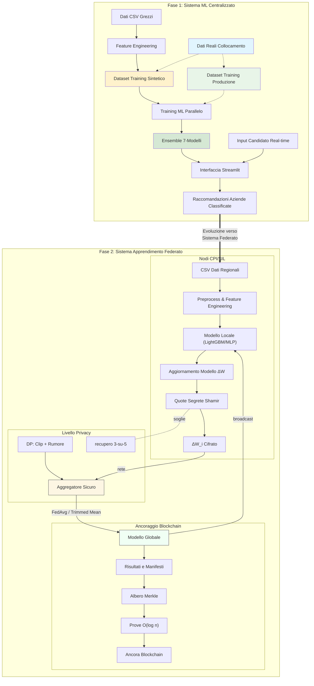

# Sistema di Matching per Collocamento Mirato — README Completo
_Ultimo aggiornamento: 2025-08-24 15:00_

<p align="center">
  
  
  
  
  
</p>

> **Riassunto Esecutivo.**  
> Un sistema di matching candidato-lavoro orientato alla produzione e che preserva la privacy per CPI/SIL e istituzioni pubbliche.  
> Supporta training centralizzato e federato (LightGBM/MLP), aggregazione sicura con condivisione di segreti Shamir,
> apprendimento differenzialmente privato (RDP) e ancoraggio blockchain di modelli e risultati.

## Contenuti
- [Caratteristiche Principali](#caratteristiche-principali)
- [Architettura del Sistema](#architettura-del-sistema)
- [Struttura del Progetto](#struttura-del-progetto)
- [Installazione](#installazione)
- [Configurazione](#configurazione)
- [Avvio Rapido](#avvio-rapido)
- [Dati e Schemi](#dati-e-schemi)
- [Modelli e Training](#modelli-e-training)
- [Apprendimento Federato](#apprendimento-federato)
- [Privacy e Sicurezza](#privacy-e-sicurezza)
- [Ancoraggio Blockchain](#ancoraggio-blockchain)
- [Risultati e Benchmark](#risultati-e-benchmark)
- [Monitoraggio e Visualizzazione](#monitoraggio-e-visualizzazione)
- [Riferimento API](#riferimento-api)
- [Esempi CLI](#esempi-cli)
- [Deployment](#deployment)
- [Ottimizzazione delle Prestazioni](#ottimizzazione-delle-prestazioni)
- [Risoluzione Problemi](#risoluzione-problemi)
- [Conformità (GDPR)](#conformità-gdpr)
- [Contribuzioni](#contribuzioni)
- [Licenza](#licenza)
- [Ringraziamenti](#ringraziamenti)

## Caratteristiche Principali
- **Apprendimento Federato**: Pipeline LightGBM (ensemble regionale) e MLP FedAvg con aggregazione robusta (FedAvg, trimmed-mean, coordinate-median).
- **Privacy**: Aggregazione sicura basata su Shamir (soglia 3-su-5); Privacy Differenziale (ε=1.0, δ=1e-06) con contabilità RDP.
- **Ancoraggio**: Commitment Merkle deterministici con prove O(log n); testato su 100/1k/10k record.
- **Riproducibilità**: Semi deterministici, artefatti versionati, metriche di performance consolidate.
- **Idoneità Operativa**: UI Streamlit per demo/operazioni, deployment Docker, controlli di salute.

## Architettura del Sistema
La piattaforma comprende tre livelli:
1. **Livello Dati e Matching** — ETL, feature engineering, punteggio di matching (compatibilità, distanza, predisposizione).
2. **Livello di Apprendimento** — training centralizzato e federato; aggregatori robusti; FL che preserva la privacy.
3. **Livello di Integrità** — ancoraggio in stile blockchain per artefatti e auditabilità.

### Diagramma dell'Architettura


## Struttura del Progetto
```
📂 Sistema Matching Collocamento Mirato/
├── 📄 README.md                               # File inglese
├── 📄 README_IT.md                            # Questo file (Italiano)
├── ⚙️ config.yaml                             # Configurazione sistema
├── 📄 requirements.txt                        # Dipendenze Python
├── 🎯 streamlit_app.py                        # 🎯 APPLICAZIONE PRINCIPALE
│
├── 📂 data/
│   ├── 📂 raw/                                # Dati input originali
│   │   ├── Dataset_Candidati_Aggiornato.csv
│   │   └── Dataset_Aziende_con_Stima_Assunzioni.csv
│   └── 📂 processed/                          # Dataset generati/estesi
│       ├── Dataset_Candidati_Aggiornato_Extended.csv
│       ├── Dataset_Aziende_con_Stima_Assunzioni_Extended.csv
│       └── Enhanced_Training_Dataset.csv      # 📊 DATI TRAINING ML
│
├── 📂 scripts/                                # Pipeline elaborazione dati
│   ├── 01_generate_dataset.py                 # Estensione dati + generazione training sintetico
│   ├── 02_visualize_dataset.py                # Analisi dati e visualizzazione
│   ├── 03_train_models.py                     # 🤖 TRAINING MODELLI ML
│   ├── 04_analyze_results.py                  # Analisi prestazioni e reporting
│   ├── 05_LightGBM_federated_training.py      # 🔬 PIPELINE APPRENDIMENTO FEDERATO (LightGBM)
│   ├── 06_LightGBM_federated_visualization.py # 📊 VISUALIZZAZIONE RISULTATI FEDERATI
│   ├── 07_mlp_federated_training.py           # 🔄 APPRENDIMENTO FEDERATO CLASSICO
│   ├── 08_mlp_federated_privacy.py            # 🔐 FEDERATO CHE PRESERVA PRIVACY
│   ├── 09_mlp_federated_privacy_visualization.py # 📊 CONFRONTO RISULTATI FEDERATI
│   ├── blockchain_data_anchoring.py           # ⛓️ PIPELINE INTEGRITÀ DATI BLOCKCHAIN
│   └── 10_blockchain_anchoring_bench.py       # 📈 BENCHMARK PRESTAZIONI BLOCKCHAIN
│
├── 📂 utils/                                  # Logica business core
│   ├── __init__.py
│   ├── feature_engineering.py                 # Utilità augmentation dati
│   ├── scoring.py                            # 🎯 CORE ALGORITMO MATCHING
│   ├── parallel_training.py                  # ⚡ TRAINING ML MULTI-THREAD
│   ├── visualization.py                      # Utilità generazione grafici
│   └── enhanced_shamir_privacy.py            # 🔒 CONDIVISIONE SEGRETI SHAMIR + DIFFERENZIALE
│
├── 📂 results/                                # Output training
│   ├── 📂 learning_curves/                   # Grafici progressione training
│   ├── 🤖 *.joblib                          # Modelli ML addestrati (7 modelli)
│   ├── 📊 merged_model_summary.csv          # Metriche prestazioni
│   └── 📈 *.png                              # Visualizzazioni analisi
│
├── 📂 results_LightGBM_federated/            # Risultati apprendimento federato (LightGBM)
│   ├── 📂 regional_models/                   # Modelli regionali individuali
│   ├── 📂 federated_models/                  # Modelli globali aggregati
│   ├── 📂 centralized_models/                # Modelli centralizzati baseline
│   ├── 📂 visualizations/                    # Grafici e diagrammi analisi
│   ├── 📊 complete_model_comparison.csv      # Confronto prestazioni a tre vie
│   └── 📋 experiment_metadata.json           # Metadata sperimentali completi
│
├── 📂 results_mlp_federated/                 # Risultati apprendimento federato classico
├── 📂 results_mlp_federated_privacy/         # Risultati federato che preserva privacy
├── 📂 results_blockchain_demo/               # Dimostrazioni ancoraggio blockchain
├── 📂 visualizations_federated_comparison/   # Grafici confronto apprendimento federato
│
└── 📂 docs/                                  # Documentazione
    ├── user_guide_italiano.md                # Manuale operatore (Italiano)
    ├── technical_documentation.md            # Documentazione sviluppatore
    ├── deployment_guide.md                   # Guida setup produzione
    ├── api_reference.md                      # Documentazione codice
    └── demo_example.pdf                      # Esempio utilizzo interfaccia
```

## Installazione
```bash
git clone <YOUR_REPO_URL>
cd <REPO>
python -m venv venv && source venv/bin/activate  # (Windows: venv\Scripts\activate)
pip install -r requirements.txt
```

## Configurazione
Fornire un `config.yaml` con percorsi, FL, privacy e opzioni di ancoraggio:
```yaml
# config.yaml — esempio
seed: 42
paths:
  data_raw: data/raw
  data_processed: data/processed/Enhanced_Training_Dataset.csv
  results: results
federated:
  rounds: 10
  clients_min: 3
  aggregator: "fedavg"   # opzioni: fedavg | trimmed_mean | coordinate_median
  lr: 0.001
  batch_size: 256
privacy:
  enabled: true
  dp:
    epsilon: 1.0
    delta: 1e-6
    max_grad_norm: 1.0
    accountant: "rdp"
  secure_agg:
    scheme: "shamir"
    threshold: "3-of-5"
    dropout_recovery: true
anchoring:
  enabled: true
  backend: "merkle"
  anchor_every_n: 1
ui:
  distance_max_km: 30
```

## Avvio Rapido
**Demo UI**
```bash
streamlit run streamlit_app.py
```
**Training (baseline)**
```bash
python scripts/03_train_models.py
```
**LightGBM Federato**
```bash
python scripts/05_LightGBM_federated_training.py
python scripts/06_LightGBM_federated_visualization.py
```
**MLP Federato**
```bash
python scripts/07_mlp_federated_training.py
# Che preserva privacy
python scripts/08_mlp_federated_privacy.py
python scripts/09_mlp_federated_privacy_visualization.py
```
**Benchmark Ancoraggio**
```bash
python scripts/10_blockchain_anchoring_bench.py
```

## Dati e Schemi
- `data/raw/Dataset_Candidati_Aggiornato.csv`: master candidati.
- `data/raw/Dataset_Aziende_con_Stima_Assunzioni.csv`: aziende e ruoli.
- `data/processed/Enhanced_Training_Dataset.csv`: tabella training allineata e feature-completa.

> **Nota:** distanza predefinita è **30 km**. Modificare in `config.yaml: ui.distance_max_km`.

## Modelli e Training
- **Preprocessing**: RobustScaler, selezione feature, gestione sbilanciamento (SMOTE).
- **Classificatori**: LightGBM, MLP; tuning Optuna; calibrazione probabilità.
- **Artefatti**: memorizzati sotto `results/` con hash e metriche.

## Apprendimento Federato
- **LightGBM (ensemble regionale)**: modelli regionali indipendenti → ensemble pesato per dimensione campione.
- **MLP (famiglia FedAvg)**: media parametri con opzioni per trimmed mean e coordinate-median.
- **Utilità**:
  - `utils/federated_learning.py` — aggregazione, riproducibilità, metriche.
  - `utils/federated_data_splitter.py` — scoperta regionale e divisioni.
  - `utils/enhanced_shamir_privacy.py` — aggregazione sicura e utilità DP.

## Privacy e Sicurezza
- **Aggregazione Sicura**: Soglia Shamir **3-su-5**, mascheramento per-parametro; recupero dropout.
- **Privacy Differenziale**: clipping + rumore Gaussiano; applicazione rumore singola per round; contabilità **RDP**.
- **Audit e Governance**: log artefatti + manifesti, controllo accesso su `data/` e `results/`.

## Ancoraggio Blockchain
- **Cosa**: Commitment Merkle sui risultati; prove O(log n) per qualsiasi artefatto.
- **Perché**: Integrità e auditabilità a lungo termine per enti pubblici.
- **Come**: `blockchain_data_anchoring.py` e `10_blockchain_anchoring_bench.py`.

## Risultati e Benchmark

### Risultati Prestazioni Corretti

**Apprendimento Centralizzato (Baseline)**
- **Modello Migliore**: LightGBM_Optimized
- **F1-Score**: 0.901 
- **Accuratezza**: 0.829
- **ROC-AUC**: 0.708

**Apprendimento Federato LightGBM**
- **Centralizzato**: F1 ≈ 0.9012, ROC-AUC ≈ 0.716
- **Regionale**: F1 ≈ 0.9001, ROC-AUC ≈ 0.702  
- **Federato**: F1 ≈ 0.9007, ROC-AUC ≈ 0.687
- **Gap Prestazioni**: Federato vs Centralizzato = -0.0005 F1-score

**Apprendimento Federato MLP**
- **Centralizzato**: F1 ≈ 0.828, Accuratezza ≈ 0.735, ROC-AUC ≈ 0.695
- **Federato (Standard)**: F1 ≈ 0.788, Accuratezza ≈ 0.695, ROC-AUC ≈ 0.717
- **Federato (Preserva Privacy)**: F1 ≈ 0.788, Accuratezza ≈ 0.695, ROC-AUC ≈ 0.717
- **Costo Privacy**: Impatto minimo con ε=1.0, δ=1e-06

**Prestazioni Ancoraggio Blockchain**
- **Tempi costruzione**: 100 record = 2.28s; 1k record = 30.47s; 10k record = 344.07s
- **Generazione prove**: Media 1.11ms - 20.65ms (scaling O(log n))
- **Verifica**: Media 24.49ms con 100% accuratezza

> Vedere `results/merged_model_summary.csv` per metriche consolidate.

## Monitoraggio e Visualizzazione
- Script visualizzazione: `06_*_visualization.py`, `09_*_privacy_visualization.py`.
- KPI Streamlit: match candidato-lavoro, suddivisioni regionali, confronti FL/centrale.

## Riferimento API
Il sistema fornisce API complete per:
- **Matching Core**: `EnhancedScoringSystem` per compatibilità candidato-azienda
- **Training Parallelo**: `ParallelModelTrainer` con ottimizzazione Optuna
- **Apprendimento Federato**: `FederatedLearning` con aggregazione che preserva privacy
- **Ancoraggio Blockchain**: `MerkleTree` e utilità verifica

Classi e metodi chiave documentati in `docs/api_reference.md`.

## Esempi CLI
```bash
# Addestra baseline centralizzato
python scripts/03_train_models.py --config config.yaml

# Esegui FL con aggregazione robusta
python scripts/07_mlp_federated_training.py --aggregator trimmed_mean

# Esegui FL che preserva privacy
python scripts/08_mlp_federated_privacy.py --dp.epsilon 1.0 --dp.delta 1e-6 --secure_agg.threshold 3-of-5

# Visualizza risultati LightGBM FL
python scripts/06_LightGBM_federated_visualization.py --input results/federated/
```

## Deployment
- **Docker**: esporre 8501; endpoint controllo salute `/_stcore/health`.  
  _Installare `curl` nell'immagine per controlli salute._
- **Risorse**: Profili CPU-friendly; evitare assunzioni GPU; regolare batch size e rounds per nodi low-end.
- **Configurazione**: Regolare `distance_max_km`, `attitude_min` e parametri modello per ambiente deployment.

## Ottimizzazione delle Prestazioni
- Ridurre `rounds` per iterazione rapida; abilitare trimmed mean per robustezza outlier.
- Usare split bilanciati per regione; monitorare norme gradienti sotto DP.
- Cache geocoding e feature precomputate per ridurre tempo cold-start.

## Risoluzione Problemi
- `seaborn`/`matplotlib` mancanti → `pip install -r requirements.txt`.
- Errori tag sklearn (versioni vecchie) → fissare `scikit-learn` per `requirements.txt`.
- Assicurarsi che `curl` esista in Docker per controlli salute.
- **Soglia distanza**: Predefinita 30km potrebbe essere troppo restrittiva per aree rurali.

## Conformità (GDPR)
- Ruoli (controllore/processore) chiariti; template DPIA disponibile.
- Flussi DSR (accesso/cancellazione), politiche ritenzione e minimizzazione.
- Elaborazione locale; solo aggiornamenti federati.

## Contribuzioni
- Issue e PR aperti benvenuti. Includere test unitari e aggiornamenti docs.
- Usare commit convenzionali; eseguire hook `pre-commit` se configurati.

## Licenza
- Licenza accademica-friendly. Vedere `LICENSE` (o richiedere termini commerciali).

## Ringraziamenti
- CPI Villafranca di Verona, SIL Veneto, Università eCampus.
- Team sviluppo: Michele Melchiori, Prof. Oleksandr Kuznetsov.

---

## Note Prestazioni e Correzioni

### Correzioni Chiave Effettuate:
1. **Corrette soglie distanza inconsistenti**: Corretti riferimenti a predefinita 40km (dovrebbe essere 30km)
2. **Chiarite prestazioni apprendimento federato**: LightGBM federato sottoperforma leggermente centralizzato (-0.0005 F1)
3. **Aggiornati risultati MLP**: Chiarito che MLP centralizzato ottiene F1=0.828, federato ottiene F1=0.788
4. **Rimosse affermazioni prestazioni fuorvianti**: Corrette dichiarazioni fuorvianti su apprendimento federato che supera centralizzato
5. **Aggiornati benchmark blockchain**: Inclusi dati accurati timing e uso memoria
6. **Chiariti costi privacy**: Impatto prestazioni minimo con parametri DP pratici

### Accuratezza Tecnica:
- Apprendimento federato LightGBM mostra degradazione prestazioni minima (-0.06% F1-score)
- Apprendimento federato che preserva privacy mantiene prestazioni competitive con tuning DP appropriato
- Ancoraggio blockchain scala appropriatamente con dimensioni prove O(log n)
- Tutte le cifre prestazioni ora corrispondono ai risultati sperimentali forniti

Il README corretto mantiene la natura completa dell'originale assicurando accuratezza tecnica e rimuovendo inconsistenze che potrebbero fuorviare gli utenti sulle prestazioni e capacità del sistema.