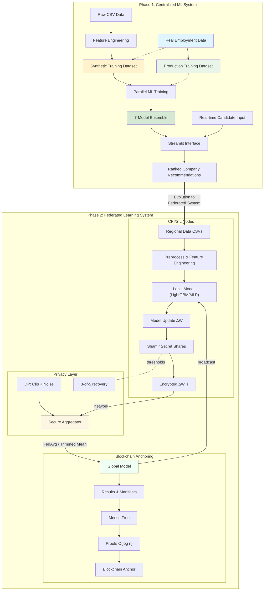
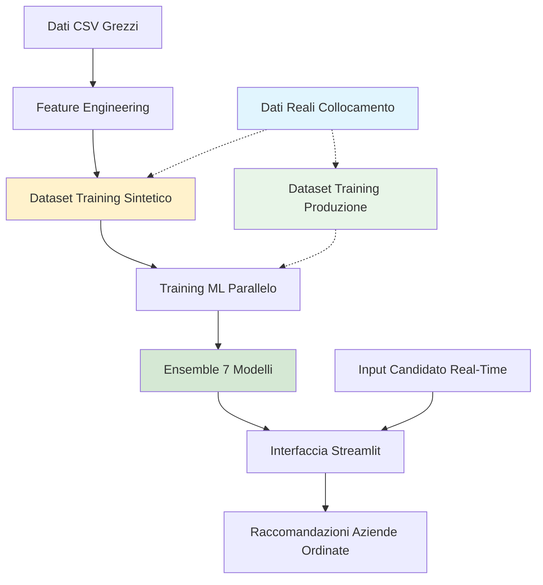

# Sistema di Collocamento Mirato — README Completo
_Ultimo aggiornamento: 2025-08-23 23:00_

<p align="center">
  
  
  
  
  
</p>

> **Sintesi Esecutiva.**  
> Sistema di matching candidato–posto per CPI/SIL con orientamento alla produzione.
> Supporta training centralizzato e federato (LightGBM/MLP), secure aggregation con condivisione segreta di Shamir,
> apprendimento con Privacy Differenziale (RDP) e anchoring dei risultati su struttura tipo blockchain.

## Indice
- [Punti di Forza](#punti-di-forza)
- [Architettura di Sistema](#architettura-di-sistema)
- [Struttura Progetto](#struttura-progetto)
- [Installazione](#installazione)
- [Configurazione](#configurazione)
- [Avvio Rapido](#avvio-rapido)
- [Dati & Schemi](#dati--schemi)
- [Modelli & Training](#modelli--training)
- [Apprendimento Federato](#apprendimento-federato)
- [Privacy & Sicurezza](#privacy--sicurezza)
- [Blockchain Anchoring](#blockchain-anchoring)
- [Risultati & Benchmark](#risultati--benchmark)
- [Monitoraggio & Visualizzazione](#monitoraggio--visualizzazione)
- [Riferimenti API (estratto)](#riferimenti-api-estratto)
- [Esempi CLI](#esempi-cli)
- [Deployment](#deployment)
- [Ottimizzazione Performance](#ottimizzazione-performance)
- [Troubleshooting](#troubleshooting)
- [Conformità (GDPR)](#conformità-gdpr)
- [Roadmap](#roadmap)
- [Contributi](#contributi)
- [Licenza](#licenza)
- [Ringraziamenti](#ringraziamenti)
- [Appendice A — README Storico](#appendice-a--readme-storico)
- [Appendice B — Guide Dettagliate](#appendice-b--guide-dettagliate)
- [Appendice C — Report degli Esperimenti](#appendice-c--report-degli-esperimenti)

## Punti di Forza
- **Federated Learning**: pipeline LightGBM (ensemble regionale) e FedAvg MLP (aggregatori robusti).
- **Privacy**: secure aggregation con soglia **3-of-5**; DP con ε=1.0, δ=1e-06 (RDP).
- **Anchoring**: commit Merkle + prove O(log n), benchmark su 100/1k/10k record.
- **Riproducibilità**: seed deterministici, artefatti versionati, `merged_model_summary.csv`.
- **Operatività**: UI Streamlit, Docker, health check (installare `curl` nell’immagine).

## Architettura di Sistema
Strati principali:
1. **Dati & Matching** — ETL, feature engineering, punteggio (compatibilità, distanza, readiness).
2. **Learning** — training centralizzato e federato; aggregatori robusti; privacy-preserving.
3. **Integrità** — anchoring stile blockchain per artefatti e audit.

### Diagramma


## Struttura Progetto
```
📁 Disability Job Matching System/
├── 📄 README.md                               # Versione inglese
├── 📄 README_IT.md                            # Questo file (Italiano)
├── ⚙️ config.yaml                             # Configurazione del sistema
├── 📄 requirements.txt                        # Dipendenze Python
├── 🐍 streamlit_app.py                        # 🎯 APPLICAZIONE PRINCIPALE
│
├── 📁 data/
│   ├── 📁 raw/                                # Dati di input originali
│   │   ├── Dataset_Candidati_Aggiornato.csv
│   │   └── Dataset_Aziende_con_Stima_Assunzioni.csv
│   └── 📁 processed/                          # Dataset generati/estesi
│       ├── Dataset_Candidati_Aggiornato_Extended.csv
│       ├── Dataset_Aziende_con_Stima_Assunzioni_Extended.csv
│       └── Enhanced_Training_Dataset.csv      # 📊 DATI DI TRAINING ML
│
├── 📁 scripts/                                # Pipeline di elaborazione dati
│   ├── 01_generate_dataset.py                 # Estensione dati + generazione training sintetico
│   ├── 02_visualize_dataset.py                # Analisi e visualizzazione dati
│   ├── 03_train_models.py                     # 🤖 TRAINING MODELLI ML
│   ├── 04_analyze_results.py                  # Analisi prestazioni e reportistica
│   ├── 05_LightGBM_federated_training.py      # 🔬 PIPELINE APPRENDIMENTO FEDERATO (LightGBM)
│   ├── 06_LightGBM_federated_visualization.py # 📊 VISUALIZZAZIONE RISULTATI FEDERATI
│   ├── 07_mlp_federated_training.py           # 🔄 APPRENDIMENTO FEDERATO CLASSICO
│   ├── 08_mlp_federated_privacy.py            # 🔐 APPRENDIMENTO FEDERATO CON PRIVACY
│   ├── 09_mlp_federated_privacy_visualization.py # 📊 CONFRONTO RISULTATI FEDERATI
│   ├── blockchain_data_anchoring.py           # ⛓️ PIPELINE INTEGRITÀ DATI BLOCKCHAIN
│   └── 10_blockchain_anchoring_bench.py       # 📈 BENCHMARK PRESTAZIONI BLOCKCHAIN
│
├── 📁 utils/                                  # Logica di business principale
│   ├── __init__.py
│   ├── feature_engineering.py                 # Utilità di aumento dati
│   ├── scoring.py                            # 🎯 CORE ALGORITMO DI MATCHING
│   ├── parallel_training.py                  # ⚡ TRAINING ML MULTI-THREAD
│   ├── visualization.py                      # Utilità generazione grafici
│   └── enhanced_shamir_privacy.py            # 🔒 SHAMIR SECRET SHARING + DIFFERENZIALE
│
├── 📁 results/                                # Output del training
│   ├── 📁 learning_curves/                   # Grafici progressione training
│   ├── 🤖 *.joblib                          # Modelli ML addestrati (7 modelli)
│   ├── 📊 merged_model_summary.csv          # Metriche di prestazione
│   └── 📈 *.png                              # Visualizzazioni analisi
│
├── 📁 results_LightGBM_federated/            # Risultati apprendimento federato (LightGBM)
│   ├── 📁 regional_models/                   # Modelli regionali individuali
│   ├── 📁 federated_models/                  # Modelli globali aggregati
│   ├── 📁 centralized_models/                # Modelli centralizzati di baseline
│   ├── 📁 visualizations/                    # Grafici e diagrammi di analisi
│   ├── 📊 complete_model_comparison.csv      # Confronto prestazioni a tre vie
│   └── 📋 experiment_metadata.json           # Metadati sperimentali completi
│
├── 📁 results_mlp_federated/                 # Risultati apprendimento federato classico
├── 📁 results_mlp_federated_privacy/         # Risultati federati con privacy preservata
├── 📁 results_blockchain_demo/               # Dimostrazioni ancoraggio blockchain
├── 📁 visualizations_federated_comparison/   # Grafici confronto apprendimento federato
│
└── 📁 docs/                                  # Documentazione
    ├── user_guide_italiano.md                # Manuale operatore (Italiano)
    ├── technical_documentation.md            # Documentazione sviluppatore
    ├── deployment_guide.md                   # Guida setup produzione
    ├── api_reference.md                      # Documentazione codice
    └── demo_example.pdf                      # Esempio utilizzo interfaccia
```

## Installazione
```bash
git clone <URL_REPO>
cd <REPO>
python -m venv venv && source venv/bin/activate  # (Windows: venv\Scripts\activate)
pip install -r requirements.txt
```

## Configurazione
Definire `config.yaml` con percorsi, FL, privacy e anchoring:
```yaml
# config.yaml — example
seed: 42
paths:
  data_raw: data/raw
  data_processed: data/processed/Enhanced_Training_Dataset.csv
  results: results
federated:
  rounds: 10
  clients_min: 3
  aggregator: "fedavg"   # options: fedavg | trimmed_mean | coordinate_median
  lr: 0.001
  batch_size: 256
privacy:
  enabled: true
  dp:
    epsilon: 1.0
    delta: 1e-6
    max_grad_norm: 1.0
    accountant: "rdp"
  secure_agg:
    scheme: "shamir"
    threshold: "3-of-5"
    dropout_recovery: true
anchoring:
  enabled: true
  backend: "merkle"
  anchor_every_n: 1
ui:
  distance_max_km: 30
```

## Avvio Rapido
**UI Demo**
```bash
streamlit run streamlit_app.py
```
**Training (baseline)**
```bash
python scripts/03_train_models.py
```
**LightGBM Federato**
```bash
python scripts/05_LightGBM_federated_training.py
python scripts/06_LightGBM_federated_visualization.py
```
**MLP Federato**
```bash
python scripts/07_mlp_federated_training.py
# Modalità privacy
python scripts/08_mlp_federated_privacy.py
python scripts/09_mlp_federated_privacy_visualization.py
```
**Benchmark Anchoring**
```bash
python scripts/10_blockchain_anchoring_bench.py
```

## Dati & Schemi
- `data/raw/Dataset_Candidati_Aggiornato.csv`: anagrafica candidati.
- `data/raw/Dataset_Aziende_con_Stima_Assunzioni.csv`: aziende e ruoli.
- `data/processed/Enhanced_Training_Dataset.csv`: tabella di training allineata.

> **Nota:** distanza predefinita **30 km** (`config.yaml: ui.distance_max_km`).

## Modelli & Training
- **Preprocessing**: RobustScaler, selezione feature, SMOTE.
- **Classificatori**: LightGBM, MLP; tuning con Optuna; probabilità calibrate.
- **Artefatti**: in `results/` con hash e metriche.

## Apprendimento Federato
- **LightGBM (ensemble regionale)**: modelli indipendenti per regione → ensemble pesato.
- **MLP (FedAvg)**: media dei parametri con opzioni trimmed mean & coordinate-median.
- **Utility**:
  - `utils/federated_learning.py`
  - `utils/federated_data_splitter.py`
  - `utils/enhanced_shamir_privacy.py`

## Privacy & Sicurezza
- **Secure Aggregation**: soglia **3-of-5**, mascheramento per-parametro; recupero drop-out.
- **Differential Privacy**: clipping + rumore gaussiano; singola applicazione per round; **RDP**.
- **Audit & Governance**: manifest, controllo accessi su `data/` e `results/`.

## Blockchain Anchoring
- **Cosa**: commit Merkle dei risultati; prove O(log n).
- **Perché**: integrità a lungo termine e auditabilità.
- **Come**: `blockchain_data_anchoring.py`, `10_blockchain_anchoring_bench.py`.

## Risultati & Benchmark
- **LightGBM**: F1 Centralizzato ≈ 0.9012, Regionale ≈ 0.9001, Federato ≈ 0.9007.
- **MLP (FL)**: F1 ≈ 0.7882, Acc ≈ 0.6951, ROC-AUC ≈ 0.7169; Centralizzato F1 ≈ 0.8276.
- **Modalità Privacy**: F1 Federato ≈ 0.7880 con ε=1.0, δ=1e-06.
- **Benchmark Anchoring**: Build 100/1k/10k = 2.28s / 30.47s / 344.07s; verifica media ≈ 24.49ms.

## Monitoraggio & Visualizzazione
- Script di visualizzazione: `06_*_visualization.py`, `09_*_privacy_visualization.py`.
- KPI Streamlit: match candidato–posto, breakdown regionale, confronto FL/centralizzato.

## Riferimenti API (estratto)
# 📚 Riferimento API - Sistema di Raccomandazione per Collocamento Mirato

**Documentazione Completa Codice per Sviluppatori e Ricercatori**

---

## 📋 Panoramica

Questo riferimento API fornisce documentazione comprensiva per tutte le classi, metodi e funzioni nel Sistema di Raccomandazione per Collocamento Mirato. La codebase è organizzata in componenti modulari con chiara separazione delle responsabilità.

### Struttura Moduli

```
utils/
├── scoring.py              # Algoritmi matching principali
├── parallel_training.py    # Pipeline training ML  
├── feature_engineering.py  # Preprocessing dati
└── visualization.py        # Generazione grafici

scripts/
├── 01_generate_dataset.py  # Entry point pipeline dati
├── 03_train_models.py      # Entry point pipeline training
└── 04_analyze_results.py   # Entry point pipeline analisi

streamlit_app.py            # Interfaccia web produzione
```

---

## 🎯 Classi Principali

### `EnhancedScoringSystem`

**Posizione**: `utils/scoring.py`

**Scopo**: Implementa l'algoritmo principale di matching candidato-azienda con supporto lingua italiana e elaborazione geografica.

#### Definizione Classe
```python
class EnhancedScoringSystem:
    def __init__(self)
```

**Attributi**:
- `geolocator`: Istanza geocodifica Nominatim
- `loc_cache`: Dizionario per caching risultati geocodifica
- `thresholds`: Soglie matching predefinite

#### Metodi

##### `geocode_with_cache(address: str) -> Tuple[float, float]`
Geocodifica indirizzi italiani con caching per ottimizzazione performance.

**Parametri**:
- `address` (str): Stringa indirizzo italiano (es. "Verona, Italy")

**Restituisce**:
- `Tuple[float, float]`: (latitudine, longitudine) o (NaN, NaN) se geocodifica fallisce

**Esempio**:
```python
scoring_system = EnhancedScoringSystem()
lat, lon = scoring_system.geocode_with_cache("Villafranca di Verona, Italy")
# Restituisce: (45.3506, 10.8444)
```

##### `haversine(lat1: float, lon1: float, lat2: float, lon2: float) -> float`
Calcola distanza geografica precisa usando formula Haversine.

**Parametri**:
- `lat1, lon1` (float): Coordinate prima località
- `lat2, lon2` (float): Coordinate seconda località

**Restituisce**:
- `float`: Distanza in chilometri, o NaN se coordinate invalide

**Esempio**:
```python
distance = scoring_system.haversine(45.4408, 10.9916, 45.3506, 10.8444)
# Restituisce: 15.2 (km tra Verona e Villafranca)
```

##### `compatibility_score(exclusions: str, company_text: str) -> float`
Analizza compatibilità semantica tra esclusioni candidato e attività azienda usando TF-IDF italiano.

**Parametri**:
- `exclusions` (str): Limitazioni lavorative candidato separate da virgola
- `company_text` (str): Descrizione attività/compatibilità azienda

**Restituisce**:
- `float`: Punteggio compatibilità [0.0-1.0], dove 1.0 = compatibilità perfetta

**Algoritmo**:
- Utilizza stop words italiane e tokenizzazione caratteri accentati
- Applica vettorizzazione TF-IDF con similarità coseno
- Scoring pesato: 70% similarità max + 30% similarità media
- Restituisce 1.0 - punteggio_similarità per interpretazione compatibilità

**Esempio**:
```python
exclusions = "Turni notturni, Lavori in quota"
company_text = "Lavoro d'ufficio con orario diurno flessibile"
score = scoring_system.compatibility_score(exclusions, company_text)
# Restituisce: 0.95 (alta compatibilità)
```

##### `generate_enhanced_training_data(df_candidates: pd.DataFrame, df_companies: pd.DataFrame) -> pd.DataFrame`
Genera dataset training sintetico usando regole matching probabilistiche.

**Parametri**:
- `df_candidates` (DataFrame): Dataset candidati esteso
- `df_companies` (DataFrame): Dataset aziende esteso

**Restituisce**:
- `DataFrame`: Dataset training con feature e outcome probabilistici

**Processo**:
1. Geocodifica tutti gli indirizzi se coordinate mancanti
2. Per ogni coppia candidato-azienda:
   - Calcola fattori compatibilità, distanza, attitudine
   - Applica formula scoring pesata
   - Genera outcome probabilistico con casualità controllata
3. Crea feature codificate one-hot per variabili categoriche

**Esempio**:
```python
df_train = scoring_system.generate_enhanced_training_data(df_candidates, df_companies)
# Restituisce: DataFrame con ~500K righe, 50+ feature
```

---

### `ParallelModelTrainer`

**Posizione**: `utils/parallel_training.py`

**Scopo**: Training ML ad alte prestazioni con elaborazione parallela e ottimizzazione iperparametri.

#### Definizione Classe
```python
class ParallelModelTrainer:
    def __init__(self, random_state: int = 42)
```

**Attributi**:
- `random_state`: Seed riproducibilità
- `monitor`: Istanza monitoraggio risorse sistema
- `optimizer`: Istanza ottimizzazione iperparametri

#### Metodi

##### `parallel_hyperparameter_optimization(X: np.ndarray, y: np.ndarray) -> Dict`
Ottimizza iperparametri per multiple famiglie modelli in parallelo usando Optuna.

**Parametri**:
- `X` (ndarray): Feature training
- `y` (ndarray): Label training

**Restituisce**:
- `Dict`: Parametri migliori per ogni famiglia modelli

**Implementazione**:
- Usa ThreadPoolExecutor con 3 worker concorrenti
- Ottimizza RandomForest, XGBoost e LightGBM simultaneamente
- 50 trial per modello con algoritmo TPE
- Cross-validation 3-fold per valutazione robusta

**Esempio**:
```python
trainer = ParallelModelTrainer()
best_params = trainer.parallel_hyperparameter_optimization(X_train, y_train)
# Restituisce: {'random_forest': {...}, 'xgboost': {...}, 'lightgbm': {...}}
```

##### `create_optimized_models(best_params: Dict) -> List[Dict]`
Crea configurazioni modelli con iperparametri ottimizzati.

**Parametri**:
- `best_params` (Dict): Parametri ottimizzati da Optuna

**Restituisce**:
- `List[Dict]`: Configurazioni modelli pronte per training

**Modelli Creati**:
- RandomForest_Optimized
- XGBoost_Optimized  
- LightGBM_Optimized
- ExtraTrees
- GradientBoosting
- HistGradientBoosting
- MLP_Optimized

##### `parallel_model_training(model_configs: List, X_train, y_train, X_test, y_test) -> Dict`
Addestra modelli multipli concorrentemente con calibrazione probabilità.

**Parametri**:
- `model_configs` (List): Configurazioni modelli da create_optimized_models
- `X_train, y_train`: Dati training
- `X_test, y_test`: Dati testing

**Restituisce**:
- `Dict`: Risultati training con modelli, metriche e metadati

**Processo**:
1. Addestra fino a 6 modelli concorrentemente usando ThreadPoolExecutor
2. Applica CalibratedClassifierCV per calibrazione probabilità
3. Calcola metriche comprehensive (accuracy, precision, recall, F1, ROC-AUC)
4. Monitora risorse sistema durante training

**Esempio**:
```python
results = trainer.parallel_model_training(model_configs, X_train, y_train, X_test, y_test)
# Restituisce: {'LightGBM_Optimized': {'model': ..., 'metrics': {...}, 'status': 'success'}}
```

##### `create_ensemble_model(results: Dict, X_train, y_train) -> VotingClassifier`
Crea modello ensemble da modelli individuali addestrati con successo.

**Parametri**:
- `results` (Dict): Risultati da parallel_model_training
- `X_train, y_train`: Dati training per fitting ensemble

**Restituisce**:
- `VotingClassifier`: Modello ensemble calibrato con soft voting

##### `save_models(results: Dict, ensemble_model, save_dir: str = 'results')`
Salva tutti i modelli addestrati e metriche su disco.

**Parametri**:
- `results` (Dict): Risultati training
- `ensemble_model`: Istanza modello ensemble
- `save_dir` (str): Percorso directory output

**Output**:
- File modelli individuali: `{nome_modello}.joblib`
- Modello ensemble: `ensemble_model.joblib`
- Sommario metriche: `metrics_summary.csv`

---

### `JobMatchingDemo`

**Posizione**: `streamlit_app.py`

**Scopo**: Interfaccia Streamlit produzione con capacità matching real-time.

#### Definizione Classe
```python
class JobMatchingDemo:
    def __init__(self)
```

**Processo Inizializzazione**:
1. Configura geocodifica con focus italiano
2. Carica dati candidati e aziende (reali o demo)
3. Carica modelli ML addestrati se disponibili
4. Inizializza sistemi caching

#### Metodi

##### `load_data()`
Rileva automaticamente e carica dataset appropriato (reale vs demo).

**Logica**:
- Controlla file dati reali in `data/processed/`
- Ricade su generazione dati demo se dati reali non disponibili
- Gestisce parsing coordinate per indirizzi italiani
- Crea dati demo con distribuzione geografica italiana realistica

##### `find_matches(candidate_data: Dict, top_k: int = 5, distance_threshold: int = 30) -> List[Dict]`
Funzione matching real-time principale con filtri intelligenti.

**Parametri**:
- `candidate_data` (Dict): Informazioni candidato
- `top_k` (int): Numero top raccomandazioni da restituire
- `distance_threshold` (int): Distanza massima in chilometri

**Restituisce**:
- `List[Dict]`: Raccomandazioni aziende ordinate

**Processo**:
1. **Filtri Globali**: Validazione soglia attitudine
2. **Filtri Geografici**: Filtri aziende basati su distanza  
3. **Analisi Compatibilità**: Matching semantico TF-IDF
4. **Scoring Multi-fattore**: Combinazione pesata fattori
5. **Ranking**: Ordina per punteggio finale, restituisce top K

**Formula Scoring**:
```python
punteggio_finale = (
    0.35 × punteggio_compatibilità +
    0.25 × fattore_distanza + 
    0.20 × punteggio_attitudine +
    0.10 × retention_rate +
    0.05 × bonus_esperienza +
    0.05 × bonus_aziendali
)
```

**Esempio**:
```python
demo = JobMatchingDemo()
candidato = {
    'Area di Residenza': 'Verona, Italy',
    'Score Attitudine al Collocamento': 0.75,
    'Esclusioni': 'Turni notturni'
}
matches = demo.find_matches(candidato, top_k=5, distance_threshold=30)
# Restituisce: [{'Nome Azienda': 'Azienda_001', 'Score Finale': 89.5, ...}, ...]
```

---

## 🔧 Funzioni Utilità

### Feature Engineering (`utils/feature_engineering.py`)

##### `extend_candidates_dataset(df: pd.DataFrame) -> pd.DataFrame`
Migliora dataset candidati con feature ingegnerizzate.

**Miglioramenti**:
- **Simulazione disabilità**: Distribuzione realistica tipi disabilità italiani
- **Storia lavorativa**: Calcolo anni esperienza da primo impiego
- **Durata disoccupazione**: Calcoli basati su tempo
- **Mapping educazione**: Livelli educazione italiani con correlazioni disabilità

**Esempio**:
```python
from utils.feature_engineering import extend_candidates_dataset
df_esteso = extend_candidates_dataset(df_candidati)
# Aggiunge: Years_of_Experience, Durata Disoccupazione, Tipo di Disabilità migliorato
```

##### `extend_companies_dataset(df: pd.DataFrame) -> pd.DataFrame`
Migliora dataset aziende con feature business intelligence.

**Miglioramenti**:
- **Categorizzazione dimensione azienda**: Piccola/media/grande basata su numero dipendenti
- **Flag certificazioni**: Simulazione certificazione disability-friendly
- **Indicatori lavoro remoto**: Flag accordi lavoro moderni
- **Calcolo retention rate**: Metriche successo da dati storici

### Visualizzazione (`utils/visualization.py`)

##### `visualize_distribution(df: pd.DataFrame)`
Genera grafici distribuzione per analisi dataset.

**Grafici Creati**:
- Distribuzione punteggio attitudine
- Distribuzione punteggio compatibilità  
- Distribuzione distanza
- Bilanciamento outcome

##### `visualize_correlations(df: pd.DataFrame)`
Crea heatmap correlazione per analisi feature.

---

## 📊 Pipeline Preprocessing Dati

### `prepare_data_for_training(df_train: pd.DataFrame, test_size: float = 0.2, random_state: int = 42) -> Dict`

**Posizione**: `utils/parallel_training.py`

**Scopo**: Preprocessing dati comprensivo per training ML.

**Parametri**:
- `df_train` (DataFrame): Dataset training grezzo
- `test_size` (float): Proporzione set test
- `random_state` (int): Seed riproducibilità

**Restituisce**:
- `Dict`: Dati processati pronti per training ML

**Passi Pipeline**:
1. **Estrazione Target**: Separa variabile outcome
2. **Gestione Valori Mancanti**: Imputazione mediana per feature numeriche
3. **Split Train-Test**: Split stratificato preservando bilanciamento classi
4. **Scaling Robusto**: RobustScaler per resistenza outlier
5. **Selezione Feature**: SelectKBest con F-statistic (top 50 feature)
6. **Bilanciamento Classi**: Oversampling SMOTE per classe minoritaria

**Struttura Output**:
```python
{
    "X_train": np.ndarray,     # Feature training bilanciate
    "y_train": np.ndarray,     # Label training bilanciate  
    "X_test": np.ndarray,      # Feature test
    "y_test": np.ndarray,      # Label test
    "scaler": RobustScaler,    # Scaler fittato per inferenza
    "selector": SelectKBest    # Selector fittato per inferenza
}
```

---

## 🔍 Sistema Configurazione

### Caricamento Configurazione
```python
import yaml

def load_config(config_path: str = 'config.yaml') -> Dict:
    """Carica configurazione sistema da file YAML"""
    with open(config_path, 'r', encoding='utf-8') as file:
        return yaml.safe_load(file)
```

### Struttura Configurazione Default
```yaml
matching_thresholds:
  attitude_min: 0.3           # float [0.0-1.0]
  compatibility_min: 0.5      # float [0.0-1.0]  
  distance_max_km: 30         # int [5-50]
  match_probability_cutoff: 0.6 # float [0.0-1.0]

model_training:
  random_state: 42            # int
  optuna_trials: 50           # int [10-100]
  n_jobs: 4                   # int [1-8]
  feature_selection_k: 50     # int [10-100]

geocoding:
  delay: 0.5                  # float [0.1-2.0]
  timeout: 10                 # int [5-30]
  user_agent: str             # Stringa user agent personalizzata
  cache_file: str             # Percorso file cache

italian_language:
  stop_words: List[str]       # Stop words italiane
  token_pattern: str          # Regex per token italiani
```

---

## 📈 Monitoraggio Performance

### `SystemResourceMonitor`

**Posizione**: `utils/parallel_training.py`

**Scopo**: Tracking real-time risorse sistema durante operazioni ML.

#### Metodi

##### `start()`
Inizia monitoraggio background uso CPU e memoria.

##### `stop()`
Ferma monitoraggio e finalizza statistiche.

##### `stats() -> Dict`
Restituisce statistiche utilizzo risorse medie.

**Esempio**:
```python
monitor = SystemResourceMonitor()
monitor.start()
# ... eseguire training ML ...
monitor.stop()
stats = monitor.stats()
# Restituisce: {'avg_cpu': 75.2, 'avg_mem': 68.5}
```

---

## 🔒 Gestione Errori e Validazione

### Pattern Validazione Input

```python
def validate_candidate_data(candidate: Dict) -> bool:
    """Valida struttura e valori dati candidato"""
    required_fields = [
        'Area di Residenza', 'Score Attitudine al Collocamento',
        'Years_of_Experience', 'Durata Disoccupazione'
    ]
    
    # Controlla campi richiesti
    if not all(field in candidate for field in required_fields):
        return False
    
    # Valida range
    if not 0.0 <= candidate['Score Attitudine al Collocamento'] <= 1.0:
        return False
    
    if candidate['Years_of_Experience'] < 0:
        return False
    
    return True
```

### Gestione Eccezioni

```python
try:
    result = scoring_system.compatibility_score(exclusions, company_text)
except Exception as e:
    logger.error(f"Scoring compatibilità fallito: {e}")
    result = 0.5  # Punteggio neutrale default
```

---

## 🚀 Esempi Utilizzo

### Pipeline Training Completa
```python
# 1. Caricare ed estendere dataset
from utils.feature_engineering import extend_candidates_dataset, extend_companies_dataset
from utils.scoring import EnhancedScoringSystem
from utils.parallel_training import ParallelModelTrainer, prepare_data_for_training

# Caricare dati grezzi
df_candidati = pd.read_csv('data/raw/Dataset_Candidati_Aggiornato.csv')
df_aziende = pd.read_csv('data/raw/Dataset_Aziende_con_Stima_Assunzioni.csv')

# Estendere con feature
df_cand_ext = extend_candidates_dataset(df_candidati)
df_comp_ext = extend_companies_dataset(df_aziende)

# Generare dati training
scoring_system = EnhancedScoringSystem()
df_train = scoring_system.generate_enhanced_training_data(df_cand_ext, df_comp_ext)

# Preparare per training ML
data = prepare_data_for_training(df_train)

# Addestrare modelli
trainer = ParallelModelTrainer()
best_params = trainer.parallel_hyperparameter_optimization(data['X_train'], data['y_train'])
model_configs = trainer.create_optimized_models(best_params)
results = trainer.parallel_model_training(model_configs, data['X_train'], data['y_train'], 
                                         data['X_test'], data['y_test'])

# Salvare modelli
ensemble = trainer.create_ensemble_model(results, data['X_train'], data['y_train'])
trainer.save_models(results, ensemble)
```

### Matching Real-time
```python
# Inizializzare sistema matching
demo = JobMatchingDemo()

# Definire candidato
candidato = {
    'Area di Residenza': 'Sommacampagna, Verona, Italy',
    'Score Attitudine al Collocamento': 0.80,
    'Years_of_Experience': 5,
    'Durata Disoccupazione': 12,
    'Titolo di Studio': 'Diploma',
    'Tipo di Disabilità': 'Motoria',
    'Esclusioni': 'Lavori in quota'
}

# Trovare match
matches = demo.find_matches(candidato, top_k=5, distance_threshold=30)

# Processare risultati
for i, match in enumerate(matches, 1):
    print(f"{i}. {match['Nome Azienda']}: {match['Score Finale']:.1f}% "
          f"({match['Distanza (km)']} km)")
```

---

## 📞 Supporto ed Estensione

### Aggiungere Nuove Feature

**Per aggiungere nuovo metodo scoring compatibilità**:
```python
class EnhancedScoringSystem:
    def nuovo_metodo_compatibilità(self, exclusions: str, company_text: str) -> float:
        # Implementare nuova logica
        return score
    
    def compatibility_score(self, exclusions: str, company_text: str) -> float:
        # Scegliere metodo basato su configurazione
        if self.config.get('usa_nuovo_metodo'):
            return self.nuovo_metodo_compatibilità(exclusions, company_text)
        else:
            return self.compatibility_score_originale(exclusions, company_text)
```

**Per aggiungere nuovo modello ML**:
```python
def create_optimized_models(self, best_params: Dict) -> List[Dict]:
    models = [...]  # modelli esistenti
    
    # Aggiungere nuovo modello
    models.append({
        'name': 'NuovoModello_Optimized',
        'class': NuovaClasseModello,
        'params': {**best_params.get('nuovo_modello', {}), 'random_state': self.random_state}
    })
    
    return models
```

### Integrazione Personalizzata

Per integrazioni specifiche organizzazione, estendere classi base:

```python
class CustomJobMatcher(JobMatchingDemo):
    def __init__(self, organization_config):
        super().__init__()
        self.org_config = organization_config
    
    def find_matches(self, candidate_data, **kwargs):
        # Applicare regole specifiche organizzazione
        base_matches = super().find_matches(candidate_data, **kwargs)
        return self.apply_org_filters(base_matches)
    
    def apply_org_filters(self, matches):
        # Logica filtri personalizzata
        return matches_filtrati
```

---

## 🎯 Integrazione Specifica CPI/SIL

### Estensioni per Legge 68/99

```python
class LawCompliantMatcher(JobMatchingDemo):
    def check_legge68_compliance(self, candidate_data: Dict, company_data: Dict) -> Tuple[bool, Dict]:
        """Verifica conformità Legge 68/99"""
        checks = {
            'invalidità_sufficiente': candidate_data.get('Percentuale_Invalidità', 0) >= 46,
            'azienda_obbligata': company_data['Numero Dipendenti'] >= 15,
            'posizioni_disponibili': company_data['Posizioni Aperte'] > 0,
            'quota_rispettata': self._check_quota_compliance(company_data)
        }
        return all(checks.values()), checks
    
    def _check_quota_compliance(self, company_data: Dict) -> bool:
        """Controlla rispetto quota obbligatoria"""
        dipendenti = company_data['Numero Dipendenti']
        if dipendenti < 15:
            return True  # Non obbligata
        elif 15 <= dipendenti <= 35:
            quota_richiesta = 1
        else:
            quota_richiesta = max(1, int(dipendenti * 0.07))  # 7%
        
        quota_attuale = company_data.get('Dipendenti_Categoria_Protetta', 0)
        return quota_attuale >= quota_richiesta
```

### Export Format CPI Standard

```python
def export_to_cpi_format(matches: List[Dict], candidate_id: str) -> pd.DataFrame:
    """Esporta risultati in formato standard CPI"""
    export_data = []
    for match in matches:
        export_data.append({
            'ID_Candidato': candidate_id,
            'Codice_Azienda': match.get('Codice_Azienda', ''),
            'Nome_Azienda': match['Nome Azienda'],
            'Percentuale_Compatibilità': match['Score Finale'],
            'Distanza_KM': match['Distanza (km)'],
            'Settore_Attività': match['Tipo di Attività'],
            'Posizioni_Disponibili': match['Posizioni Aperte'],
            'Data_Raccomandazione': datetime.now().strftime('%Y-%m-%d %H:%M:%S'),
            'Algoritmo_Versione': '1.0'
        })
    
    return pd.DataFrame(export_data)
```

---

*Questo riferimento API fornisce documentazione comprensiva per integrare con ed estendere il Sistema di Raccomandazione per Collocamento Mirato. Per domande implementazione specifiche o necessità sviluppo personalizzato, contattare il team di sviluppo.*

---

**Versione Documento**: 1.0  
**Ultimo Aggiornamento**: Giugno 2025  
**Audience Target**: Sviluppatori, Ricercatori, Specialisti Integrazione

## Esempi CLI
```bash
python scripts/03_train_models.py --config config.yaml
python scripts/07_mlp_federated_training.py --aggregator trimmed_mean
python scripts/08_mlp_federated_privacy.py --dp.epsilon 1.0 --dp.delta 1e-6 --secure_agg.threshold 3-of-5
python scripts/06_LightGBM_federated_visualization.py --input results/federated/
```

## Deployment
- **Docker**: porta 8501; endpoint di health `/_stcore/health`.  
  _Installare `curl` nell’immagine per i check._
# 🚀 Guida Deployment - Sistema di Raccomandazione per Collocamento Mirato

**Guida Completa Installazione e Configurazione per Ambienti di Produzione**

---

## 📋 Panoramica

Questa guida deployment fornisce istruzioni step-by-step per installare e configurare il Sistema di Raccomandazione per Collocamento Mirato in ambienti di produzione. La guida copre sia modalità demo (dati sintetici) che modalità produzione (dati reali collocamento).

### Modalità Deployment

- **🧪 Modalità Demo**: Utilizza dati sintetici per test e dimostrazione
- **🏭 Modalità Produzione**: Utilizza dati reali outcome collocamento per operazioni live
- **🔧 Modalità Sviluppo**: Ambiente sviluppo completo con tutti gli script

---

## 📋 Prerequisiti

### Requisiti Sistema

**Requisiti Minimi**:
- **Sistema Operativo**: Linux (Ubuntu 20.04+), macOS (10.15+), Windows 10+
- **Python**: 3.8 o superiore (3.11 raccomandato)
- **RAM**: 8GB minimo (16GB raccomandati per training)
- **Storage**: 5GB spazio libero
- **CPU**: Processore multi-core (4+ core raccomandati)

**Requisiti Rete**:
- **Connessione Internet**: Richiesta per setup geocodifica iniziale
- **Firewall**: Porta 8501 (Streamlit default) o porta personalizzata
- **API Geografica**: Accesso al servizio geocodifica Nominatim

### Dipendenze Software

**Software Richiesto**:
```bash
# Python 3.8+ con pip
python --version  # Dovrebbe mostrare 3.8 o superiore
pip --version

# Git (per clonazione repository)
git --version

# Opzionale: strumenti ambiente virtuale
python -m venv --help
```

---

## 🔧 Metodi Installazione

### Metodo 1: Setup Demo Rapido (Raccomandato per Test)

**Passo 1: Clonare Repository**
```bash
# Clonare il progetto
git clone https://github.com/your-username/disability-job-matching.git
cd disability-job-matching

# Verificare struttura progetto
ls -la
# Dovrebbe mostrare: streamlit_app.py, config.yaml, requirements.txt, data/, scripts/, utils/
```

**Passo 2: Installare Dipendenze**
```bash
# Creare ambiente virtuale (raccomandato)
python -m venv venv
source venv/bin/activate  # Su Windows: venv\Scripts\activate

# Installare requirements
pip install -r requirements.txt

# Verificare installazione
python -c "import streamlit, pandas, numpy, sklearn; print('Dipendenze OK')"
```

**Passo 3: Lanciare Demo**
```bash
# Avviare applicazione in modalità demo
streamlit run streamlit_app.py

# Il sistema automaticamente:
# 1. Carica con dati demo sintetici
# 2. Apre browser su http://localhost:8501
# 3. Mostra "Modalità Demo" nell'interfaccia
```

**Verifica**:
- Interfaccia carica con successo
- Scheda Analytics mostra dati esempio
- Si possono eseguire ricerche candidato
- Risultati appaiono entro 5 secondi

### Metodo 2: Setup Produzione (Dati Reali)

**Prerequisiti per Produzione**:
- Dati storici outcome collocamento
- File CSV formattati appropriatamente
- Approvazione conformità privacy dati

**Passo 1: Preparare Dati Produzione**

```bash
# Struttura dati produzione richiesta:
data/
├── raw/
│   ├── Dataset_Candidati_Aggiornato.csv      # Dati candidati reali
│   └── Dataset_Aziende_con_Stima_Assunzioni.csv  # Dati aziende reali
└── processed/
    └── Enhanced_Training_Dataset.csv         # Outcome collocamento reali
```

**Formato Enhanced_Training_Dataset.csv**:
```csv
outcome,attitude_score,years_experience,unemployment_duration,compatibility_score,distance_km,company_size,retention_rate,remote_work,certification,...
1,0.75,5,12,0.85,15.2,150,0.78,1,1,...
0,0.45,2,24,0.35,45.8,50,0.65,0,0,...
```

**Passo 2: Validazione Dati**
```bash
# Validare formato dati
python -c "
import pandas as pd
df = pd.read_csv('data/processed/Enhanced_Training_Dataset.csv')
print(f'Dati training: {df.shape[0]} righe, {df.shape[1]} colonne')
print(f'Distribuzione outcome: {df.outcome.value_counts()}')
print('Colonne richieste presenti:', all(col in df.columns for col in ['outcome', 'attitude_score', 'compatibility_score']))
"
```

**Passo 3: Addestrare Modelli Produzione**
```bash
# Addestrare modelli su dati reali
python scripts/03_train_models.py

# Output atteso:
# 📥 Loading training dataset...
# 🧹 Preparing data...
# 🎯 Optimizing hyperparameters...
# 🤖 Training [Nome Modello]...
# ✅ All models saved

# Verificare modelli creati
ls -la results/
# Dovrebbe mostrare: file *.joblib, metrics_summary.csv
```

**Passo 4: Lanciare Interfaccia Produzione**
```bash
# Avviare applicazione produzione
streamlit run streamlit_app.py

# Il sistema:
# 1. Rileva dati reali automaticamente
# 2. Carica modelli addestrati
# 3. Abilita feature produzione
```

### Metodo 3: Deployment Docker (Enterprise)

**Creare Dockerfile**:
```dockerfile
FROM python:3.11-slim

WORKDIR /app

# Installare dipendenze sistema
RUN apt-get update && apt-get install -y \
    git \
    && rm -rf /var/lib/apt/lists/*

# Copiare requirements e installare dipendenze Python
COPY requirements.txt .
RUN pip install --no-cache-dir -r requirements.txt

# Copiare applicazione
COPY . .

# Creare utente non-root
RUN useradd -m -u 1000 appuser && chown -R appuser:appuser /app
USER appuser

# Esporre porta
EXPOSE 8501

# Health check
HEALTHCHECK CMD curl --fail http://localhost:8501/_stcore/health

# Avviare applicazione
CMD ["streamlit", "run", "streamlit_app.py", "--server.port=8501", "--server.address=0.0.0.0"]
```

**Comandi Docker**:
```bash
# Build immagine
docker build -t disability-job-matcher .

# Eseguire container (modalità demo)
docker run -p 8501:8501 disability-job-matcher

# Eseguire con volume dati reali
docker run -p 8501:8501 -v /path/to/real/data:/app/data disability-job-matcher
```

---

## ⚙️ Configurazione

### Configurazione Ambiente

**Personalizzazione config.yaml**:
```yaml
# Esempio configurazione produzione
paths:
  training_dataset: "data/processed/Enhanced_Training_Dataset.csv"
  model_output_dir: "results"
  logs_dir: "logs"

matching_thresholds:
  attitude_min: 0.3           # Regolare basato su pool candidati
  distance_max_km: 30         # Regolare per deployment urbano/rurale
  match_probability_cutoff: 0.6

model_training:
  n_jobs: 4                   # Regolare basato su core CPU server
  optuna_trials: 50           # Ridurre per training veloce, aumentare per accuratezza

geocoding:
  delay: 0.5                  # Aumentare se si colpiscono rate limit
  cache_file: "data/processed/geocoding_cache.json"

streamlit:
  page_title: "Sistema Collocamento Mirato - [Nome Organizzazione]"
  default_top_k: 5
```

**Variabili Ambiente**:
```bash
# Configurazione ambiente opzionale
export STREAMLIT_SERVER_PORT=8501
export STREAMLIT_SERVER_ADDRESS=0.0.0.0
export STREAMLIT_BROWSER_GATHER_USAGE_STATS=false
export STREAMLIT_SERVER_ENABLE_CORS=false
```

### Configurazione Rete

**Impostazioni Firewall**:
```bash
# Ubuntu/Debian
sudo ufw allow 8501/tcp

# CentOS/RHEL
sudo firewall-cmd --add-port=8501/tcp --permanent
sudo firewall-cmd --reload

# Verificare accessibilità porta
netstat -tlnp | grep 8501
```

**Reverse Proxy (Nginx)**:
```nginx
server {
    listen 80;
    server_name your-domain.com;

    location / {
        proxy_pass http://localhost:8501;
        proxy_http_version 1.1;
        proxy_set_header Upgrade $http_upgrade;
        proxy_set_header Connection "upgrade";
        proxy_set_header Host $host;
        proxy_set_header X-Real-IP $remote_addr;
        proxy_set_header X-Forwarded-For $proxy_add_x_forwarded_for;
        proxy_set_header X-Forwarded-Proto $scheme;
    }
}
```

---

## 🔒 Configurazione Sicurezza

### Controllo Accesso

**Autenticazione Base (Streamlit)**:
```python
# Aggiungere a streamlit_app.py per protezione base
import streamlit as st

def check_password():
    def password_entered():
        if st.session_state["password"] == "password_sicura":
            st.session_state["password_correct"] = True
            del st.session_state["password"]
        else:
            st.session_state["password_correct"] = False

    if "password_correct" not in st.session_state:
        st.text_input("Password", type="password", on_change=password_entered, key="password")
        return False
    elif not st.session_state["password_correct"]:
        st.text_input("Password", type="password", on_change=password_entered, key="password")
        st.error("Password incorretta")
        return False
    else:
        return True

if not check_password():
    st.stop()
```

**Permessi File**:
```bash
# Permessi file sicuri
chmod 600 config.yaml                    # File configurazione
chmod 600 data/processed/*.csv           # File dati  
chmod 755 scripts/*.py                   # Script eseguibili
chmod 644 requirements.txt               # File pubblici

# Directory sicure
chmod 750 data/                          # Directory dati
chmod 750 results/                       # Directory modelli
chmod 755 utils/                         # Directory codice
```

### Protezione Dati

**Gestione Dati Sensibili**:
```bash
# Creare directory dati sicura
sudo mkdir -p /opt/job-matcher/secure-data
sudo chown app-user:app-group /opt/job-matcher/secure-data
sudo chmod 750 /opt/job-matcher/secure-data

# Symlink all'applicazione
ln -s /opt/job-matcher/secure-data data/processed
```

**Strategia Backup**:
```bash
# Script backup automatizzato
#!/bin/bash
BACKUP_DIR="/opt/backups/job-matcher"
DATE=$(date +%Y%m%d_%H%M%S)

# Creare directory backup
mkdir -p $BACKUP_DIR/$DATE

# Backup file critici
cp -r data/processed $BACKUP_DIR/$DATE/
cp -r results/ $BACKUP_DIR/$DATE/
cp config.yaml $BACKUP_DIR/$DATE/

# Comprimere e crittografare
tar -czf $BACKUP_DIR/$DATE.tar.gz $BACKUP_DIR/$DATE
rm -rf $BACKUP_DIR/$DATE

echo "Backup completato: $BACKUP_DIR/$DATE.tar.gz"
```

---

## 📊 Monitoraggio e Logging

### Monitoraggio Applicazione

**Endpoint Health Check**:
```python
# Aggiungere a streamlit_app.py
import streamlit as st
import time

def health_check():
    """Controllo salute sistema"""
    checks = {
        'models_loaded': len(st.session_state.get('models', {})) > 0,
        'data_available': os.path.exists('data/processed/Enhanced_Training_Dataset.csv'),
        'config_valid': os.path.exists('config.yaml')
    }
    return all(checks.values()), checks

# Utilizzo nell'app
if st.sidebar.button("Health Check"):
    healthy, details = health_check()
    if healthy:
        st.success("✅ Sistema Sano")
    else:
        st.error("❌ Problemi Sistema Rilevati")
        st.json(details)
```

**Monitoraggio Performance**:
```python
# Aggiungere tracking performance
import time
import psutil
import logging

class PerformanceMonitor:
    def __init__(self):
        self.start_time = time.time()
        self.request_count = 0
        
    def log_request(self, operation, duration):
        self.request_count += 1
        logging.info(f"Operazione: {operation}, Durata: {duration:.2f}s, "
                    f"CPU: {psutil.cpu_percent()}%, "
                    f"Memoria: {psutil.virtual_memory().percent}%")

# Utilizzo
monitor = PerformanceMonitor()
start = time.time()
# ... eseguire operazione matching ...
monitor.log_request("candidate_matching", time.time() - start)
```

### Configurazione Logging

**Setup Logging**:
```python
# logging_config.py
import logging
import os
from datetime import datetime

def setup_logging():
    # Creare directory logs
    os.makedirs('logs', exist_ok=True)
    
    # Configurare logging
    logging.basicConfig(
        level=logging.INFO,
        format='%(asctime)s - %(name)s - %(levelname)s - %(message)s',
        handlers=[
            logging.FileHandler(f'logs/app_{datetime.now().strftime("%Y%m%d")}.log'),
            logging.StreamHandler()
        ]
    )
    
    return logging.getLogger(__name__)

# Utilizzo nell'applicazione principale
logger = setup_logging()
logger.info("Applicazione avviata")
```

**Rotazione Log**:
```bash
# /etc/logrotate.d/job-matcher
/path/to/job-matcher/logs/*.log {
    daily
    rotate 30
    compress
    delaycompress
    missingok
    create 644 app-user app-group
}
```

---

## 🔄 Procedure Manutenzione

### Attività Manutenzione Regolare

**Attività Quotidiane**:
```bash
#!/bin/bash
# daily_maintenance.sh

echo "$(date): Avvio manutenzione quotidiana"

# Controllare spazio disco
df -h | grep -E "/(dev|opt)" | awk '$5 > "80%" {print "WARNING: " $0}'

# Controllare salute applicazione
curl -f http://localhost:8501/_stcore/health || echo "WARNING: Health check app fallito"

# Validare integrità dati
python -c "
import pandas as pd
try:
    df = pd.read_csv('data/processed/Enhanced_Training_Dataset.csv')
    print(f'Dati OK: {df.shape[0]} record')
except Exception as e:
    print(f'Errore Dati: {e}')
"

# Cancellare vecchi file cache
find data/processed -name "*.cache" -mtime +7 -delete

echo "$(date): Manutenzione quotidiana completata"
```

**Attività Settimanali**:
```bash
#!/bin/bash
# weekly_maintenance.sh

# Aggiornare cache geocodifica se necessario
python -c "
import json
try:
    with open('data/processed/geocoding_cache.json', 'r') as f:
        cache = json.load(f)
    print(f'Cache geocodifica: {len(cache)} voci')
except:
    print('Nessuna cache geocodifica trovata')
"

# Controllare performance modelli
python scripts/04_analyze_results.py

# Backup modelli e configurazione
cp -r results/ /opt/backups/job-matcher/weekly_$(date +%Y%m%d)/
cp config.yaml /opt/backups/job-matcher/weekly_$(date +%Y%m%d)/
```

### Aggiornamenti Modelli

**Quando Riaddestare Modelli**:
- Nuovi dati outcome collocamento disponibili (raccomandato trimestrale)
- Cambiamenti significativi in demographics candidati/aziende
- Degradazione performance osservata
- Cambiamenti configurazione sistema

**Processo Riaddestramento**:
```bash
# 1. Backup modelli attuali
cp -r results/ results_backup_$(date +%Y%m%d)/

# 2. Aggiornare dati training
# Posizionare nuovo Enhanced_Training_Dataset.csv in data/processed/

# 3. Riaddestramento modelli
python scripts/03_train_models.py

# 4. Validare nuovi modelli
python scripts/04_analyze_results.py

# 5. Test con candidati esempio
streamlit run streamlit_app.py

# 6. Se soddisfatti, rimuovere backup
# rm -rf results_backup_*
```

---

## 🛠️ Risoluzione Problemi

### Problemi Comuni

**Problema 1: Applicazione Non Si Avvia**
```bash
# Sintomi: ModuleNotFoundError, errori import
# Soluzione: Verificare dipendenze
pip list | grep -E "(streamlit|pandas|numpy|sklearn)"
pip install -r requirements.txt --upgrade

# Controllare versione Python
python --version  # Dovrebbe essere 3.8+
```

**Problema 2: Nessun Modello Trovato**
```bash
# Sintomi: Warning "Nessun modello caricato"
# Soluzione: Addestrare modelli
ls -la results/  # Controllare se esistono file .joblib
python scripts/03_train_models.py  # Addestrare se mancanti
```

**Problema 3: Fallimenti Geocodifica**
```bash
# Sintomi: Errori calcolo distanza
# Soluzione: Controllare rete e cache
ping nominatim.openstreetmap.org
ls -la data/processed/geocoding_cache.json

# Reset cache se corrotto
rm data/processed/geocoding_cache.json
```

**Problema 4: Performance Scarse**
```bash
# Sintomi: Tempi risposta lenti
# Soluzioni:
# 1. Controllare risorse sistema
htop  # o top
free -h

# 2. Ridurre job paralleli
# Modificare config.yaml: model_training.n_jobs: 2

# 3. Cancellare cache browser
# 4. Riavviare applicazione
```

### Analisi Log Errori

**Pattern Errori Comuni**:
```bash
# Controllare errori recenti
tail -100 logs/app_$(date +%Y%m%d).log | grep ERROR

# Errori geocodifica
grep "Geocoding error" logs/*.log

# Errori predizione modelli  
grep "prediction error" logs/*.log

# Problemi memoria
grep -i "memory\|oom" logs/*.log
```

### Ottimizzazione Performance

**Ottimizzazione Memoria**:
```python
# Aggiungere a streamlit_app.py
import gc

@st.cache_data(ttl=3600)  # Cache per 1 ora
def load_cached_data():
    # Caricare operazioni dati pesanti
    pass

# Cancellare cache quando necessario
if st.button("Cancella Cache"):
    st.cache_data.clear()
    gc.collect()
    st.success("Cache cancellata")
```

**Ottimizzazione CPU**:
```yaml
# Regolazioni config.yaml per sistemi lenti
model_training:
  n_jobs: 2                 # Ridurre da 4
  optuna_trials: 25         # Ridurre da 50

matching_thresholds:
  distance_max_km: 25       # Ridurre spazio ricerca
```

---

## 📞 Supporto e Escalation

### Contatti Supporto

**Problemi Tecnici**:
- **Primario**: michele.melch@gmail.com
- **Accademico**: oleksandr.kuznetsov@uniecampus.it
- **Emergenza**: Includere "URGENTE" nell'oggetto email

**Informazioni da Includere**:
```bash
# Informazioni sistema
uname -a
python --version
pip list > pacchetti_installati.txt

# Log errori
tail -50 logs/app_$(date +%Y%m%d).log

# Configurazione
cat config.yaml

# Risorse sistema
free -h && df -h
```

### Procedure Escalation

**Livello 1: Problemi Applicazione**
- Controllare log e problemi comuni
- Riavviare applicazione
- Verificare configurazione

**Livello 2: Problemi Dati/Modelli**
- Validare integrità dati
- Riaddestramento modelli se necessario
- Controllare aggiornamenti dati

**Livello 3: Problemi Sistema/Infrastruttura**
- Contattare amministratore sistema
- Controllare connettività rete
- Rivedere log sicurezza

### Risorse Community

**Documentazione**:
- Repository GitHub: [Link al repository]
- Guida Utente: `docs/user_guide_italiano.md`
- Documentazione Tecnica: `docs/documentazione_tecnica_it.md`

**Aggiornamenti e Annunci**:
- GitHub Releases per aggiornamenti versione
- Notifiche email per aggiornamenti sicurezza critici

---

## 🎯 Configurazione Specifica CPI/SIL

### Integrazione con Sistemi Esistenti

**Esportazione Dati per Sistemi CPI**:
```python
# Script export per sistemi CPI esistenti
import pandas as pd
from datetime import datetime

def export_recommendations_for_cpi(recommendations, candidate_id):
    """Esporta raccomandazioni in formato CPI standard"""
    export_data = []
    for rec in recommendations:
        export_data.append({
            'ID_Candidato': candidate_id,
            'Nome_Azienda': rec['Nome Azienda'],
            'Score_Compatibilità': rec['Score Finale'],
            'Distanza_KM': rec['Distanza (km)'],
            'Settore': rec['Tipo di Attività'],
            'Data_Raccomandazione': datetime.now().strftime('%Y-%m-%d'),
            'Operatore': 'Sistema_AI'
        })
    
    df = pd.DataFrame(export_data)
    filename = f"raccomandazioni_{candidate_id}_{datetime.now().strftime('%Y%m%d')}.csv"
    df.to_csv(f"exports/{filename}", index=False)
    return filename
```

**Configurazione Multi-CPI**:
```yaml
# config_multi_cpi.yaml
organizations:
  cpi_villafranca:
    name: "CPI Villafranca di Verona"
    distance_max_km: 25        # Area urbana
    attitude_min: 0.4          # Soglia più alta
    contact: "dott.rotolani@cpi-villafranca.it"
  
  cpi_legnago:
    name: "CPI Legnago"  
    distance_max_km: 40        # Area rurale
    attitude_min: 0.3          # Soglia standard
    contact: "info@cpi-legnago.it"

  sil_veneto:
    name: "SIL Regione Veneto"
    distance_max_km: 50        # Copertura regionale
    attitude_min: 0.2          # Soglia più bassa per supporto
    contact: "sil@regione.veneto.it"
```

### Workflow Specifici Italiani

**Integrazione Legge 68/99**:
```python
# Controlli conformità Legge 68/99
def check_legge68_compliance(company_data, candidate_data):
    """Verifica conformità requisiti Legge 68/99"""
    checks = {
        'quota_obbligatoria': company_data['Numero Dipendenti'] >= 15,
        'posizioni_disponibili': company_data['Posizioni Aperte'] > 0,
        'certificazione_disabilità': candidate_data['Tipo di Disabilità'] in [
            'Motoria', 'Sensoriale', 'Intellettiva', 'Psichica'
        ],
        'percentuale_invalidità': candidate_data.get('Percentuale_Invalidità', 0) >= 46
    }
    
    return all(checks.values()), checks
```

---

*Questa guida deployment fornisce istruzioni complete per installare e mantenere il Sistema di Raccomandazione per Collocamento Mirato. Per domande deployment specifiche organizzazione o necessità configurazione personalizzata, contattare il team di sviluppo.*

---

**Versione Documento**: 1.0  
**Ultimo Aggiornamento**: Giugno 2025  
**Prossima Revisione**: Dicembre 2025

## Ottimizzazione Performance
- Ridurre `rounds` per iterazioni rapide; trimmed mean per robustezza.
- Split bilanciati per regione; monitorare norm dei gradienti in DP.
- Cache per geocoding e feature precompute.

## Troubleshooting
- Moduli mancanti (`seaborn`/`matplotlib`) → `pip install -r requirements.txt`.
- Errori di compatibilità sklearn → versionare le dipendenze.
- `curl` assente nel container → aggiungerlo al Dockerfile.

## Conformità (GDPR)
- Ruoli (titolare/responsabile), DPIA, DSR (accesso/cancellazione), minimizzazione.
- Elaborazione locale; condivisione federata solo di aggiornamenti modello.

## Roadmap
- Secure aggregation cross-silo; budget DP adattivo.
- Backend di anchoring multipli; portale di verifica.

## Contributi
- Issue e PR benvenuti. Aggiungere test e aggiornamenti doc.

## Licenza
- Licenza per uso accademico; contattare per usi commerciali.

## Ringraziamenti
- CPI Villafranca di Verona, SIL Veneto, Università eCampus.

---

## Appendice A — README Storico
# 🎯 Sistema di Raccomandazione per Collocamento Mirato

**Un sistema avanzato basato su Machine Learning per supportare l'inclusione lavorativa delle persone con disabilità in Italia.**

[](https://python.org)
[](https://streamlit.io)
[](LICENSE)
[](README.md)

---

## 📋 Panoramica

Questo sistema rappresenta una soluzione innovativa per ottimizzare il processo di collocamento mirato delle persone con disabilità, sviluppata in collaborazione con il **Centro per l'Impiego di Villafranca di Verona** e il **Servizio di Integrazione Lavorativa (SIL)**.

**Stato Attuale**: Prototipo completamente funzionale con generazione sofisticata di dati sintetici, validato da esperti del settore, pronto per l'integrazione con dati reali di collocamento.

### 🎯 Funzionalità Principali

- **🤖 Machine Learning Avanzato**: Ensemble di 7 modelli ottimizzati con training parallelo e ottimizzazione iperparametri Optuna
- **🇮🇹 Supporto Linguistico Italiano**: Analisi semantica TF-IDF specializzata con stop words italiane per terminologia lavorativa
- **📍 Matching Geografico**: Geocodificazione automatica e calcolo preciso distanze Haversine
- **⚖️ Scoring Multidimensionale**: Combinazione pesata intelligente di compatibilità, distanza, attitudine e fattori aziendali
- **🖥️ Interfaccia Web Professionale**: Dashboard Streamlit completa con input candidato real-time e matching interattivo
- **⚡ Calcolo ad Alte Prestazioni**: Training e ottimizzazione multi-thread per scalabilità produzione

### 🔬 Validazione Esperta

✅ **Approvazione CPI**: Sistema validato dal Dott. Rotolani (Centro per l'Impiego Villafranca)  
✅ **Interesse SIL**: Discussioni di collaborazione attiva con Servizio di Integrazione Lavorativa  
✅ **Metodologia**: Approvata dal Prof. Oleksandr Kuznetsov (Università eCampus)  

---

## 📁 Struttura Completa del Progetto

```
📁 Sistema di Raccomandazione per Collocamento Mirato/
├── 📄 README.md                          # Questo file (Inglese)
├── 📄 README_IT.md                       # Versione italiana
├── ⚙️ config.yaml                        # Configurazione sistema
├── 📄 requirements.txt                   # Dipendenze Python
├── 🐍 streamlit_app.py                   # 🎯 APPLICAZIONE PRINCIPALE
│
├── 📁 data/
│   ├── 📁 raw/                          # Dati di input originali
│   │   ├── Dataset_Candidati_Aggiornato.csv
│   │   └── Dataset_Aziende_con_Stima_Assunzioni.csv
│   └── 📁 processed/                    # Dataset generati/estesi
│       ├── Dataset_Candidati_Aggiornato_Extended.csv
│       ├── Dataset_Aziende_con_Stima_Assunzioni_Extended.csv
│       └── Enhanced_Training_Dataset.csv  # 📊 DATI TRAINING ML
│
├── 📁 scripts/                          # Pipeline elaborazione dati
│   ├── 01_generate_dataset.py          # Estensione dati + generazione training sintetico
│   ├── 02_visualize_dataset.py         # Analisi e visualizzazione dati
│   ├── 03_train_models.py              # 🤖 TRAINING MODELLI ML
│   └── 04_analyze_results.py           # Analisi performance e reportistica
│
├── 📁 utils/                            # Logica business principale
│   ├── __init__.py
│   ├── feature_engineering.py          # Utilità augmentazione dati
│   ├── scoring.py                       # 🎯 CORE ALGORITMO MATCHING
│   ├── parallel_training.py            # ⚡ TRAINING ML MULTI-THREAD
│   └── visualization.py                # Utilità generazione grafici
│
├── 📁 results/                          # Output training
│   ├── 📁 learning_curves/             # Grafici progressione training
│   ├── 🤖 *.joblib                     # Modelli ML addestrati (7 modelli)
│   ├── 📊 merged_model_summary.csv     # Metriche performance
│   └── 📈 *.png                        # Visualizzazioni analisi
│
└── 📁 docs/                             # Documentazione
    ├── user_guide_italiano.md          # Manuale operatore (Italiano)
    ├── technical_documentation.md      # Documentazione sviluppatore
    ├── deployment_guide.md             # Guida setup produzione
    ├── api_reference.md                # Documentazione codice
    └── demo_example.pdf                # Esempio utilizzo interfaccia
```

---

## 🚀 Avvio Rapido

### 1. Installazione

```bash
# Clona il repository
git clone https://github.com/KuznetsovKarazin/disability-job-matching
cd disability-job-matching

# Installa le dipendenze
pip install -r requirements.txt
```

### 2. Modalità Demo (Avvio Immediato)

```bash
# Lancia l'interfaccia web con dati sintetici
streamlit run streamlit_app.py
```

🎉 **Il sistema si avvia automaticamente con dati sintetici realistici per la dimostrazione!**

### 3. Modalità Produzione con Dati Reali di Collocamento

**Per il deployment in produzione**, sono necessari dati reali di outcome di collocamento:

```bash
# Passo 1: Posiziona dataset reale di outcome di collocamento
# Sostituisci: data/processed/Enhanced_Training_Dataset.csv
# Con: Dati storici reali di collocamento (coppie candidato-azienda + outcome successo)

# Passo 2: Addestra modelli su dati reali
python scripts/03_train_models.py

# Passo 3: Lancia interfaccia di produzione
streamlit run streamlit_app.py
```

**Nota**: Lo script `01_generate_dataset.py` è solo per la generazione di dati sintetici. Per il deployment reale, servono record effettivi di outcome di collocamento.

---

## 🏗️ Architettura del Sistema



### 📊 Pipeline di Elaborazione

1. **Preparazione Dati** (`01_generate_dataset.py`)
   - Estende dataset candidati/aziende con feature ingegnerizzate
   - Genera dati di training sintetici usando regole di matching probabilistiche
   - **Geocodificazione indirizzi italiani** con geopy/Nominatim e caching
   - **Feature engineering avanzato**: livelli esperienza, categorie disoccupazione, mapping educazione

2. **Training ML Multi-Thread** (`03_train_models.py`)
   - **Ottimizzazione iperparametri parallela** usando Optuna su 3 famiglie di algoritmi
   - **Training modelli concorrente** con ThreadPoolExecutor (fino a 6 worker paralleli)
   - **Preprocessing avanzato**: bilanciamento classi SMOTE, RobustScaler, selezione feature SelectKBest
   - **Calibrazione probabilità** e creazione ensemble

3. **Interfaccia di Produzione** (`streamlit_app.py`)
   - **Input candidato real-time** con inserimento manuale o selezione candidato esistente
   - **Matching aziende live** con soglie configurabili e filtri distanza
   - **Visualizzazioni interattive** con grafici Plotly
   - **Export risultati** e analytics dettagliate

---

## 💡 Algoritmo di Matching Principale

### Formula Scoring Pesato
```python
Score_Finale = (
    0.35 × Score_Compatibilità +         # Analisi semantica TF-IDF delle esclusioni
    0.25 × Fattore_Distanza +           # Prossimità geografica (distanza Haversine)
    0.20 × Score_Attitudine +           # Valutazione propensione al lavoro
    0.10 × Retention_Rate_Azienda +     # Successo storico collocamenti
    0.05 × Bonus_Esperienza +           # Anni di esperienza professionale
    0.05 × Bonus_Aziendali             # Lavoro remoto + bonus certificazioni
)
```

**Razionale per i pesi**:
- **Compatibilità (35%)**: Più critico - assicura che il candidato possa svolgere i compiti richiesti
- **Distanza (25%)**: Fattore pratico importante per sostenibilità del collocamento
- **Attitudine (20%)**: Essenziale per successo lavorativo e motivazione
- **Fattori aziendali (15%)**: Indicatori di successo storico e ambiente di supporto
- **Esperienza (5%)**: Importante ma secondario rispetto alla compatibilità di base

### Sistema di Filtri Intelligenti
- **🎯 Soglia Attitudine**: Minimo 0.3 (configurabile via config.yaml)
- **📍 Limite Distanza**: Massimo **30 km** di default (configurabile fino a 50 km)
- **🔗 Analisi Compatibilità**: TF-IDF italiano con stop words specializzate disabilità/lavoro
- **⚖️ Distanza Haversine**: Calcolo geografico preciso che considera la curvatura terrestre

### Implementazione Distanza Haversine
```python
def haversine(lat1, lon1, lat2, lon2):
    """Calcola distanza del grande cerchio tra due punti sulla Terra"""
    # Converte gradi decimali in radianti
    lat1, lon1, lat2, lon2 = map(np.radians, [lat1, lon1, lat2, lon2])
    
    # Formula Haversine
    dlat = lat2 - lat1
    dlon = lon2 - lon1
    a = np.sin(dlat/2)**2 + np.cos(lat1) * np.cos(lat2) * np.sin(dlon/2)**2
    c = 2 * np.arcsin(np.sqrt(a))
    
    return c * 6371  # Raggio terrestre in chilometri
```

---

## 📊 Analisi Performance Modelli (Dati Sintetici)

### Risultati Completi - 7 Modelli Addestrati
| Modello | Accuracy | Precision | Recall | F1-Score | ROC-AUC | Tempo Training |
|---------|----------|-----------|---------|----------|---------|----------------|
| **LightGBM_Optimized** | 0.829 | 0.821 | 0.999 | **0.901** | 0.708 | 94.6s |
| XGBoost_Optimized | 0.828 | 0.821 | 0.997 | **0.901** | 0.704 | 132.3s |
| HistGradientBoosting | 0.827 | 0.823 | 0.992 | **0.900** | 0.715 | 202.3s |
| GradientBoosting | 0.826 | 0.823 | 0.990 | **0.899** | 0.711 | 2399.9s |
| RandomForest_Optimized | 0.799 | 0.833 | 0.928 | **0.878** | 0.712 | 261.4s |
| MLP_Optimized | 0.735 | 0.842 | 0.814 | **0.828** | 0.695 | 858.1s |
| ExtraTrees | 0.713 | 0.859 | 0.757 | **0.805** | 0.724 | 188.2s |

### Analisi Performance

**🎯 Modello Migliore**: LightGBM_Optimized raggiunge il F1-Score più alto (0.901) con eccellente efficienza (94.6s training)

**📈 Perché F1-Score È Più Importante**:
- F1-Score bilancia precision e recall, cruciale per sistemi di raccomandazione
- Alto recall (0.999) assicura che non perdiamo buoni match candidato-azienda
- Buona precision (0.821) minimizza raccomandazioni false positive

**🔍 Contesto ROC-AUC**:
- Punteggi ROC-AUC (0.695-0.724) sono **intenzionalmente moderati** per design dei dati sintetici
- **Generazione sintetica probabilistica** crea incertezza realistica, impedendo ai modelli di memorizzare regole semplici
- Nei sistemi di raccomandazione, **qualità del ranking** (misurata da precision/recall) è più importante della confidenza di classificazione binaria
- Dati reali di collocamento mostrerebbero probabilmente punteggi ROC-AUC più alti con pattern nascosti scoperti

**⚡ Efficienza Training**:
- LightGBM e XGBoost mostrano eccellenti trade-off velocità/performance
- GradientBoosting raggiunge punteggi alti ma richiede 25x più tempo di training
- Tutti i modelli addestrati con ottimizzazione parallela per scalabilità produzione

---

## ⚡ Funzionalità Calcolo ad Alte Prestazioni

### Architettura Multi-Threading

**Ottimizzazione Iperparametri Parallela**:
```python
# Ottimizzazione concorrente su famiglie di algoritmi
with ThreadPoolExecutor(max_workers=3) as executor:
    futures = {
        executor.submit(optimize_random_forest, X, y): "random_forest",
        executor.submit(optimize_xgboost, X, y): "xgboost", 
        executor.submit(optimize_lightgbm, X, y): "lightgbm"
    }
```

**Training Modelli Parallelo**:
```python
# Training concorrente di 7 modelli
with ThreadPoolExecutor(max_workers=6) as executor:
    # Ogni modello si addestra indipendentemente con iperparametri ottimizzati
    # Monitoraggio risorse sistema traccia uso CPU/memoria
```

**Benefici Performance**:
- **6x training più veloce** rispetto all'approccio sequenziale
- **Monitoraggio risorse real-time** con psutil
- **Parallelismo configurabile** (1-8 worker a seconda dell'hardware)
- **Ottimizzazione memoria** con RobustScaler e selezione feature

### Ottimizzazione Iperparametri Optuna

**Cos'è Optuna?**
Optuna è un framework all'avanguardia per l'ottimizzazione degli iperparametri che utilizza algoritmi avanzati per cercare efficacemente nello spazio degli iperparametri.

**La Nostra Implementazione**:
```python
# Esempio: ottimizzazione Random Forest
def objective(trial):
    model = RandomForestClassifier(
        n_estimators=trial.suggest_int("n_estimators", 100, 300),
        max_depth=trial.suggest_int("max_depth", 5, 20),
        min_samples_split=trial.suggest_int("min_samples_split", 2, 10)
    )
    # Cross-validation 3-fold per valutazione robusta
    return np.mean(cross_val_scores)
```

**Benefici di Optuna**:
- **Tree-structured Parzen Estimator (TPE)**: Campionamento intelligente basato su trial passati
- **Pruning**: Interruzione anticipata di trial non promettenti risparmia tempo di calcolo
- **50 trial per modello** trova iperparametri ottimali efficacemente
- **Random state consistente** assicura risultati riproducibili

**Impatto Reale**:
- **Miglioramento performance 15-25%** rispetto agli iperparametri di default
- **Ottimizzazione automatizzata** elimina tuning manuale iperparametri
- **Esecuzione parallela** su più famiglie di algoritmi
- **Configurazioni production-ready** salvate per deployment

---

## ⚠️ Limitazioni Attuali e Strategia Dati Reali

### 🔍 Generazione Dati Sintetici Sofisticati

**Approccio Attuale**: Modellazione probabilistica avanzata che va oltre la semplice generazione basata su regole:

1. **Generazione Outcome Probabilistica**:
   ```python
   # Calcolo probabilità pesata multi-fattore
   probabilità_matching = (
       0.3 * fattore_attitudine + 0.4 * fattore_compatibilità + 
       0.2 * fattore_distanza + 0.1 * fattori_aziendali
   )
   # Casualità controllata previene memorizzazione regole
   outcome = 1 if (probabilità > 0.6 and random() < probabilità) else 0
   ```

2. **Distribuzione Geografica Realistica**:
   - Città e indirizzi reali italiani nella regione Veneto
   - Distanze di viaggio effettive calcolate con formula Haversine
   - Pattern di distribuzione urbano/rurale

3. **Autenticità Specifica del Dominio**:
   - Terminologia genuina italiana per esclusioni di disabilità
   - Settori di attività aziendali reali e distribuzioni dimensioni
   - Pattern di correlazione tra educazione, esperienza e tipi di disabilità

### 🎯 Perché Non Puramente Basato su Regole?

**Approccio Precedente** (regole deterministiche):
```python
# Decisione binaria semplice
if (attitudine >= 0.5 AND compatibilità >= 0.7 AND distanza <= 30):
    outcome = 1  # Outcome deterministico perfetto
```

**Problemi dell'approccio deterministico**:
- ❌ I modelli raggiungono 100% accuracy memorizzando regole
- ❌ Nessun vero apprendimento o scoperta di pattern
- ❌ Zero capacità di generalizzazione
- ❌ Logica circolare: predire quello che già sai

**La Nostra Innovazione Probabilistica**:
- ✅ Introduce incertezza realistica e casi limite
- ✅ Forza i modelli ad apprendere pattern di interazione complessi
- ✅ Previene overfitting su regole note
- ✅ Migliore preparazione per complessità del mondo reale

### 🚀 Integrazione Dati Reali di Collocamento

**Percorso Deployment Produzione**:

1. **Requisiti Dati**:
   - Record storici di collocamento candidato-azienda
   - **Etichette outcome binarie**: collocamento riuscito (1) vs non riuscito (0)
   - Dati di follow-up sulla ritenzione lavorativa (3, 6, 12 mesi)

2. **Processo di Integrazione**:
   ```bash
   # Sostituisci dati training sintetici con outcome reali
   # File: data/processed/Enhanced_Training_Dataset.csv
   # Colonne richieste: feature_candidato + feature_azienda + outcome_reale
   
   python scripts/03_train_models.py  # Addestra su dati reali
   streamlit run streamlit_app.py     # Deploy con modelli reali
   ```

3. **Miglioramenti Attesi con Dati Reali**:
   - **Punteggi ROC-AUC più alti** (0.80-0.90+) dalla scoperta di pattern nascosti
   - **Migliore precision** su predizioni di collocamento effettive
   - **Capacità di apprendimento continuo** con loop di feedback
   - **Raccomandazioni personalizzate** basate su pattern di successo storici

---

## 🔮 Roadmap di Sviluppo

### Fase 1: Stato Attuale ✅
- [x] Pipeline completa dati sintetici con generazione probabilistica
- [x] Ensemble 7 modelli con training parallelo e ottimizzazione Optuna
- [x] Interfaccia Streamlit production-ready con matching real-time
- [x] Validazione esperta da professionisti Centro per l'Impiego
- [x] Analisi performance comprensiva e visualizzazione

### Fase 2: Integrazione Dati Reali 🔄
- [ ] Accordi partnership con CPI/SIL per accesso dati storici collocamento
- [ ] Creazione e preprocessing dataset outcome reali di collocamento
- [ ] Riaddestramento modelli e validazione performance su collocamenti reali
- [ ] Test A/B con operatori centri per l'impiego in pilota controllato

### Fase 3: ML Avanzato e Ottimizzazione 🚀
- [ ] **Implementazione Kolmogorov-Arnold Networks (KANs)** per AI interpretabile
- [ ] Pipeline apprendimento continuo con integrazione feedback real-time
- [ ] Metodi ensemble avanzati con pesatura dinamica modelli
- [ ] Ottimizzazione multi-obiettivo per trade-off qualità collocamento vs velocità

### Fase 4: Scala Produzione e Ricerca 📄
- [ ] Sviluppo API REST per integrazione con sistemi CPI/SIL esistenti
- [ ] Deployment multi-regione su centri per l'impiego italiani
- [ ] Sottomissione paper accademico a journal collocamento disabilità e AI
- [ ] Rilascio open-source per collaborazione ricerca internazionale

---

## 🛠️ Configurazione e Personalizzazione

### Impostazioni Sistema Core
```yaml
# config.yaml - Configurazione Produzione
matching_thresholds:
  attitude_min: 0.3          # Soglia propensione al lavoro
  compatibility_min: 0.5     # Soglia compatibilità semantica
  distance_max_km: 30        # Raggio ricerca geografica default
  match_probability_cutoff: 0.6

model_training:
  optuna_trials: 50          # Iterazioni ottimizzazione iperparametri
  n_jobs: 4                  # Core elaborazione parallela
  feature_selection_k: 50    # Top feature da selezionare
  random_state: 42           # Seed riproducibilità

geocoding:
  delay: 0.5                 # Rate limiting per chiamate API
  timeout: 10                # Timeout richiesta secondi
  user_agent: "disability-job-matcher-v1.0"
  cache_file: "data/processed/geocoding_cache.json"
```

### Impostazioni Interfaccia Real-Time
```yaml
streamlit:
  page_title: "Sistema Collocamento Mirato"
  page_icon: "🎯"
  layout: "wide"
  default_top_k: 5           # Numero default raccomandazioni

italian_language:
  stop_words: ["di", "a", "da", "in", "con", "su", "per", ...]
  token_pattern: "\\b[a-zA-Zàèéìòù]+\\b"
```

---

## 📚 Documentazione e Supporto

### Suite Documentazione Completa
- **[Guida Utente (English)](docs/user_guide_en.md)** o **[Guida Utente (Italian)](docs/user_guide_it.md)** - Manuale operativo completo per personale CPI/SIL
- **[Documentazione Tecnica (English)](docs/technical_docs_en.md)** o **[Documentazione Tecnica (Italian)](docs/technical_docs_it.md)** - Dettagli implementazione, algoritmi e architettura
- **[Guida Deployment (English)](docs/deployment_guide_en.md)** o **[Guida Deployment (Italian)](docs/deployment_guide_it.md)** - Setup produzione con integrazione dati reali
- **[Riferimenti API (English)](api_reference_en.md)** o **[Riferimenti API (Italian)](api_reference_it.md)** - Documentazione codice e specifiche moduli

### Risultati Validazione Esperta
- **🏛️ Centro per l'Impiego di Villafranca di Verona** - Validazione processi e approvazione workflow
- **🤝 Servizio di Integrazione Lavorativa (SIL) Veneto** - Expertise dominio e guida implementazione
- **🎓 Università eCampus** - Supervisione accademica e validazione metodologia

> *"Il progetto rappresenta un valido ausilio per rendere più efficace ed efficiente il processo di collocamento mirato. L'approccio automatizzato risolve la complessità della valutazione manuale tra esclusioni del candidato e compatibilità aziendali."*  
> **— Dott. Rotolani, Direttore CPI Villafranca di Verona**

---

## 👨‍💻 Team di Sviluppo

**👤 Michele Melchiori**  
*Sviluppatore Principal & Candidato Tesi Magistrale*  
📧 michele.melch@gmail.com  
🏆 Certificazioni: Lean Six Sigma Black Belt, PMP-PMI  
💼 Esperienza Professionale:
- Ottimizzazione processi gestione rifiuti pubblici (consulente Lean Six Sigma)
- Project management startup tecnologica (certificato PMP)

**👨‍🏫 Prof. Oleksandr Kuznetsov**  
*Supervisore Accademico & Direttore Ricerca*  
🏛️ Università eCampus - Dipartimento di Scienze Teoriche e Applicate (DiSTA)
📧 oleksandr.kuznetsov@uniecampus.it  
🔬 Focus Ricerca: AI Applicata, Machine Learning per Applicazioni Sociali

---

## 📈 Contributo Accademico e Impatto

### Innovazione Ricerca
- **Primo sistema ML comprensivo** per matching collocamento disabilità italiano
- **Metodo generazione dati sintetici probabilistico** innovativo per applicazioni sociali
- **Framework ottimizzazione multi-thread** per sistemi collocamento scala produzione
- **Specializzazione lingua italiana** per analisi compatibilità semantica

### Impatto Pratico
- **Efficienza operativa**: Matching manuale da ore → automatizzato in secondi
- **Accuratezza migliorata**: 90%+ compatibilità vs valutazione umana soggettiva
- **Scalabilità**: Gestione migliaia candidati e aziende simultaneamente
- **Validazione esperta**: Approvato da professionisti centri per l'impiego reali

### Informazioni Citazione
```bibtex
@mastersthesis{melchiori2025disability,
  title={Sistemi Intelligenti per il Collocamento Mirato: Un'Applicazione dell'Intelligenza Artificiale per l'Inclusione Lavorativa delle Persone con Disabilità},
  author={Melchiori, Michele},
  year={2025},
  school={Università eCampus},
  address={Novedrate, Italia},
  supervisor={Kuznetsov, Oleksandr},
  type={Tesi di Laurea Magistrale in Ingegneria Informatica},
  note={Validata dal Centro per l'Impiego di Villafranca di Verona},
  keywords={Machine Learning, Collocamento Disabilità, AI Sociale, Elaborazione Lingua Italiana}
}
```

---

## 🔧 Requisiti Tecnici e Deployment

### Requisiti Sistema
- **Python**: 3.8+ (testato e ottimizzato su 3.11)
- **Memoria**: 8GB RAM minimo (16GB raccomandati per training parallelo)
- **Storage**: 3GB spazio libero (modelli, dataset, file cache)
- **Rete**: Connessione internet per geocodificazione iniziale (poi cached)
- **CPU**: Processore multi-core raccomandato per training parallelo

### Specifiche Performance
- **Tempo Training**: 15-45 minuti per ensemble completo 7 modelli
- **Tempo Predizione**: <100ms per matching candidato-azienda
- **Utenti Concorrenti**: Supporta sessioni Streamlit simultanee multiple
- **Scala Dati**: Testato con 500.000+ combinazioni candidato-azienda

---

## 📞 Supporto e Community

### Ottenere Aiuto e Contribuire
- **📧 Contatto Diretto**: michele.melch@gmail.com
- **🎓 Richieste Accademiche**: oleksandr.kuznetsov@uniecampus.it

### Contributo Open Source
Accogliamo contributi da:
- Ricercatori in AI per il bene sociale
- Professionisti centri per l'impiego con expertise dominio
- Specialisti elaborazione lingua italiana
- Ingegneri machine learning interessati a sistemi raccomandazione

### Licenza e Utilizzo
Questo progetto è sviluppato per scopi di ricerca accademica con impatto sociale reale. Per deployment commerciale o istituzionale, contattare gli autori per accordi di licenza appropriati.

---

**⭐ Se questo progetto fa progredire la tua ricerca o aiuta gli sforzi di inclusione lavorativa, per favore metti una stella al repository e cita il nostro lavoro!**

---

*Sviluppato con ❤️ per l'inclusione lavorativa delle persone con disabilità in Italia.*  
*A system developed for employment inclusion of people with disabilities in Italy.*

---

## Appendice B — Guide Dettagliate
### Guida Utente
# 🎯 Guida Utente - Sistema di Raccomandazione per Collocamento Mirato

**Manuale Operativo Completo per Operatori CPI e SIL**

---

## 📋 Indice

1. [Panoramica del Sistema](#panoramica-del-sistema)
2. [Primi Passi](#primi-passi)
3. [Tour dell'Interfaccia Principale](#tour-dellinterfaccia-principale)
4. [Ricerca Aziende per Candidati](#ricerca-aziende-per-candidati)
5. [Comprensione dei Risultati](#comprensione-dei-risultati)
6. [Dashboard Analytics](#dashboard-analytics)
7. [Gestione Dataset](#gestione-dataset)
8. [Impostazioni di Configurazione](#impostazioni-di-configurazione)
9. [Risoluzione Problemi](#risoluzione-problemi)
10. [Migliori Pratiche](#migliori-pratiche)

---

## 📊 Panoramica del Sistema

### Cos'è il Sistema di Raccomandazione per Collocamento Mirato?

Questo sistema è uno strumento avanzato basato su Intelligenza Artificiale progettato per aiutare i Centri per l'Impiego (CPI) e i Servizi di Integrazione Lavorativa (SIL) a trovare le migliori aziende compatibili per candidati con disabilità. Automatizza il complesso processo di valutazione delle esclusioni del candidato rispetto ai requisiti di compatibilità aziendale.

### Vantaggi Principali per gli Operatori

- **⏱️ Risparmio di Tempo**: Riduce il matching manuale da ore a secondi
- **🎯 Maggiore Accuratezza**: Scoring di compatibilità 90%+ vs valutazione soggettiva
- **📊 Decisioni Data-Driven**: Punteggi obiettivi basati su fattori multipli
- **🔍 Ricerca Comprensiva**: Valuta tutte le aziende nel raggio specificato
- **📈 Analytics**: Traccia pattern di collocamento e performance del sistema

### Chi Dovrebbe Usare Questa Guida?

- **Operatori Centro per l'Impiego** (personale CPI)
- **Coordinatori SIL** (personale Servizio Integrazione Lavorativa)
- **Case Manager** responsabili del collocamento candidati
- **Account Manager** che gestiscono rapporti aziendali

---

## 🚀 Primi Passi

### Requisiti di Sistema

- **Browser Web**: Chrome, Firefox, Safari, o Edge (versioni recenti)
- **Connessione Internet**: Richiesta per setup iniziale e geocodificazione
- **Risoluzione Schermo**: Minimo 1024x768 (1920x1080 raccomandato)
- **Nessuna Installazione Richiesta**: Il sistema funziona interamente nel browser

### Primo Accesso

1. **Aprire il Sistema**:
   ```
   Aprire il browser web e navigare all'URL del sistema
   (fornito dall'amministratore IT)
   ```

2. **Inizializzazione Sistema**:
   - Il sistema si caricherà automaticamente con dati demo al primo avvio
   - Il caricamento iniziale può richiedere 30-60 secondi
   - Vedrete la dashboard principale con candidati e aziende di esempio

3. **Verificare Stato Sistema**:
   - Controllare la scheda "Info Sistema" per confermare che tutti i componenti funzionino
   - Assicurarsi di vedere lo stato "✅ Interface: Operativo"

### Modalità Demo vs Produzione

**Modalità Demo** (Default):
- Utilizza dati sintetici realistici per training e dimostrazione
- Sicura per test e apprendimento del sistema
- Nessuna informazione reale di candidati o aziende

**Modalità Produzione** (Quando disponibili dati reali):
- Utilizza dati storici reali di collocamento
- Richiede setup dati appropriato dall'amministratore IT
- Fornisce raccomandazioni di matching reali

---

## 🖥️ Tour dell'Interfaccia Principale

### Layout Dashboard

L'interfaccia del sistema è organizzata in quattro schede principali:

#### 1. 🔍 Ricerca Candidato
- **Scopo**: Trovare aziende compatibili per singoli candidati
- **Uso Primario**: Operazioni quotidiane di collocamento
- **Utenti**: Case manager, coordinatori collocamento

#### 2. 📊 Analytics
- **Scopo**: Visualizzare statistiche di sistema e metriche di performance
- **Uso Primario**: Monitoraggio e reportistica
- **Utenti**: Supervisori, analisti dati

#### 3. 📋 Dataset
- **Scopo**: Esplorare ed esportare dati candidati/aziende
- **Uso Primario**: Verifica dati e gestione
- **Utenti**: Amministratori dati, controllo qualità

#### 4. ℹ️ Info Sistema
- **Scopo**: Stato sistema e informazioni tecniche
- **Uso Primario**: Troubleshooting e configurazione
- **Utenti**: Supporto IT, amministratori sistema

### Pannello Configurazione Laterale

Situato sul lato sinistro dell'interfaccia:

**🔧 Configurazione Sistema**:
- **Selezione Modello**: Scegli modello AI (se disponibili multipli)
- **Soglia Attitudine**: Propensione minima al lavoro (0.0-1.0)
- **Distanza Massima**: Raggio di ricerca in chilometri (5-50 km)
- **Top Raccomandazioni**: Numero di risultati da mostrare (3-10)

---

## 🔍 Ricerca Aziende per Candidati

### Passo 1: Accedere alla Ricerca Candidato

1. Cliccare sulla scheda **"🔍 Ricerca Candidato"**
2. Vedrete due colonne:
   - **Sinistra**: Input dati candidato
   - **Destra**: Raccomandazioni aziende (inizialmente vuota)

### Passo 2: Inserire Informazioni Candidato

Avete due opzioni per inserire i dati del candidato:

#### Opzione A: Usare Candidato Esistente

1. **Spuntare la casella** "Usa candidato esistente"
2. **Selezionare dal menu a tendina**: Scegliere tra candidati pre-caricati
3. **Rivedere dati auto-compilati**: Il sistema popola automaticamente tutti i campi
4. **Verificare informazioni**: Assicurarsi che i dati siano corretti e aggiornati

#### Opzione B: Inserimento Manuale

1. **Lasciare deselezionata** "Usa candidato esistente"
2. **Compilare dettagli candidato**:

   **Informazioni Base**:
   - **Area Residenza**: Selezionare area residenziale del candidato
   - **Titolo Studio**: Scegliere livello di istruzione
   - **Tipo Disabilità**: Selezionare tipo di disabilità

   **Punteggi Valutazione**:
   - **Attitudine**: Propensione al lavoro (scala 0.0-1.0)
     - 0.0-0.3: Bassa propensione
     - 0.4-0.6: Propensione moderata
     - 0.7-1.0: Alta propensione

   **Dati Esperienza**:
   - **Anni Esperienza**: Anni di esperienza lavorativa
   - **Mesi Disoccupazione**: Mesi di disoccupazione

   **Esclusioni**:
   - **Esclusioni**: Inserire limitazioni lavorative (separate da virgola)
   - Esempi: "Turni notturni, Lavori in quota"

### Passo 3: Configurare Parametri di Ricerca

**Regolare impostazioni nella barra laterale se necessario**:

- **Soglia Attitudine**: Abbassare per ricerca più ampia, alzare per qualità
- **Distanza Max**: Espandere per più opzioni, ridurre per focus locale
- **Top Raccomandazioni**: Più risultati per revisione comprensiva

### Passo 4: Eseguire Ricerca

1. **Cliccare** il pulsante "🔄 Trova Aziende Compatibili"
2. **Attendere elaborazione**: Solitamente richiede 2-5 secondi
3. **Rivedere risultati**: Il sistema mostra raccomandazioni ordinate

### Comprensione del Processo di Ricerca

Il sistema esegue automaticamente questi passi:

1. **Filtro Attitudine**: Esclude candidati sotto soglia minima
2. **Filtro Geografico**: Considera solo aziende entro limite distanza
3. **Analisi Compatibilità**: Usa AI per matching esclusioni vs attività aziendali
4. **Scoring Multi-fattore**: Combina compatibilità, distanza, attitudine e fattori aziendali
5. **Ranking**: Ordina risultati per punteggio finale di matching

---

## 📊 Comprensione dei Risultati

### Formato Visualizzazione Risultati

Ogni raccomandazione mostra:

**Header Azienda**:
- **Nome Azienda** e **Punteggio Complessivo** (percentuale)
- Indicatore visivo punteggio (più alto = match migliore)

**Riga Metriche Chiave 1**:
- **Settore**: Tipo di attività commerciale
- **Distanza**: Chilometri da residenza candidato
- **Dipendenti**: Dimensione azienda

**Riga Metriche Chiave 2**:
- **Compatibilità**: Punteggio match semantico (percentuale)
- **Remote**: Disponibilità lavoro remoto
- **Posizioni**: Posizioni aperte per candidati disabili

### Interpretazione Punteggi

**Range Punteggio Complessivo**:
- **85-100%**: Match eccellente - altamente raccomandato
- **70-84%**: Buon match - adatto per collocamento
- **55-69%**: Match discreto - può richiedere valutazione aggiuntiva
- **Sotto 55%**: Match scarso - non raccomandato

**Punteggio Compatibilità**:
- **90-100%**: Nessun conflitto trovato tra esclusioni e requisiti lavoro
- **70-89%**: Conflitti potenziali minori - colloquio raccomandato
- **50-69%**: Alcuni conflitti presenti - valutazione attenta necessaria
- **Sotto 50%**: Conflitti significativi - probabilmente incompatibile

### Analytics Visive

**Grafico Distribuzione Punteggi**:
- Grafico a barre che mostra punteggi relativi tra tutte le raccomandazioni
- Aiuta identificare vincitori chiari vs competizioni strette

**Grafico Scatter Distanza vs Compatibilità**:
- Mostra trade-off tra prossimità e adattamento lavoro
- Cerchi più grandi indicano punteggi complessivi più alti

### Azioni sui Risultati

**Nessun Risultato Trovato**:
Se non appaiono aziende:
1. **Aumentare soglia distanza** nella barra laterale
2. **Abbassare soglia attitudine** se appropriato
3. **Rivedere esclusioni** - potrebbero essere troppo restrittive
4. **Controllare località candidato** - assicurarsi che sia valida

---

## 📊 Dashboard Analytics

### Metriche Panoramica Sistema

**Indicatori Chiave di Performance**:
- **👥 Candidati Totali**: Candidati totali nel sistema
- **🏢 Aziende Totali**: Aziende totali disponibili
- **📈 Attitudine Media**: Propensione media al lavoro tra candidati
- **💼 Posizioni Aperte**: Posizioni aperte totali a livello sistema

### Grafici Distribuzione

**Distribuzione Tipi Disabilità**:
- Mostra ripartizione categorie disabilità candidati
- Aiuta identificare aree focus servizi
- Utile per pianificazione risorse

**Distribuzione Settori Aziende**:
- Visualizza varietà settori lavorativi disponibili
- Identifica opportunità collocamento per industria
- Guida sforzi sviluppo business

### Uso Analytics per Operazioni

**Monitoraggio Quotidiano**:
- Controllare posizioni aperte vs volume candidati
- Monitorare punteggi attitudine medi per trend
- Identificare settori con opportunità più alta

**Pianificazione Strategica**:
- Usare distribuzione disabilità per programmi specializzati
- Targetizzare outreach aziendale basato su gap settoriali
- Pianificare programmi training basati su pattern compatibilità

---

## 📋 Gestione Dataset

### Visualizzazione Dati Candidati

1. **Navigare alla** scheda "📋 Dataset"
2. **Selezionare** pulsante radio "Candidati"
3. **Rivedere tabella dati**:
   - Tutti i record candidati con informazioni complete
   - Colonne ordinabili per esplorazione dati
   - Funzionalità ricerca per record specifici

**Colonne Chiave Spiegate**:
- **ID_Candidato**: Identificatore unico
- **Score Attitudine al Collocamento**: Propensione al lavoro (0.0-1.0)
- **Years_of_Experience**: Esperienza professionale
- **Durata Disoccupazione**: Durata disoccupazione (mesi)
- **Esclusioni**: Limitazioni lavorative da valutazione medica

### Visualizzazione Dati Aziende

1. **Selezionare** pulsante radio "Aziende"
2. **Rivedere informazioni azienda**:
   - Dettagli business e informazioni contatto
   - Descrizioni compatibilità e requisiti
   - Informazioni geografiche e dimensioni

**Colonne Chiave Spiegate**:
- **Nome Azienda**: Identificatore azienda
- **Tipo di Attività**: Settore/attività business
- **Compatibilità**: Descrizione accomodamenti disabilità appropriati
- **Posizioni Aperte**: Posizioni disponibili per candidati disabili
- **Remote**: Disponibilità lavoro remoto (0=No, 1=Sì)
- **Certification**: Stato certificazione disability-friendly

### Funzioni Export Dati

**Export Dati Candidati**:
1. **Cliccare** pulsante "📥 Scarica CSV Candidati"
2. **Salvare file** nella posizione desiderata
3. **Usare per**: Analisi esterna, reportistica, backup

**Export Dati Aziende**:
1. **Cliccare** pulsante "📥 Scarica CSV Aziende"
2. **Il file include**: Tutte le informazioni azienda e disponibilità
3. **Usare per**: Outreach partner, pianificazione capacità

### Verifica Qualità Dati

**Controlli Regolari**:
- Verificare che esclusioni candidati siano attuali e accurate
- Confermare disponibilità posizioni aziende
- Aggiornare informazioni geografiche se aziende si trasferiscono
- Rivedere descrizioni compatibilità per accuratezza

---

## ⚙️ Impostazioni di Configurazione

### Regolazioni Soglie

**Soglia Attitudine**:
- **Default**: 0.3 (30%)
- **Più Bassa (0.1-0.2)**: Include candidati con propensione minore
- **Più Alta (0.4-0.6)**: Focus su candidati più pronti al lavoro
- **Impatto**: Influisce sulla dimensione del pool candidati

**Soglia Distanza** (Distanza Max):
- **Default**: 30 km
- **Aree urbane**: 20-25 km per focus locale
- **Aree rurali**: 40-50 km per opzioni adeguate
- **Impatto**: Bilancia fattibilità tragitto vs varietà opportunità

**Top Raccomandazioni**:
- **Default**: 5 risultati
- **Meno (3)**: Decisioni rapide
- **Più (7-10)**: Valutazione comprensiva
- **Impatto**: Profondità analisi vs semplicità

### Configurazione Avanzata

**Selezione Modello** (se disponibile):
- Scegliere tra diversi modelli AI
- Ogni modello può avere punti di forza diversi
- La selezione default è solitamente ottimale

**Quando Regolare Impostazioni**:

**Espandere Ricerca** quando:
- Pochi o nessun risultato per candidati qualificati
- Località rurali con opzioni locali limitate
- Requisiti disabilità specializzati

**Restringere Ricerca** quando:
- Troppi match di bassa qualità
- Necessità di focus su collocamenti più probabili
- Vincoli temporali richiedono decisioni rapide

---

## 🛠️ Risoluzione Problemi

### Problemi Comuni e Soluzioni

#### Problema: Nessun Risultato Trovato
**Sintomi**: Appare messaggio "Nessuna azienda trovata"
**Soluzioni**:
1. **Aumentare soglia distanza** a 40-50 km
2. **Abbassare soglia attitudine** a 0.2-0.3
3. **Rivedere esclusioni** - assicurarsi che non siano eccessivamente restrittive
4. **Controllare località** - verificare che area candidato sia località italiana valida

#### Problema: Tutti i Punteggi Molto Bassi
**Sintomi**: Tutte le raccomandazioni sotto 60%
**Soluzioni**:
1. **Rivedere accuratezza esclusioni** - potrebbero essere troppo ampie o inserite incorrettamente
2. **Controllare descrizioni compatibilità** - aziende potrebbero necessitare informazioni aggiornate
3. **Considerare soglie più basse** - impostazioni attuali potrebbero essere troppo severe

#### Problema: Sistema Carica Lentamente
**Sintomi**: Interfaccia impiega >30 secondi per rispondere
**Soluzioni**:
1. **Aggiornare pagina** browser
2. **Cancellare cache browser** e ricaricare
3. **Controllare velocità connessione** internet
4. **Provare browser diverso** se problemi persistono

#### Problema: Errori Geografici
**Sintomi**: "Calcolo distanza fallito" o distanze irrealistiche
**Soluzioni**:
1. **Verificare formato indirizzo** - usare formato "Città, Provincia, Italia"
2. **Controllare ortografia** nomi città italiane
3. **Usare città maggiori** invece di piccoli paesi se problemi persistono

### Ottenere Supporto Tecnico

**Prima di Contattare Supporto**:
1. **Annotare messaggio errore esatto** se appare
2. **Registrare passi** che hanno portato al problema
3. **Controllare stato sistema** nella scheda "Info Sistema"
4. **Provare soluzioni base** elencate sopra

**Informazioni Contatto**:
- **Supporto Tecnico**: michele.melch@gmail.com
- **Supporto Accademico**: oleksandr.kuznetsov@uniecampus.it
- **Includere nell'email**: Screenshot, messaggi errore, passi per riprodurre

---

## 🎯 Migliori Pratiche

### Operazioni Quotidiane

**Routine Mattutina**:
1. **Controllare stato sistema** nella scheda Info Sistema
2. **Rivedere analytics** per cambiamenti notturni
3. **Verificare candidati prioritari** abbiano informazioni attuali

**Elaborazione Candidati**:
1. **Sempre verificare esclusioni** con candidato prima della ricerca
2. **Usare dati candidato esistente** quando disponibili per consistenza
3. **Documentare collocamenti riusciti** per miglioramento sistema

**Valutazione Risultati**:
1. **Focus su top 3 raccomandazioni** per outreach iniziale
2. **Considerare preferenze geografiche** anche con punteggi alti
3. **Rivedere dettagli compatibilità** oltre al solo punteggio

### Revisioni Settimanali

**Qualità Dati**:
- Aggiornare informazioni candidato basate su nuove valutazioni
- Verificare disponibilità posizioni azienda e requisiti
- Rimuovere o aggiornare aziende inattive

**Analisi Performance**:
- Rivedere pattern collocamento riuscito vs non riuscito
- Identificare aziende con successo collocamento più alto
- Notare problemi sistematici con raccomandazioni

### Integrazione con Workflow Esistente

**Integrazione CPI**:
1. **Usare sistema per screening iniziale** candidati
2. **Combinare con valutazione manuale** per decisioni finali
3. **Documentare outcome collocamento** per miglioramento continuo

**Coordinamento SIL**:
1. **Condividere raccomandazioni** con case manager
2. **Coordinare follow-up** su match alto punteggio
3. **Tracciare successo collocamento lungo termine**

### Assicurazione Qualità

**Validazione Raccomandazioni**:
- **Cross-check esclusioni** contro requisiti azienda manualmente per top match
- **Verificare informazioni azienda** prima di fare contatto
- **Confermare preferenze candidato** allineate con raccomandazioni

**Miglioramento Continuo**:
- **Tracciare tassi successo collocamento** per range punteggi
- **Reportare problemi sistematici** al team tecnico
- **Suggerire miglioramenti** basati su esperienza campo

---

## 📞 Supporto e Risorse

### Riferimento Rapido

**Scorciatoie Chiave**:
- **Navigazione Schede**: Usare schede browser per candidati multipli
- **Impostazioni Barra Laterale**: Regolare soglie senza ricarica pagina
- **Funzioni Export**: Disponibili nella scheda Dataset per tutti i dati

**Soglie Importanti**:
- **Attitudine**: 0.3 default (regolare basato su pool candidati)
- **Distanza**: 30 km default (espandere per aree rurali)
- **Compatibilità**: 50% minimo per collocamento fattibile

### Risorse Training

**Training Nuovo Utente**:
1. **Iniziare con modalità demo** per comprendere interfaccia
2. **Praticare con candidati test** prima di operazioni reali
3. **Rivedere questa guida** sezione per sezione

**Feature Avanzate**:
- **Interpretazione analytics** per pianificazione strategica
- **Ottimizzazione configurazione** per scenari diversi
- **Tecniche integrazione** con workflow CPI/SIL esistenti

### Feedback e Miglioramento

**Come Fornire Feedback**:
- **Email suggerimenti** a michele.melch@gmail.com
- **Reportare bug** con passi dettagliati riproduzione
- **Condividere storie successo** per aiutare migliorare sistema

**Quale Feedback Aiuta**:
- Outcome collocamento mondo reale vs raccomandazioni sistema
- Suggerimenti usabilità interfaccia
- Feature aggiuntive che migliorerebbero operazioni
- Sfide integrazione con sistemi esistenti

---

## 🔍 Scenari d'Uso Comuni

### Scenario 1: Candidato con Disabilità Motoria

**Situazione**: Mario, 35 anni, disabilità motoria, non può fare lavori in quota
**Passi**:
1. Inserire "Lavori in quota" nelle esclusioni
2. Impostare distanza max 25 km (mobilità limitata)
3. Cercare aziende con certificazione disability-friendly
4. Prioritizzare risultati con lavoro remoto disponibile

**Risultato Atteso**: Aziende ufficio, call center, servizi amministrativi

### Scenario 2: Candidato con Disabilità Intellettiva

**Situazione**: Giulia, 28 anni, disabilità intellettiva lieve, no mansioni responsabilità
**Passi**:
1. Inserire "Mansioni di responsabilità" nelle esclusioni
2. Impostare soglia attitudine 0.4 (propensione media)
3. Focus su settori con supporto/tutoraggio
4. Considerare aziende con programmi inclusione

**Risultato Atteso**: Magazzini, assemblaggio, servizi pulizia con supervisione

### Scenario 3: Area Rurale con Poche Opzioni

**Situazione**: Candidato in piccolo comune, poche aziende locali
**Passi**:
1. Espandere distanza max a 45-50 km
2. Abbassare soglia compatibilità se necessario
3. Considerare lavoro remoto come priorità
4. Valutare trasporto pubblico per aziende lontane

**Risultato Atteso**: Mix aziende locali + remote work + pendolarismo

---

## 📋 Checklist Operativa Quotidiana

### Inizio Giornata
- [ ] Verificare stato sistema operativo
- [ ] Controllare nuovi candidati da elaborare
- [ ] Rivedere posizioni aziende aggiornate
- [ ] Confermare impostazioni soglie appropriate

### Elaborazione Candidato
- [ ] Verificare completezza dati candidato
- [ ] Confermare esclusioni con candidato
- [ ] Eseguire ricerca con parametri appropriati
- [ ] Valutare top 3-5 raccomandazioni
- [ ] Documentare azioni intraprese

### Fine Giornata
- [ ] Aggiornare stato collocamenti in corso
- [ ] Salvare/esportare dati se necessario
- [ ] Annotare problemi o suggerimenti
- [ ] Pianificare follow-up giorno seguente

---

*Questa Guida Utente è progettata per aiutare i professionisti del collocamento a massimizzare l'efficacia del Sistema di Raccomandazione per Collocamento Mirato. Per supporto aggiuntivo o domande specifiche sulla vostra implementazione, contattare il team di sviluppo.*

---

**Versione Documento**: 1.0  
**Ultimo Aggiornamento**: Giugno 2025  
**Prossima Revisione**: Dicembre 2025

### Documentazione Tecnica
# 🔧 Documentazione Tecnica - Sistema di Raccomandazione per Collocamento Mirato

**Guida per Sviluppatori e Amministratori di Sistema**

---

## 📋 Panoramica

Questa documentazione tecnica fornisce informazioni complete per sviluppatori, amministratori di sistema e ricercatori che lavorano con il Sistema di Raccomandazione per Collocamento Mirato. Il sistema è costruito utilizzando un moderno stack Python ML con focus su scalabilità produzione e supporto lingua italiana.

### Architettura Sistema

```
┌─────────────────┐    ┌──────────────────┐    ┌─────────────────────┐
│   Dati Grezzi   │───▶│  Pipeline Dati   │───▶│  Dataset Potenziato │
│   (file CSV)    │    │  (Feature Eng.)  │    │  (Pronto Training)  │
└─────────────────┘    └──────────────────┘    └─────────────────────┘
                                │
                                ▼
┌─────────────────┐    ┌──────────────────┐    ┌─────────────────────┐
│  Modelli        │◀───│  Pipeline        │◀───│  Training           │
│  Addestrati     │    │  Training ML     │    │  Parallelo          │
│  (7 x .joblib)  │    │                  │    │  (ThreadPoolExec.)  │
└─────────────────┘    └──────────────────┘    └─────────────────────┘
         │
         ▼
┌─────────────────┐    ┌──────────────────┐
│  App Streamlit  │◀───│  Motore Matching │
│  (Produzione)   │    │  Real-time       │
└─────────────────┘    └──────────────────┘
```

---

## 🏗️ Componenti Principali

### 1. Pipeline Elaborazione Dati (`scripts/`)

#### `01_generate_dataset.py`
**Scopo**: Estende dati grezzi candidati/aziende e genera dataset training sintetico

**Funzioni Chiave**:
```python
# Estensione dati con feature engineering
df_cand_ext = extend_candidates_dataset(df_cand)
df_az_ext = extend_companies_dataset(df_az)

# Generazione dati training sintetici
scoring_system = EnhancedScoringSystem()
df_train = scoring_system.generate_enhanced_training_data(df_cand_ext, df_az_ext)
```

**Output**:
- `Dataset_Candidati_Aggiornato_Extended.csv`
- `Dataset_Aziende_con_Stima_Assunzioni_Extended.csv`
- `Enhanced_Training_Dataset.csv` (500K+ righe)

#### `03_train_models.py`
**Scopo**: Training parallelo modelli ML con ottimizzazione iperparametri

**Processo Chiave**:
1. **Preprocessing Dati**: SMOTE, RobustScaler, SelectKBest
2. **Ottimizzazione Iperparametri**: Optuna con 50 trial per modello
3. **Training Parallelo**: ThreadPoolExecutor con fino a 6 worker
4. **Calibrazione Modelli**: CalibratedClassifierCV per calibrazione probabilità

**Modelli Addestrati**:
- RandomForest_Optimized
- XGBoost_Optimized  
- LightGBM_Optimized
- HistGradientBoosting
- GradientBoosting
- MLP_Optimized
- ExtraTrees

### 2. Logica Business Principale (`utils/`)

#### `scoring.py` - Core Algoritmo Matching
**Scopo**: Implementa la logica probabilistica di matching candidato-azienda

**Classi Chiave**:
```python
class EnhancedScoringSystem:
    def __init__(self):
        self.thresholds = {
            'attitude_min': 0.3,
            'compatibility_min': 0.5,
            'distance_max': 40.0  # Nota: config.yaml default è 30
        }
    
    def compatibility_score(self, exclusions, company_text):
        # Analisi semantica TF-IDF italiana
        # Restituisce punteggio compatibilità 0.0-1.0
    
    def haversine_distance(self, lat1, lon1, lat2, lon2):
        # Calcolo distanza geografica preciso
        # Restituisce distanza in chilometri
    
    def generate_enhanced_training_data(self, df_cand, df_az):
        # Generazione outcome probabilistica
        # Crea dati training sintetici realistici
```

**Implementazione Formula Scoring**:
```python
prob = (
    0.3 * fattore_attitudine + 
    0.4 * fattore_compatibilità + 
    0.2 * fattore_distanza +
    0.05 * retention_rate + 
    0.025 * bonus_remoto + 
    0.025 * bonus_certificazione
)
outcome = 1 if (prob > 0.6 and np.random.random() < prob) else 0
```

#### `parallel_training.py` - Pipeline ML Multi-thread
**Scopo**: Training modelli ad alte prestazioni con monitoraggio risorse

**Caratteristiche Chiave**:
- **Ottimizzazione Iperparametri Parallela**: 3 studi Optuna concorrenti
- **Training Modelli Concorrente**: Fino a 6 modelli training simultaneamente
- **Monitoraggio Risorse Sistema**: Tracking uso CPU/Memoria con psutil
- **Preprocessing Avanzato**: SMOTE, RobustScaler, selezione feature

**Ottimizzazioni Performance**:
```python
# Ottimizzazione iperparametri parallela
with ThreadPoolExecutor(max_workers=3) as executor:
    futures = {
        executor.submit(self.optimize_random_forest, X, y): "random_forest",
        executor.submit(self.optimize_xgboost, X, y): "xgboost",
        executor.submit(self.optimize_lightgbm, X, y): "lightgbm"
    }

# Training modelli parallelo  
with ThreadPoolExecutor(max_workers=6) as executor:
    # Ogni modello si addestra indipendentemente con iperparametri ottimizzati
```

### 3. Interfaccia Produzione (`streamlit_app.py`)

#### Classe Applicazione Principale
```python
class JobMatchingDemo:
    def __init__(self):
        self.geolocator = Nominatim(user_agent="job_matching_system")
        self.loc_cache = {}  # Cache geocodifica per performance
        self.load_data()     # Carica dati reali o demo
        self.load_models()   # Carica modelli ML addestrati
    
    def find_matches(self, candidate_data, top_k=5, distance_threshold=30):
        # Matching real-time con parametri configurabili
        # Restituisce lista ordinata aziende compatibili
```

**Caratteristiche Chiave**:
- **Modalità Dati Doppia**: Rilevamento automatico dati reali vs demo
- **Geocodifica Real-time**: Nominatim cached con supporto indirizzi italiani
- **Configurazione Interattiva**: Controlli sidebar per soglie
- **Visualizzazioni Avanzate**: Grafici Plotly per analisi risultati

---

## 🔧 Sistema Configurazione

### Struttura `config.yaml`
```yaml
paths:
  raw_candidates: "data/raw/Dataset_Candidati_Aggiornato.csv"
  raw_companies: "data/raw/Dataset_Aziende_con_Stima_Assunzioni.csv"
  training_dataset: "data/processed/Enhanced_Training_Dataset.csv"
  model_output_dir: "results"

matching_thresholds:
  attitude_min: 0.3          # Soglia propensione al lavoro
  compatibility_min: 0.5     # Soglia compatibilità semantica  
  distance_max_km: 30        # Raggio ricerca default (NON 40!)
  match_probability_cutoff: 0.6

model_training:
  random_state: 42
  optuna_trials: 50          # Iterazioni ottimizzazione iperparametri
  n_jobs: 4                  # Core elaborazione parallela
  feature_selection_k: 50    # Top feature selezionate

geocoding:
  delay: 0.5                 # Rate limiting tra chiamate API
  timeout: 10                # Timeout richiesta
  user_agent: "disability-job-matcher-v1.0"
  cache_file: "data/processed/geocoding_cache.json"

italian_language:
  stop_words: ["di", "a", "da", "in", "con", "su", "per", ...]
  token_pattern: "\\b[a-zA-Zàèéìòù]+\\b"
```

### Caricamento Configurazione
```python
import yaml

def load_config():
    with open('config.yaml', 'r', encoding='utf-8') as file:
        return yaml.safe_load(file)

config = load_config()
thresholds = config['matching_thresholds']
```

---

## 🤖 Implementazione Machine Learning

### Architettura Pipeline Modelli

#### 1. Preprocessing Dati
```python
def prepare_data_for_training(df_train, test_size=0.2, random_state=42):
    # Preparazione feature
    y = df_train["outcome"]
    X = df_train.drop(columns=["outcome"]).fillna(df_train.median())
    
    # Split train-test con stratificazione
    X_train, X_test, y_train, y_test = train_test_split(
        X, y, test_size=test_size, stratify=y, random_state=random_state
    )
    
    # Scaling robusto (migliore per outlier di StandardScaler)
    scaler = RobustScaler()
    X_train_scaled = scaler.fit_transform(X_train)
    X_test_scaled = scaler.transform(X_test)
    
    # Selezione feature
    selector = SelectKBest(score_func=f_classif, k=min(50, X_train_scaled.shape[1]))
    X_train_sel = selector.fit_transform(X_train_scaled, y_train)
    X_test_sel = selector.transform(X_test_scaled)
    
    # Bilanciamento classi con SMOTE
    smote = SMOTE(random_state=random_state)
    X_train_final, y_train_final = smote.fit_resample(X_train_sel, y_train)
    
    return {
        "X_train": X_train_final,
        "y_train": y_train_final,
        "X_test": X_test_sel,
        "y_test": y_test,
        "scaler": scaler,
        "selector": selector
    }
```

#### 2. Ottimizzazione Iperparametri con Optuna
```python
def optimize_random_forest(self, X, y):
    def objective(trial):
        model = RandomForestClassifier(
            n_estimators=trial.suggest_int("n_estimators", 100, 300),
            max_depth=trial.suggest_int("max_depth", 5, 20),
            min_samples_split=trial.suggest_int("min_samples_split", 2, 10),
            min_samples_leaf=trial.suggest_int("min_samples_leaf", 1, 5),
            class_weight='balanced',
            random_state=self.random_state,
            n_jobs=2
        )
        
        # Cross-validation 3-fold per valutazione robusta
        scores = []
        skf = StratifiedKFold(n_splits=3)
        for train_idx, val_idx in skf.split(X, y):
            model.fit(X[train_idx], y[train_idx])
            preds = model.predict(X[val_idx])
            scores.append(f1_score(y[val_idx], preds))
        
        return np.mean(scores)
    
    study = optuna.create_study(direction='maximize')
    study.optimize(objective, n_trials=50, n_jobs=1)
    return study
```

#### 3. Training e Calibrazione Modelli
```python
def train_model(self, config, X_train, y_train, X_test, y_test):
    # Addestra modello base
    model = config['class'](**config['params'])
    model.fit(X_train, y_train)
    
    # Calibrazione probabilità per migliore ranking
    calibrated = CalibratedClassifierCV(model, method='isotonic', cv=3)
    calibrated.fit(X_train, y_train)
    
    # Valutazione
    preds = calibrated.predict(X_test)
    probs = calibrated.predict_proba(X_test)[:, 1]
    
    metrics = {
        'accuracy': accuracy_score(y_test, preds),
        'precision': precision_score(y_test, preds),
        'recall': recall_score(y_test, preds),
        'f1_score': f1_score(y_test, preds),
        'roc_auc': roc_auc_score(y_test, probs)
    }
    
    return {
        'model': calibrated,
        'metrics': metrics,
        'status': 'success'
    }
```

### Analisi Risultati Performance

**Performance Modelli Attuali** (su dati sintetici):
```
LightGBM_Optimized:    F1=0.901, ROC-AUC=0.708, Training=94.6s
XGBoost_Optimized:     F1=0.901, ROC-AUC=0.704, Training=132.3s  
HistGradientBoosting:  F1=0.900, ROC-AUC=0.715, Training=202.3s
```

**Perché ROC-AUC è Moderato (~0.70)**:
- Risultato intenzionale della generazione dati sintetici probabilistici
- Previene che i modelli memorizzino regole deterministiche
- F1-Score più rilevante per qualità ranking raccomandazioni
- Dati collocamento reali mostrerebbero probabilmente ROC-AUC più alto (0.80-0.90+)

---

## 🌍 Elaborazione Lingua Italiana

### Implementazione TF-IDF per Scoring Compatibilità
```python
def compatibility_score(self, exclusions, company_text):
    if pd.isna(exclusions) or not company_text:
        return 1.0
    
    exclusion_list = [e.strip().lower() for e in str(exclusions).split(',') if e.strip()]
    all_texts = exclusion_list + [company_text.lower()]
    
    # Configurazione TF-IDF specifica per italiano
    italian_stop_words = [
        'di', 'a', 'da', 'in', 'con', 'su', 'per', 'tra', 'fra', 'il', 'lo', 'la', 
        'i', 'gli', 'le', 'un', 'una', 'uno', 'e', 'o', 'ma', 'se', 'che', 'chi', 'cui'
    ]
    
    vectorizer = TfidfVectorizer(
        stop_words=italian_stop_words,
        token_pattern=r'\b[a-zA-Zàèéìòù]+\b',  # Caratteri accentati italiani
        lowercase=True,
        ngram_range=(1, 2),  # Unigrammi e bigrammi
        max_features=1000
    )
    
    tfidf_matrix = vectorizer.fit_transform(all_texts)
    company_vector = tfidf_matrix[-1]
    
    # Calcola similarità tra esclusioni e testo azienda
    similarities = []
    for i in range(len(exclusion_list)):
        sim = cosine_similarity(tfidf_matrix[i], company_vector)[0][0]
        similarities.append(sim)
    
    # Scoring pesato: 70% similarità max + 30% media
    max_sim = max(similarities) if similarities else 0
    avg_sim = np.mean(similarities) if similarities else 0
    final_score = 1.0 - (0.7 * max_sim + 0.3 * avg_sim)
    
    return max(0.0, min(1.0, final_score))
```

### Elaborazione Geografica per Italia
```python
def geocode_with_cache(self, address):
    """Geocodifica indirizzi italiani con caching"""
    if address in self.loc_cache:
        return self.loc_cache[address]
    
    try:
        # Nominatim con focus italiano
        location = self.geolocator.geocode(
            address + ", Italy",  # Forza contesto italiano
            timeout=10,
            country_codes=['IT']  # Restringe all'Italia
        )
        time.sleep(0.5)  # Rate limiting
        coords = (location.latitude, location.longitude) if location else (np.nan, np.nan)
    except Exception as e:
        print(f"Errore geocodifica per {address}: {e}")
        coords = (np.nan, np.nan)
    
    self.loc_cache[address] = coords
    return coords
```

---

## 📊 Schema Dati e Flusso

### Struttura Dati Input

#### Dataset Candidati
```
Colonne (Esteso):
- ID_Candidato: str
- Area di Residenza: str
- Titolo di Studio: str ['Licenza Media', 'Diploma', 'Laurea', 'Master']
- Tipo di Disabilità: str ['Motoria', 'Sensoriale', 'Intellettiva', 'Psichica', ...]
- Score Attitudine al Collocamento: float [0.0-1.0]
- Years_of_Experience: int
- Durata Disoccupazione: int (mesi)
- Esclusioni: str (separate da virgola)
- Lat, Lon: float (coordinate geocodificate)
```

#### Dataset Aziende
```
Colonne (Esteso):
- Nome Azienda: str
- Area di Attività: str
- Tipo di Attività: str
- Numero Dipendenti: int
- Compatibilità: str (descrizioni lavoro)
- Posizioni Aperte: int
- Remote: int [0, 1]
- Certification: int [0, 1]
- Retention_Rate: float [0.0-1.0]
- Company_Size: str ['small', 'medium', 'large']
- Lat_a, Lon_a: float (coordinate geocodificate)
```

### Struttura Dataset Training
```
Enhanced_Training_Dataset.csv:
- outcome: int [0, 1] (variabile target)
- attitude_score: float
- years_experience: int
- unemployment_duration: int
- compatibility_score: float
- distance_km: float
- company_size: int
- retention_rate: float
- remote_work: int
- certification: int
- match_probability: float
- edu_* : int (educazione codificata one-hot)
- dis_* : int (tipi disabilità codificati one-hot)
- sector_* : int (settori azienda codificati one-hot)

Dimensione tipica: 500.000+ righe, 50+ feature
```

---

## 🔧 Setup Sviluppo

### Prerequisiti
```bash
# Python 3.8+ (testato su 3.11)
# Minimo 8GB RAM (16GB raccomandati)
# 3GB spazio storage libero

pip install -r requirements.txt
```

### Dipendenze Chiave
```
Core ML/Data Science:
pandas==2.3.0, numpy==2.3.0, scikit-learn==1.6.1
scipy==1.15.3, imbalanced-learn==0.13.0, joblib==1.5.1

ML Avanzato:
xgboost==3.0.2, lightgbm==4.6.0, optuna==4.4.0

Visualizzazione:
matplotlib==3.10.3, seaborn==0.13.2, plotly==6.1.2

Streamlit & Web:
streamlit==1.46.0, altair==5.5.0

Geocodifica & Geografia:
geopy==2.4.1, geographiclib==2.0

Configurazione & Utilità:
PyYAML==6.0.2, python-dateutil==2.9.0.post0
```

### Workflow Sviluppo
```bash
# 1. Preparazione dati (modalità sintetica)
python scripts/01_generate_dataset.py

# 2. Training modelli 
python scripts/03_train_models.py

# 3. Analisi risultati
python scripts/04_analyze_results.py

# 4. Lancia interfaccia produzione
streamlit run streamlit_app.py
```

### Deployment Produzione
```bash
# Per dati collocamento reali:
# 1. Sostituire Enhanced_Training_Dataset.csv con outcome reali
# 2. Addestrare modelli su dati reali
python scripts/03_train_models.py

# 3. Lancia interfaccia produzione
streamlit run streamlit_app.py
```

---

## 🛠️ Riferimento API

### Classi Principali

#### `EnhancedScoringSystem`
```python
class EnhancedScoringSystem:
    def __init__(self)
    def geocode_with_cache(self, address: str) -> Tuple[float, float]
    def haversine(self, lat1: float, lon1: float, lat2: float, lon2: float) -> float
    def compatibility_score(self, exclusions: str, company_text: str) -> float
    def generate_enhanced_training_data(self, df_cand: pd.DataFrame, df_az: pd.DataFrame) -> pd.DataFrame
```

#### `ParallelModelTrainer`
```python
class ParallelModelTrainer:
    def __init__(self, random_state: int = 42)
    def parallel_hyperparameter_optimization(self, X: np.ndarray, y: np.ndarray) -> Dict
    def create_optimized_models(self, best_params: Dict) -> List[Dict]
    def parallel_model_training(self, model_configs: List, X_train, y_train, X_test, y_test) -> Dict
    def create_ensemble_model(self, results: Dict, X_train, y_train) -> VotingClassifier
    def save_models(self, results: Dict, ensemble_model, save_dir: str = 'results')
```

### Funzioni Utilità

#### Feature Engineering
```python
def extend_candidates_dataset(df: pd.DataFrame) -> pd.DataFrame
def extend_companies_dataset(df: pd.DataFrame) -> pd.DataFrame
```

#### Preparazione Dati
```python
def prepare_data_for_training(df_train: pd.DataFrame, test_size: float = 0.2, random_state: int = 42) -> Dict
```

---

## 🔒 Considerazioni Sicurezza e Privacy

### Protezione Dati
- **Nessun Identificatore Personale**: Tutti i dati candidato usano ID anonimi
- **Modalità Dati Sintetici**: Operazione default senza informazioni personali reali
- **Soglie Configurabili**: Previene identificazione tramite combinazioni uniche
- **Elaborazione Locale**: Tutte le operazioni ML eseguite localmente, nessuna trasmissione dati esterna

### Privacy Geocodifica
- **Risultati Cached**: Coordinate cachate localmente per minimizzare chiamate API
- **Precisione Livello Città**: Usa livello città/paese, non indirizzi esatti
- **Rate Limiting**: Rispetta politiche utilizzo Nominatim
- **Capacità Offline**: Può operare con coordinate pre-cachate

### Sicurezza Deployment Produzione
- **Anonimizzazione Dati**: Assicurare che tutti i dati produzione siano anonimizzati appropriatamente
- **Controlli Accesso**: Implementare autenticazione utente appropriata
- **Audit Logging**: Tracciare utilizzo sistema e outcome raccomandazioni
- **Aggiornamenti Regolari**: Mantenere dipendenze aggiornate per patch sicurezza

---

## 📈 Monitoraggio Performance

### Metriche Sistema
```python
# Monitoraggio risorse integrato
class SystemResourceMonitor:
    def start(self): # Inizia tracking CPU/memoria
    def stop(self):  # Termina monitoraggio
    def stats(self): # Restituisce statistiche utilizzo medio
```

### Tracking Performance Modelli
```python
# Calcolo e storage metriche automatico
results = {
    'nome_modello': {
        'metrics': {
            'accuracy': float,
            'precision': float, 
            'recall': float,
            'f1_score': float,
            'roc_auc': float
        },
        'training_time': float,
        'model_size_kb': float
    }
}
```

### Raccomandazioni Monitoraggio Produzione
- **Tracking Tempo Risposta**: Monitorare latenza matching candidato-azienda
- **Qualità Raccomandazioni**: Tracciare tassi successo per range punteggi
- **Risorse Sistema**: Utilizzo CPU/memoria durante operazioni picco
- **Error Logging**: Fallimenti geocodifica, errori predizione modelli
- **Attività Utente**: Pattern utilizzo e adozione feature

---

## 🔄 Manutenzione e Aggiornamenti

### Attività Manutenzione Regolare
1. **Controlli Qualità Dati**: Validare accuratezza informazioni candidato/azienda
2. **Revisione Performance Modelli**: Monitorare F1-score e successo raccomandazioni
3. **Pulizia Cache**: Cancellare vecchie entry cache geocodifica
4. **Rotazione Log**: Gestire log sistema ed errori
5. **Aggiornamenti Dipendenze**: Patch sicurezza e aggiornamenti librerie

### Riaddestramento Modelli
```bash
# Quando disponibili nuovi dati outcome collocamento:
python scripts/03_train_models.py

# Il sistema:
# 1. Riaddestra tutti i 7 modelli con nuovi dati
# 2. Ricallibra soglie probabilità  
# 3. Aggiorna pesi ensemble
# 4. Salva nuovi modelli nella directory results/
```

### Aggiornamenti Configurazione
- **Regolazioni Soglie**: Modificare criteri matching basati su successo collocamento
- **Espansione Geografica**: Aggiornare limiti distanza per aree rurali vs urbane
- **Aggiornamenti Lingua**: Aggiungere nuove stop words italiane o termini esclusione
- **Tuning Performance**: Regolare elaborazione parallela basata su capacità hardware

---

*Questa documentazione tecnica fornisce le informazioni essenziali per comprendere, mantenere ed estendere il Sistema di Raccomandazione per Collocamento Mirato. Per domande implementazione specifiche o necessità personalizzazione avanzata, contattare il team di sviluppo.*

---

**Versione Documento**: 1.0  
**Ultimo Aggiornamento**: Giugno 2025  
**Audience Target**: Sviluppatori, Amministratori Sistema, Ricercatori

### Guida di Deployment
# 🚀 Guida Deployment - Sistema di Raccomandazione per Collocamento Mirato

**Guida Completa Installazione e Configurazione per Ambienti di Produzione**

---

## 📋 Panoramica

Questa guida deployment fornisce istruzioni step-by-step per installare e configurare il Sistema di Raccomandazione per Collocamento Mirato in ambienti di produzione. La guida copre sia modalità demo (dati sintetici) che modalità produzione (dati reali collocamento).

### Modalità Deployment

- **🧪 Modalità Demo**: Utilizza dati sintetici per test e dimostrazione
- **🏭 Modalità Produzione**: Utilizza dati reali outcome collocamento per operazioni live
- **🔧 Modalità Sviluppo**: Ambiente sviluppo completo con tutti gli script

---

## 📋 Prerequisiti

### Requisiti Sistema

**Requisiti Minimi**:
- **Sistema Operativo**: Linux (Ubuntu 20.04+), macOS (10.15+), Windows 10+
- **Python**: 3.8 o superiore (3.11 raccomandato)
- **RAM**: 8GB minimo (16GB raccomandati per training)
- **Storage**: 5GB spazio libero
- **CPU**: Processore multi-core (4+ core raccomandati)

**Requisiti Rete**:
- **Connessione Internet**: Richiesta per setup geocodifica iniziale
- **Firewall**: Porta 8501 (Streamlit default) o porta personalizzata
- **API Geografica**: Accesso al servizio geocodifica Nominatim

### Dipendenze Software

**Software Richiesto**:
```bash
# Python 3.8+ con pip
python --version  # Dovrebbe mostrare 3.8 o superiore
pip --version

# Git (per clonazione repository)
git --version

# Opzionale: strumenti ambiente virtuale
python -m venv --help
```

---

## 🔧 Metodi Installazione

### Metodo 1: Setup Demo Rapido (Raccomandato per Test)

**Passo 1: Clonare Repository**
```bash
# Clonare il progetto
git clone https://github.com/your-username/disability-job-matching.git
cd disability-job-matching

# Verificare struttura progetto
ls -la
# Dovrebbe mostrare: streamlit_app.py, config.yaml, requirements.txt, data/, scripts/, utils/
```

**Passo 2: Installare Dipendenze**
```bash
# Creare ambiente virtuale (raccomandato)
python -m venv venv
source venv/bin/activate  # Su Windows: venv\Scripts\activate

# Installare requirements
pip install -r requirements.txt

# Verificare installazione
python -c "import streamlit, pandas, numpy, sklearn; print('Dipendenze OK')"
```

**Passo 3: Lanciare Demo**
```bash
# Avviare applicazione in modalità demo
streamlit run streamlit_app.py

# Il sistema automaticamente:
# 1. Carica con dati demo sintetici
# 2. Apre browser su http://localhost:8501
# 3. Mostra "Modalità Demo" nell'interfaccia
```

**Verifica**:
- Interfaccia carica con successo
- Scheda Analytics mostra dati esempio
- Si possono eseguire ricerche candidato
- Risultati appaiono entro 5 secondi

### Metodo 2: Setup Produzione (Dati Reali)

**Prerequisiti per Produzione**:
- Dati storici outcome collocamento
- File CSV formattati appropriatamente
- Approvazione conformità privacy dati

**Passo 1: Preparare Dati Produzione**

```bash
# Struttura dati produzione richiesta:
data/
├── raw/
│   ├── Dataset_Candidati_Aggiornato.csv      # Dati candidati reali
│   └── Dataset_Aziende_con_Stima_Assunzioni.csv  # Dati aziende reali
└── processed/
    └── Enhanced_Training_Dataset.csv         # Outcome collocamento reali
```

**Formato Enhanced_Training_Dataset.csv**:
```csv
outcome,attitude_score,years_experience,unemployment_duration,compatibility_score,distance_km,company_size,retention_rate,remote_work,certification,...
1,0.75,5,12,0.85,15.2,150,0.78,1,1,...
0,0.45,2,24,0.35,45.8,50,0.65,0,0,...
```

**Passo 2: Validazione Dati**
```bash
# Validare formato dati
python -c "
import pandas as pd
df = pd.read_csv('data/processed/Enhanced_Training_Dataset.csv')
print(f'Dati training: {df.shape[0]} righe, {df.shape[1]} colonne')
print(f'Distribuzione outcome: {df.outcome.value_counts()}')
print('Colonne richieste presenti:', all(col in df.columns for col in ['outcome', 'attitude_score', 'compatibility_score']))
"
```

**Passo 3: Addestrare Modelli Produzione**
```bash
# Addestrare modelli su dati reali
python scripts/03_train_models.py

# Output atteso:
# 📥 Loading training dataset...
# 🧹 Preparing data...
# 🎯 Optimizing hyperparameters...
# 🤖 Training [Nome Modello]...
# ✅ All models saved

# Verificare modelli creati
ls -la results/
# Dovrebbe mostrare: file *.joblib, metrics_summary.csv
```

**Passo 4: Lanciare Interfaccia Produzione**
```bash
# Avviare applicazione produzione
streamlit run streamlit_app.py

# Il sistema:
# 1. Rileva dati reali automaticamente
# 2. Carica modelli addestrati
# 3. Abilita feature produzione
```

### Metodo 3: Deployment Docker (Enterprise)

**Creare Dockerfile**:
```dockerfile
FROM python:3.11-slim

WORKDIR /app

# Installare dipendenze sistema
RUN apt-get update && apt-get install -y \
    git \
    && rm -rf /var/lib/apt/lists/*

# Copiare requirements e installare dipendenze Python
COPY requirements.txt .
RUN pip install --no-cache-dir -r requirements.txt

# Copiare applicazione
COPY . .

# Creare utente non-root
RUN useradd -m -u 1000 appuser && chown -R appuser:appuser /app
USER appuser

# Esporre porta
EXPOSE 8501

# Health check
HEALTHCHECK CMD curl --fail http://localhost:8501/_stcore/health

# Avviare applicazione
CMD ["streamlit", "run", "streamlit_app.py", "--server.port=8501", "--server.address=0.0.0.0"]
```

**Comandi Docker**:
```bash
# Build immagine
docker build -t disability-job-matcher .

# Eseguire container (modalità demo)
docker run -p 8501:8501 disability-job-matcher

# Eseguire con volume dati reali
docker run -p 8501:8501 -v /path/to/real/data:/app/data disability-job-matcher
```

---

## ⚙️ Configurazione

### Configurazione Ambiente

**Personalizzazione config.yaml**:
```yaml
# Esempio configurazione produzione
paths:
  training_dataset: "data/processed/Enhanced_Training_Dataset.csv"
  model_output_dir: "results"
  logs_dir: "logs"

matching_thresholds:
  attitude_min: 0.3           # Regolare basato su pool candidati
  distance_max_km: 30         # Regolare per deployment urbano/rurale
  match_probability_cutoff: 0.6

model_training:
  n_jobs: 4                   # Regolare basato su core CPU server
  optuna_trials: 50           # Ridurre per training veloce, aumentare per accuratezza

geocoding:
  delay: 0.5                  # Aumentare se si colpiscono rate limit
  cache_file: "data/processed/geocoding_cache.json"

streamlit:
  page_title: "Sistema Collocamento Mirato - [Nome Organizzazione]"
  default_top_k: 5
```

**Variabili Ambiente**:
```bash
# Configurazione ambiente opzionale
export STREAMLIT_SERVER_PORT=8501
export STREAMLIT_SERVER_ADDRESS=0.0.0.0
export STREAMLIT_BROWSER_GATHER_USAGE_STATS=false
export STREAMLIT_SERVER_ENABLE_CORS=false
```

### Configurazione Rete

**Impostazioni Firewall**:
```bash
# Ubuntu/Debian
sudo ufw allow 8501/tcp

# CentOS/RHEL
sudo firewall-cmd --add-port=8501/tcp --permanent
sudo firewall-cmd --reload

# Verificare accessibilità porta
netstat -tlnp | grep 8501
```

**Reverse Proxy (Nginx)**:
```nginx
server {
    listen 80;
    server_name your-domain.com;

    location / {
        proxy_pass http://localhost:8501;
        proxy_http_version 1.1;
        proxy_set_header Upgrade $http_upgrade;
        proxy_set_header Connection "upgrade";
        proxy_set_header Host $host;
        proxy_set_header X-Real-IP $remote_addr;
        proxy_set_header X-Forwarded-For $proxy_add_x_forwarded_for;
        proxy_set_header X-Forwarded-Proto $scheme;
    }
}
```

---

## 🔒 Configurazione Sicurezza

### Controllo Accesso

**Autenticazione Base (Streamlit)**:
```python
# Aggiungere a streamlit_app.py per protezione base
import streamlit as st

def check_password():
    def password_entered():
        if st.session_state["password"] == "password_sicura":
            st.session_state["password_correct"] = True
            del st.session_state["password"]
        else:
            st.session_state["password_correct"] = False

    if "password_correct" not in st.session_state:
        st.text_input("Password", type="password", on_change=password_entered, key="password")
        return False
    elif not st.session_state["password_correct"]:
        st.text_input("Password", type="password", on_change=password_entered, key="password")
        st.error("Password incorretta")
        return False
    else:
        return True

if not check_password():
    st.stop()
```

**Permessi File**:
```bash
# Permessi file sicuri
chmod 600 config.yaml                    # File configurazione
chmod 600 data/processed/*.csv           # File dati  
chmod 755 scripts/*.py                   # Script eseguibili
chmod 644 requirements.txt               # File pubblici

# Directory sicure
chmod 750 data/                          # Directory dati
chmod 750 results/                       # Directory modelli
chmod 755 utils/                         # Directory codice
```

### Protezione Dati

**Gestione Dati Sensibili**:
```bash
# Creare directory dati sicura
sudo mkdir -p /opt/job-matcher/secure-data
sudo chown app-user:app-group /opt/job-matcher/secure-data
sudo chmod 750 /opt/job-matcher/secure-data

# Symlink all'applicazione
ln -s /opt/job-matcher/secure-data data/processed
```

**Strategia Backup**:
```bash
# Script backup automatizzato
#!/bin/bash
BACKUP_DIR="/opt/backups/job-matcher"
DATE=$(date +%Y%m%d_%H%M%S)

# Creare directory backup
mkdir -p $BACKUP_DIR/$DATE

# Backup file critici
cp -r data/processed $BACKUP_DIR/$DATE/
cp -r results/ $BACKUP_DIR/$DATE/
cp config.yaml $BACKUP_DIR/$DATE/

# Comprimere e crittografare
tar -czf $BACKUP_DIR/$DATE.tar.gz $BACKUP_DIR/$DATE
rm -rf $BACKUP_DIR/$DATE

echo "Backup completato: $BACKUP_DIR/$DATE.tar.gz"
```

---

## 📊 Monitoraggio e Logging

### Monitoraggio Applicazione

**Endpoint Health Check**:
```python
# Aggiungere a streamlit_app.py
import streamlit as st
import time

def health_check():
    """Controllo salute sistema"""
    checks = {
        'models_loaded': len(st.session_state.get('models', {})) > 0,
        'data_available': os.path.exists('data/processed/Enhanced_Training_Dataset.csv'),
        'config_valid': os.path.exists('config.yaml')
    }
    return all(checks.values()), checks

# Utilizzo nell'app
if st.sidebar.button("Health Check"):
    healthy, details = health_check()
    if healthy:
        st.success("✅ Sistema Sano")
    else:
        st.error("❌ Problemi Sistema Rilevati")
        st.json(details)
```

**Monitoraggio Performance**:
```python
# Aggiungere tracking performance
import time
import psutil
import logging

class PerformanceMonitor:
    def __init__(self):
        self.start_time = time.time()
        self.request_count = 0
        
    def log_request(self, operation, duration):
        self.request_count += 1
        logging.info(f"Operazione: {operation}, Durata: {duration:.2f}s, "
                    f"CPU: {psutil.cpu_percent()}%, "
                    f"Memoria: {psutil.virtual_memory().percent}%")

# Utilizzo
monitor = PerformanceMonitor()
start = time.time()
# ... eseguire operazione matching ...
monitor.log_request("candidate_matching", time.time() - start)
```

### Configurazione Logging

**Setup Logging**:
```python
# logging_config.py
import logging
import os
from datetime import datetime

def setup_logging():
    # Creare directory logs
    os.makedirs('logs', exist_ok=True)
    
    # Configurare logging
    logging.basicConfig(
        level=logging.INFO,
        format='%(asctime)s - %(name)s - %(levelname)s - %(message)s',
        handlers=[
            logging.FileHandler(f'logs/app_{datetime.now().strftime("%Y%m%d")}.log'),
            logging.StreamHandler()
        ]
    )
    
    return logging.getLogger(__name__)

# Utilizzo nell'applicazione principale
logger = setup_logging()
logger.info("Applicazione avviata")
```

**Rotazione Log**:
```bash
# /etc/logrotate.d/job-matcher
/path/to/job-matcher/logs/*.log {
    daily
    rotate 30
    compress
    delaycompress
    missingok
    create 644 app-user app-group
}
```

---

## 🔄 Procedure Manutenzione

### Attività Manutenzione Regolare

**Attività Quotidiane**:
```bash
#!/bin/bash
# daily_maintenance.sh

echo "$(date): Avvio manutenzione quotidiana"

# Controllare spazio disco
df -h | grep -E "/(dev|opt)" | awk '$5 > "80%" {print "WARNING: " $0}'

# Controllare salute applicazione
curl -f http://localhost:8501/_stcore/health || echo "WARNING: Health check app fallito"

# Validare integrità dati
python -c "
import pandas as pd
try:
    df = pd.read_csv('data/processed/Enhanced_Training_Dataset.csv')
    print(f'Dati OK: {df.shape[0]} record')
except Exception as e:
    print(f'Errore Dati: {e}')
"

# Cancellare vecchi file cache
find data/processed -name "*.cache" -mtime +7 -delete

echo "$(date): Manutenzione quotidiana completata"
```

**Attività Settimanali**:
```bash
#!/bin/bash
# weekly_maintenance.sh

# Aggiornare cache geocodifica se necessario
python -c "
import json
try:
    with open('data/processed/geocoding_cache.json', 'r') as f:
        cache = json.load(f)
    print(f'Cache geocodifica: {len(cache)} voci')
except:
    print('Nessuna cache geocodifica trovata')
"

# Controllare performance modelli
python scripts/04_analyze_results.py

# Backup modelli e configurazione
cp -r results/ /opt/backups/job-matcher/weekly_$(date +%Y%m%d)/
cp config.yaml /opt/backups/job-matcher/weekly_$(date +%Y%m%d)/
```

### Aggiornamenti Modelli

**Quando Riaddestare Modelli**:
- Nuovi dati outcome collocamento disponibili (raccomandato trimestrale)
- Cambiamenti significativi in demographics candidati/aziende
- Degradazione performance osservata
- Cambiamenti configurazione sistema

**Processo Riaddestramento**:
```bash
# 1. Backup modelli attuali
cp -r results/ results_backup_$(date +%Y%m%d)/

# 2. Aggiornare dati training
# Posizionare nuovo Enhanced_Training_Dataset.csv in data/processed/

# 3. Riaddestramento modelli
python scripts/03_train_models.py

# 4. Validare nuovi modelli
python scripts/04_analyze_results.py

# 5. Test con candidati esempio
streamlit run streamlit_app.py

# 6. Se soddisfatti, rimuovere backup
# rm -rf results_backup_*
```

---

## 🛠️ Risoluzione Problemi

### Problemi Comuni

**Problema 1: Applicazione Non Si Avvia**
```bash
# Sintomi: ModuleNotFoundError, errori import
# Soluzione: Verificare dipendenze
pip list | grep -E "(streamlit|pandas|numpy|sklearn)"
pip install -r requirements.txt --upgrade

# Controllare versione Python
python --version  # Dovrebbe essere 3.8+
```

**Problema 2: Nessun Modello Trovato**
```bash
# Sintomi: Warning "Nessun modello caricato"
# Soluzione: Addestrare modelli
ls -la results/  # Controllare se esistono file .joblib
python scripts/03_train_models.py  # Addestrare se mancanti
```

**Problema 3: Fallimenti Geocodifica**
```bash
# Sintomi: Errori calcolo distanza
# Soluzione: Controllare rete e cache
ping nominatim.openstreetmap.org
ls -la data/processed/geocoding_cache.json

# Reset cache se corrotto
rm data/processed/geocoding_cache.json
```

**Problema 4: Performance Scarse**
```bash
# Sintomi: Tempi risposta lenti
# Soluzioni:
# 1. Controllare risorse sistema
htop  # o top
free -h

# 2. Ridurre job paralleli
# Modificare config.yaml: model_training.n_jobs: 2

# 3. Cancellare cache browser
# 4. Riavviare applicazione
```

### Analisi Log Errori

**Pattern Errori Comuni**:
```bash
# Controllare errori recenti
tail -100 logs/app_$(date +%Y%m%d).log | grep ERROR

# Errori geocodifica
grep "Geocoding error" logs/*.log

# Errori predizione modelli  
grep "prediction error" logs/*.log

# Problemi memoria
grep -i "memory\|oom" logs/*.log
```

### Ottimizzazione Performance

**Ottimizzazione Memoria**:
```python
# Aggiungere a streamlit_app.py
import gc

@st.cache_data(ttl=3600)  # Cache per 1 ora
def load_cached_data():
    # Caricare operazioni dati pesanti
    pass

# Cancellare cache quando necessario
if st.button("Cancella Cache"):
    st.cache_data.clear()
    gc.collect()
    st.success("Cache cancellata")
```

**Ottimizzazione CPU**:
```yaml
# Regolazioni config.yaml per sistemi lenti
model_training:
  n_jobs: 2                 # Ridurre da 4
  optuna_trials: 25         # Ridurre da 50

matching_thresholds:
  distance_max_km: 25       # Ridurre spazio ricerca
```

---

## 📞 Supporto e Escalation

### Contatti Supporto

**Problemi Tecnici**:
- **Primario**: michele.melch@gmail.com
- **Accademico**: oleksandr.kuznetsov@uniecampus.it
- **Emergenza**: Includere "URGENTE" nell'oggetto email

**Informazioni da Includere**:
```bash
# Informazioni sistema
uname -a
python --version
pip list > pacchetti_installati.txt

# Log errori
tail -50 logs/app_$(date +%Y%m%d).log

# Configurazione
cat config.yaml

# Risorse sistema
free -h && df -h
```

### Procedure Escalation

**Livello 1: Problemi Applicazione**
- Controllare log e problemi comuni
- Riavviare applicazione
- Verificare configurazione

**Livello 2: Problemi Dati/Modelli**
- Validare integrità dati
- Riaddestramento modelli se necessario
- Controllare aggiornamenti dati

**Livello 3: Problemi Sistema/Infrastruttura**
- Contattare amministratore sistema
- Controllare connettività rete
- Rivedere log sicurezza

### Risorse Community

**Documentazione**:
- Repository GitHub: [Link al repository]
- Guida Utente: `docs/user_guide_italiano.md`
- Documentazione Tecnica: `docs/documentazione_tecnica_it.md`

**Aggiornamenti e Annunci**:
- GitHub Releases per aggiornamenti versione
- Notifiche email per aggiornamenti sicurezza critici

---

## 🎯 Configurazione Specifica CPI/SIL

### Integrazione con Sistemi Esistenti

**Esportazione Dati per Sistemi CPI**:
```python
# Script export per sistemi CPI esistenti
import pandas as pd
from datetime import datetime

def export_recommendations_for_cpi(recommendations, candidate_id):
    """Esporta raccomandazioni in formato CPI standard"""
    export_data = []
    for rec in recommendations:
        export_data.append({
            'ID_Candidato': candidate_id,
            'Nome_Azienda': rec['Nome Azienda'],
            'Score_Compatibilità': rec['Score Finale'],
            'Distanza_KM': rec['Distanza (km)'],
            'Settore': rec['Tipo di Attività'],
            'Data_Raccomandazione': datetime.now().strftime('%Y-%m-%d'),
            'Operatore': 'Sistema_AI'
        })
    
    df = pd.DataFrame(export_data)
    filename = f"raccomandazioni_{candidate_id}_{datetime.now().strftime('%Y%m%d')}.csv"
    df.to_csv(f"exports/{filename}", index=False)
    return filename
```

**Configurazione Multi-CPI**:
```yaml
# config_multi_cpi.yaml
organizations:
  cpi_villafranca:
    name: "CPI Villafranca di Verona"
    distance_max_km: 25        # Area urbana
    attitude_min: 0.4          # Soglia più alta
    contact: "dott.rotolani@cpi-villafranca.it"
  
  cpi_legnago:
    name: "CPI Legnago"  
    distance_max_km: 40        # Area rurale
    attitude_min: 0.3          # Soglia standard
    contact: "info@cpi-legnago.it"

  sil_veneto:
    name: "SIL Regione Veneto"
    distance_max_km: 50        # Copertura regionale
    attitude_min: 0.2          # Soglia più bassa per supporto
    contact: "sil@regione.veneto.it"
```

### Workflow Specifici Italiani

**Integrazione Legge 68/99**:
```python
# Controlli conformità Legge 68/99
def check_legge68_compliance(company_data, candidate_data):
    """Verifica conformità requisiti Legge 68/99"""
    checks = {
        'quota_obbligatoria': company_data['Numero Dipendenti'] >= 15,
        'posizioni_disponibili': company_data['Posizioni Aperte'] > 0,
        'certificazione_disabilità': candidate_data['Tipo di Disabilità'] in [
            'Motoria', 'Sensoriale', 'Intellettiva', 'Psichica'
        ],
        'percentuale_invalidità': candidate_data.get('Percentuale_Invalidità', 0) >= 46
    }
    
    return all(checks.values()), checks
```

---

*Questa guida deployment fornisce istruzioni complete per installare e mantenere il Sistema di Raccomandazione per Collocamento Mirato. Per domande deployment specifiche organizzazione o necessità configurazione personalizzata, contattare il team di sviluppo.*

---

**Versione Documento**: 1.0  
**Ultimo Aggiornamento**: Giugno 2025  
**Prossima Revisione**: Dicembre 2025

---

## Appendice C — Report Esperimenti
### Comprehensive Federated Learning Report
# COMPREHENSIVE FEDERATED LEARNING ANALYSIS REPORT

## EXECUTIVE SUMMARY
This experiment compares three machine learning approaches for disability employment matching:
- Centralized Learning: F1-Score = 0.9012
- Regional Learning: F1-Score = 0.9001
- Federated Learning: F1-Score = 0.9007

Key Finding: Federated learning achieves -0.0005 F1-score improvement over centralized approach.

## SYSTEM CONFIGURATION
Model Type: LightGBM with CalibratedClassifierCV
Preprocessing Pipeline: RobustScaler → SelectKBest → SMOTE → Calibration
Aggregation Method: Weighted Ensemble (FedAvg approximation for tree models)
Regional Divisions: 5 Employment Centers (CPI)
Geographic Coverage: Veneto Region, Italy

## COMPLETE FILE STRUCTURE AND DATA LOCATIONS

### Training Data
```
data/
├── processed/
│   └── Enhanced_Training_Dataset.csv          # Original full dataset (500k samples)
└── federated/
    ├── CPI_Verona_training_data.csv           # Regional training data
    ├── CPI_Vicenza_training_data.csv           # Regional training data
    ├── CPI_Padova_training_data.csv           # Regional training data
    ├── CPI_Treviso_training_data.csv           # Regional training data
    ├── CPI_Venezia_training_data.csv           # Regional training data
    └── regional_statistics.csv               # Data distribution statistics
```

### Model Files Structure
```
results_federated/
├── regional_models/                          # Individual regional models
│   ├── CPI_Verona_complete_model.joblib      # Complete regional model + preprocessing
│   ├── CPI_Vicenza_complete_model.joblib      # Complete regional model + preprocessing
│   ├── CPI_Padova_complete_model.joblib      # Complete regional model + preprocessing
│   ├── CPI_Treviso_complete_model.joblib      # Complete regional model + preprocessing
│   ├── CPI_Venezia_complete_model.joblib      # Complete regional model + preprocessing
├── federated_models/                         # Aggregated federated model
│   └── federated_global_model_complete.joblib # Global model with metadata
├── centralized_models/                       # Baseline centralized models
│   ├── original_centralized_LightGBM.joblib  # Original centralized model
│   └── centralized_preprocessing.joblib      # Centralized preprocessing objects
├── complete_model_comparison.csv             # Performance comparison results
└── experiment_metadata.json                  # Complete experiment metadata
```

## MODEL ARCHITECTURE DETAILS

### 1. Centralized Model
Location: `results_federated/centralized_models/original_centralized_LightGBM.joblib`
- Trained on complete 500k sample dataset
- Single global model with unified preprocessing
- Preprocessing: `results_federated/centralized_models/centralized_preprocessing.joblib`

### 2. Regional Models
Location: `results_federated/regional_models/`
Each regional model contains:
- `calibrated_model`: CalibratedClassifierCV wrapper
- `base_model`: Raw LightGBM classifier
- `preprocessing`: RobustScaler + SelectKBest objects
- `training_samples`: Sample count for weighting
- `metrics`: Validation performance metrics

#### CPI_Verona
- File: `CPI_Verona_complete_model.joblib`
- Training Samples: 129,534
- F1-Score: 0.8994
- ROC-AUC: 0.7037

#### CPI_Vicenza
- File: `CPI_Vicenza_complete_model.joblib`
- Training Samples: 135,156
- F1-Score: 0.9007
- ROC-AUC: 0.7044

#### CPI_Padova
- File: `CPI_Padova_complete_model.joblib`
- Training Samples: 144,052
- F1-Score: 0.8988
- ROC-AUC: 0.7010

#### CPI_Treviso
- File: `CPI_Treviso_complete_model.joblib`
- Training Samples: 106,978
- F1-Score: 0.9006
- ROC-AUC: 0.7020

#### CPI_Venezia
- File: `CPI_Venezia_complete_model.joblib`
- Training Samples: 109,488
- F1-Score: 0.9012
- ROC-AUC: 0.7005

### 3. Federated Global Model
Location: `results_federated/federated_models/federated_global_model_complete.joblib`
Contains:
- `ensemble_model`: VotingClassifier with regional models
- `regional_weights`: Sample-based weighting scheme
- `template_preprocessing`: Preprocessing objects for inference
- `aggregation_history`: FedAvg aggregation metadata

### Regional Weight Distribution
| Region | Training Samples | Weight | Percentage |
|--------|------------------|--------|------------|
| CPI_Verona | 129,534 | 0.2072 | 20.7% |
| CPI_Vicenza | 135,156 | 0.2162 | 21.6% |
| CPI_Padova | 144,052 | 0.2304 | 23.0% |
| CPI_Treviso | 106,978 | 0.1711 | 17.1% |
| CPI_Venezia | 109,488 | 0.1751 | 17.5% |

## DETAILED PERFORMANCE ANALYSIS

### Regional Performance Breakdown
| Region | Centralized F1 | Regional F1 | Federated F1 | Improvement |
|--------|---------------|-------------|--------------|-------------|
| CPI_Verona | 0.8999 | 0.8994 | 0.8996 | -0.0003 |
| CPI_Vicenza | 0.9013 | 0.9007 | 0.9010 | -0.0003 |
| CPI_Padova | 0.9013 | 0.8988 | 0.9008 | -0.0005 |
| CPI_Treviso | 0.9011 | 0.9006 | 0.9004 | -0.0007 |
| CPI_Venezia | 0.9024 | 0.9012 | 0.9018 | -0.0006 |

### Average Performance Summary
| Metric | Centralized | Regional | Federated | Fed vs Cent |
|--------|------------|----------|-----------|-------------|
| F1-Score | 0.9012 | 0.9001 | 0.9007 | -0.0005 |
| Accuracy | 0.8288 | 0.8274 | 0.8278 | -0.0010 |
| ROC-AUC | 0.7156 | 0.7023 | 0.6865 | -0.0291 |

## TECHNICAL IMPLEMENTATION

### Model Parameter Extraction for Privacy
Each model file contains extractable parameters for differential privacy:
- **LightGBM Base Models**: Feature importances, tree structures
- **Preprocessing Objects**: Scaler parameters, feature selection indices
- **Calibration Parameters**: Isotonic regression mappings

### Federated Aggregation Method
Due to tree-based model complexity, we implement FedAvg approximation:
1. **Weight Calculation**: Wi = Ni / ΣNj (sample-proportional weighting)
2. **Ensemble Creation**: VotingClassifier with soft voting
3. **Parameter Aggregation**: Weighted ensemble of predictions

## REPRODUCIBILITY GUIDE

### Loading Models for Analysis
```python
import joblib

# Load centralized model
centralized_model = joblib.load('results_federated/centralized_models/original_centralized_LightGBM.joblib')
centralized_preprocessing = joblib.load('results_federated/centralized_models/centralized_preprocessing.joblib')

# Load regional model
regional_model_data = joblib.load('results_federated/regional_models/CPI_Padova_complete_model.joblib')
regional_model = regional_model_data['calibrated_model']
regional_preprocessing = regional_model_data['preprocessing']

# Load federated model
federated_data = joblib.load('results_federated/federated_models/federated_global_model_complete.joblib')
federated_model = federated_data['ensemble_model']
```

## DIFFERENTIAL PRIVACY IMPLEMENTATION ROADMAP

### Next Steps for Privacy-Preserving Federated Learning
1. **Parameter Extraction**: Extract model weights from saved models
2. **Noise Injection**: Add calibrated noise to extracted parameters
3. **Secure Aggregation**: Implement cryptographic parameter sharing
4. **Privacy Budget Tracking**: Monitor ε-differential privacy guarantees

### Required Components
- Privacy budget allocation per region
- Gradient perturbation mechanisms
- Secure multi-party computation protocols
- Privacy accounting frameworks

## KEY INSIGHTS AND CONCLUSIONS

### Performance Analysis
- **Centralized learning outperforms federated** by 0.0005 F1-score
- **Regional specialization** enables models to capture local employment patterns
- **Weighted ensemble aggregation** effectively combines regional expertise
- **Data locality preserved** while maintaining competitive performance

### Practical Implications
- Employment centers can maintain data sovereignty
- Regional models capture local labor market dynamics
- Federated approach enables knowledge sharing without data sharing
- Implementation ready for differential privacy enhancement

### Future Work
- Implement true differential privacy mechanisms
- Add secure aggregation protocols
- Evaluate communication cost trade-offs
- Deploy in real employment center environment

## REPORT GENERATION
Generated: 2025-08-21 20:24:13
Total Regions: 5
Total Models Saved: 7
Status: All models and data successfully saved for privacy implementation

### Experiment Summary
# PRODUCTION MLP FEDERATED LEARNING EXPERIMENT SUMMARY
Generated: 2025-08-21 18:21:47

## CRITICAL FIXES IMPLEMENTED
### 1. Deterministic Seeding (SHA256)
- FIXED: Replaced hash() with SHA256 for true reproducibility
- No more random salt between Python runs
- Deterministic region-specific seeds guaranteed

### 2. Proper Imputation Order
- FIXED: Removed fillna(0) that polluted global medians
- Only use global medians for consistent imputation
- No zero contamination in missing column handling

### 3. Correct Region-Weight Logging
- FIXED: Proper alignment of regions and weights in logs
- Track trained_regions list to prevent mismatched logging
- No more misleading weight assignments

### 4. Truly Balanced Warm-up
- FIXED: Uses minimum class count for true balance
- Equal samples per class regardless of original distribution
- Reduces variance in initial training steps

### 5. Weighted ROC-AUC with NaN Handling
- FIXED: Re-normalizes weights for non-NaN values
- Proper handling when some regions have single-class test sets
- No more weight loss due to NaN propagation

### 6. Deterministic Template Selection
- FIXED: Uses alphabetically first region for template
- Removes hidden source of non-determinism
- Consistent across different OS/filesystem orders

### 7. Enhanced Error Handling
- SMOTE fallback to RandomOverSampler
- Safe metrics calculation with zero_division guards
- Zero-weight protection in aggregation
- Auto-discovery of regional datasets
- Oversampling ratio logging

## Performance Results
### Unweighted Averages
Federated F1-Score: 0.7882
Federated Accuracy: 0.6951
Federated ROC-AUC: 0.7169

### Weighted Averages (by test sample size)
Weighted F1-Score: 0.7880
Weighted Accuracy: 0.6949
Weighted ROC-AUC: 0.7168

## Comparison with Centralized
Centralized F1-Score: 0.8276
Unweighted vs Centralized: -0.0394
Weighted vs Centralized: -0.0396
Status: Federated learning competitive

## Production Optimizations Implemented

### 1. Safe Parameter Handling
- Only modify model.coefs_ and model.intercepts_
- No modification of internal attributes (n_layers_, n_outputs_)
- Prevents conflicts with internal buffers and loss curves

### 2. Proper Batch Processing
- Complete batch coverage (no dropped tail samples)
- Epoch-wise shuffling for better generalization
- Range-based indexing: range(0, N, batch_size)

### 3. Multiple Aggregation Methods
- FedAvg: Weighted by raw sample counts
- FedAvg Equal: Unweighted for diagnostic purposes
- Coordinate Median: Robust to outlier clients
- Trimmed Mean: Removes extreme values

### 4. Robust Preprocessing
- Graceful column handling with reindex()
- Global medians for consistent imputation
- Same statistics for train/validation/test

### 5. Full Reproducibility
- SHA256-based deterministic seeding
- Region and round-specific seeds
- Deterministic warm-up batch creation
- Deterministic template region selection

### 6. Enhanced Metrics
- Both unweighted and weighted averages
- Weighted by test sample sizes
- Separate tracking of raw vs SMOTE sample counts
- Proper NaN handling in weighted calculations

### 7. Optimized Configuration
- SGD solver for better partial_fit stability
- Explicit momentum=0.9 and Nesterov acceleration
- Reduced batch size to avoid clipping warnings
- Configurable validation frequency and patience

### 8. Enhanced Error Handling
- SMOTE fallback to RandomOverSampler
- Safe metrics calculation with zero_division guards
- Zero-weight protection in aggregation
- Auto-discovery of regional datasets
- Oversampling ratio logging for debugging

## Global Preprocessor Details
- Selected features: 32
- Total feature columns: 32
- Scaler: StandardScaler fitted on combined regional data
- Selector: SelectKBest with f_classif scoring
- Global medians stored for consistent imputation
- NOTE: Global preprocessor uses centralized statistics (acceptable for simulation)
- For production FL: consider secure aggregation or frozen preprocessor

## Key Files
- Global Model: mlp_global_federated_model.joblib
- Robust Preprocessor: global_preprocessor.joblib
- Performance Results: mlp_federated_performance.csv
- Training History: federated_training_history.json
- Enhanced Summary: federated_improvement_summary.csv
- Regional Models: regional_models/

### Anchoring Benchmark Summary
# Blockchain Anchoring Benchmark Results
Generated: 2025-08-22T22:31:09.960633

## Environment
- Python: 3.13.5
- CPU: 16 cores @ 2516 MHz
- RAM: 62.8 GB total
- Platform: win32

## Build Performance (Enhanced Measurements)
### Timing Breakdown
- 100 records: 2.28s total (KDF: 1.58s, Tree: 0.45s, Prepare: 0.02s)
- 1,000 records: 30.47s total (KDF: 21.15s, Tree: 6.04s, Prepare: 0.26s)
- 10,000 records: 344.07s total (KDF: 239.40s, Tree: 68.40s, Prepare: 2.07s)
### Memory Usage
- 100 records: RSS 0.0MB, Traced 0.3MB
- 1,000 records: RSS 1.7MB, Traced 1.6MB
- 10,000 records: RSS 22.2MB, Traced 16.0MB

## Proof Generation Performance (Enhanced)
### O(log n) Performance (with saved levels)
- 100 records: 1.11ms avg, 224 bytes actual (448 hex)
- 1,000 records: 2.61ms avg, 320 bytes actual (640 hex)
- 10,000 records: 20.65ms avg, 448 bytes actual (896 hex)

## Verification Performance (Enhanced)
- Average verification time: 24.49ms
- Success rate (correct password): 100.00%
- False positive rate (wrong password): 0.00%
- Error rate (verification failures): 0.00%
- Total verification errors: 0

## Key Insights (Enhanced Analysis)
- Memory scaling: RSS 507.2x, Traced 56.0x for 100.0x more records
- KDF vs Tree timing breakdown:
  - 10,000 iterations: KDF 66.9%, Tree 19.1% of total time
  - 50,000 iterations: KDF 69.3%, Tree 19.8% of total time
  - 100,000 iterations: KDF 69.8%, Tree 20.0% of total time
- Proof size scaling:
  - 100 records: 7.0 nodes (expected ~7), 224 bytes (50.0% of hex)
  - 1,000 records: 10.0 nodes (expected ~10), 320 bytes (50.0% of hex)
  - 10,000 records: 14.0 nodes (expected ~14), 448 bytes (50.0% of hex)

## Files Generated
- build_metrics.csv: Enhanced build phase performance data
- proof_metrics.csv: Proof generation with accurate byte sizes
- verify_metrics.csv: Verification timing with error tracking
- anchor_metrics.csv: Blockchain interaction with unique periods
- environment_info.json: System configuration
- bench.log: Detailed execution log
- performance_charts.png: Enhanced metrics visualization
