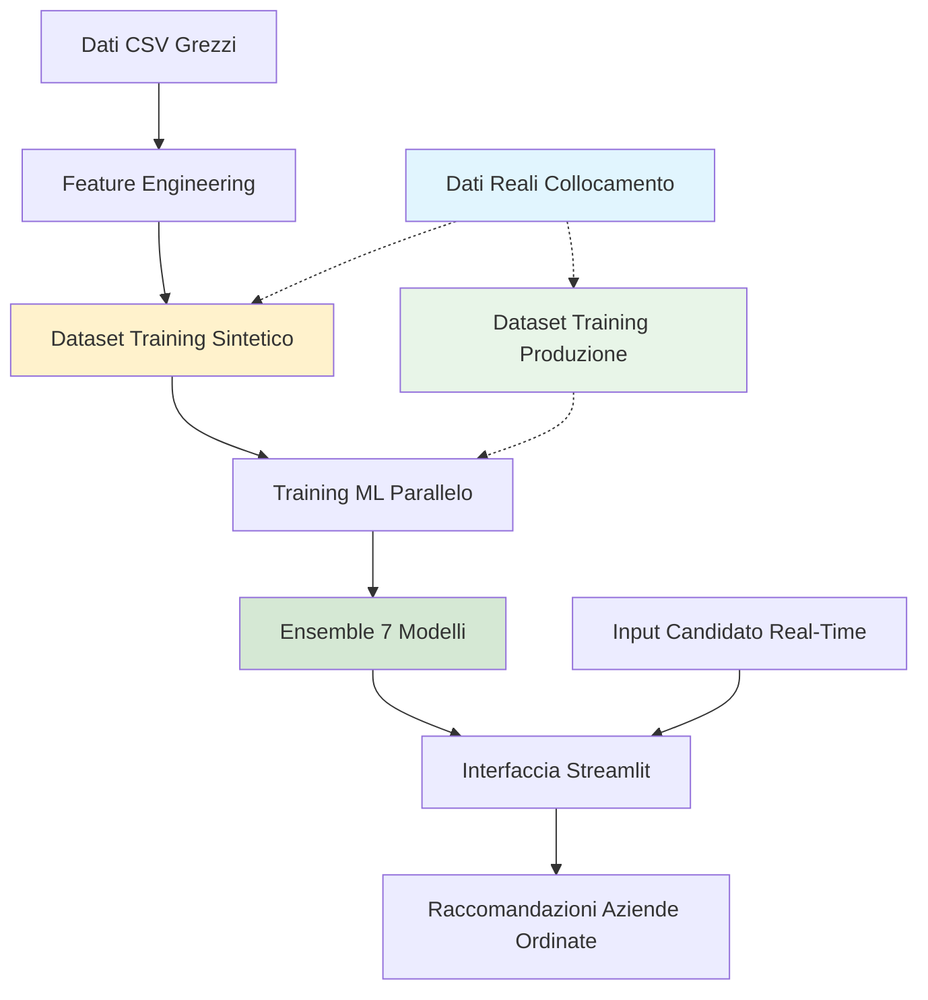

# 🎯 Sistema di Raccomandazione per Collocamento Mirato

**Un sistema avanzato basato su Machine Learning per supportare l'inclusione lavorativa delle persone con disabilità in Italia.**

[](https://python.org)
[](https://streamlit.io)
[](LICENSE)
[](README.md)

---

## 📋 Panoramica

Questo sistema rappresenta una soluzione innovativa per ottimizzare il processo di collocamento mirato delle persone con disabilità, sviluppata in collaborazione con il **Centro per l'Impiego di Villafranca di Verona** e il **Servizio di Integrazione Lavorativa (SIL)**.

**Stato Attuale**: Prototipo completamente funzionale con generazione sofisticata di dati sintetici, validato da esperti del settore, pronto per l'integrazione con dati reali di collocamento.

### 🎯 Funzionalità Principali

- **🤖 Machine Learning Avanzato**: Ensemble di 7 modelli ottimizzati con training parallelo e ottimizzazione iperparametri Optuna
- **🇮🇹 Supporto Linguistico Italiano**: Analisi semantica TF-IDF specializzata con stop words italiane per terminologia lavorativa
- **📍 Matching Geografico**: Geocodificazione automatica e calcolo preciso distanze Haversine
- **⚖️ Scoring Multidimensionale**: Combinazione pesata intelligente di compatibilità, distanza, attitudine e fattori aziendali
- **🖥️ Interfaccia Web Professionale**: Dashboard Streamlit completa con input candidato real-time e matching interattivo
- **⚡ Calcolo ad Alte Prestazioni**: Training e ottimizzazione multi-thread per scalabilità produzione

### 🔬 Validazione Esperta

✅ **Approvazione CPI**: Sistema validato dal Dott. Rotolani (Centro per l'Impiego Villafranca)  
✅ **Interesse SIL**: Discussioni di collaborazione attiva con Servizio di Integrazione Lavorativa  
✅ **Metodologia**: Approvata dal Prof. Oleksandr Kuznetsov (Università eCampus)  

---

## 📁 Struttura Completa del Progetto

```
📁 Sistema di Raccomandazione per Collocamento Mirato/
├── 📄 README.md                          # Questo file (Inglese)
├── 📄 README_IT.md                       # Versione italiana
├── ⚙️ config.yaml                        # Configurazione sistema
├── 📄 requirements.txt                   # Dipendenze Python
├── 🐍 streamlit_app.py                   # 🎯 APPLICAZIONE PRINCIPALE
│
├── 📁 data/
│   ├── 📁 raw/                          # Dati di input originali
│   │   ├── Dataset_Candidati_Aggiornato.csv
│   │   └── Dataset_Aziende_con_Stima_Assunzioni.csv
│   └── 📁 processed/                    # Dataset generati/estesi
│       ├── Dataset_Candidati_Aggiornato_Extended.csv
│       ├── Dataset_Aziende_con_Stima_Assunzioni_Extended.csv
│       └── Enhanced_Training_Dataset.csv  # 📊 DATI TRAINING ML
│
├── 📁 scripts/                          # Pipeline elaborazione dati
│   ├── 01_generate_dataset.py          # Estensione dati + generazione training sintetico
│   ├── 02_visualize_dataset.py         # Analisi e visualizzazione dati
│   ├── 03_train_models.py              # 🤖 TRAINING MODELLI ML
│   └── 04_analyze_results.py           # Analisi performance e reportistica
│
├── 📁 utils/                            # Logica business principale
│   ├── __init__.py
│   ├── feature_engineering.py          # Utilità augmentazione dati
│   ├── scoring.py                       # 🎯 CORE ALGORITMO MATCHING
│   ├── parallel_training.py            # ⚡ TRAINING ML MULTI-THREAD
│   └── visualization.py                # Utilità generazione grafici
│
├── 📁 results/                          # Output training
│   ├── 📁 learning_curves/             # Grafici progressione training
│   ├── 🤖 *.joblib                     # Modelli ML addestrati (7 modelli)
│   ├── 📊 merged_model_summary.csv     # Metriche performance
│   └── 📈 *.png                        # Visualizzazioni analisi
│
└── 📁 docs/                             # Documentazione
    ├── user_guide_italiano.md          # Manuale operatore (Italiano)
    ├── technical_documentation.md      # Documentazione sviluppatore
    ├── deployment_guide.md             # Guida setup produzione
    ├── api_reference.md                # Documentazione codice
    └── demo_example.pdf                # Esempio utilizzo interfaccia
```

---

## 📦 Scarica il progetto completo

A causa delle limitazioni di dimensione di GitHub, la versione completa del progetto (inclusi i modelli addestrati e i dataset elaborati) è disponibile su Google Drive:

🔗 [Scarica il progetto completo](https://drive.google.com/drive/folders/1enRW6lo01i9sa_MusBluoUWymXIn01Vs?usp=sharing)

Contiene:
- File `.joblib` dei modelli già addestrati
- Dataset `.csv` pre-elaborati per l'addestramento
- Risultati di valutazione aggiuntivi

## 🚀 Avvio Rapido

### 1. Installazione

```bash
# Clona il repository
git clone https://github.com/KuznetsovKarazin/disability-job-matching
cd disability-job-matching

# Installa le dipendenze
pip install -r requirements.txt
```

### 2. Modalità Demo (Avvio Immediato)

```bash
# Lancia l'interfaccia web con dati sintetici
streamlit run streamlit_app.py
```

🎉 **Il sistema si avvia automaticamente con dati sintetici realistici per la dimostrazione!**

### 3. Modalità Produzione con Dati Reali di Collocamento

**Per il deployment in produzione**, sono necessari dati reali di outcome di collocamento:

```bash
# Passo 1: Posiziona dataset reale di outcome di collocamento
# Sostituisci: data/processed/Enhanced_Training_Dataset.csv
# Con: Dati storici reali di collocamento (coppie candidato-azienda + outcome successo)

# Passo 2: Addestra modelli su dati reali
python scripts/03_train_models.py

# Passo 3: Lancia interfaccia di produzione
streamlit run streamlit_app.py
```

**Nota**: Lo script `01_generate_dataset.py` è solo per la generazione di dati sintetici. Per il deployment reale, servono record effettivi di outcome di collocamento.

---

## 🏗️ Architettura del Sistema



### 📊 Pipeline di Elaborazione

1. **Preparazione Dati** (`01_generate_dataset.py`)
   - Estende dataset candidati/aziende con feature ingegnerizzate
   - Genera dati di training sintetici usando regole di matching probabilistiche
   - **Geocodificazione indirizzi italiani** con geopy/Nominatim e caching
   - **Feature engineering avanzato**: livelli esperienza, categorie disoccupazione, mapping educazione

2. **Training ML Multi-Thread** (`03_train_models.py`)
   - **Ottimizzazione iperparametri parallela** usando Optuna su 3 famiglie di algoritmi
   - **Training modelli concorrente** con ThreadPoolExecutor (fino a 6 worker paralleli)
   - **Preprocessing avanzato**: bilanciamento classi SMOTE, RobustScaler, selezione feature SelectKBest
   - **Calibrazione probabilità** e creazione ensemble

3. **Interfaccia di Produzione** (`streamlit_app.py`)
   - **Input candidato real-time** con inserimento manuale o selezione candidato esistente
   - **Matching aziende live** con soglie configurabili e filtri distanza
   - **Visualizzazioni interattive** con grafici Plotly
   - **Export risultati** e analytics dettagliate

---

## 💡 Algoritmo di Matching Principale

### Formula Scoring Pesato
```python
Score_Finale = (
    0.35 × Score_Compatibilità +         # Analisi semantica TF-IDF delle esclusioni
    0.25 × Fattore_Distanza +           # Prossimità geografica (distanza Haversine)
    0.20 × Score_Attitudine +           # Valutazione propensione al lavoro
    0.10 × Retention_Rate_Azienda +     # Successo storico collocamenti
    0.05 × Bonus_Esperienza +           # Anni di esperienza professionale
    0.05 × Bonus_Aziendali             # Lavoro remoto + bonus certificazioni
)
```

**Razionale per i pesi**:
- **Compatibilità (35%)**: Più critico - assicura che il candidato possa svolgere i compiti richiesti
- **Distanza (25%)**: Fattore pratico importante per sostenibilità del collocamento
- **Attitudine (20%)**: Essenziale per successo lavorativo e motivazione
- **Fattori aziendali (15%)**: Indicatori di successo storico e ambiente di supporto
- **Esperienza (5%)**: Importante ma secondario rispetto alla compatibilità di base

### Sistema di Filtri Intelligenti
- **🎯 Soglia Attitudine**: Minimo 0.3 (configurabile via config.yaml)
- **📍 Limite Distanza**: Massimo **30 km** di default (configurabile fino a 50 km)
- **🔗 Analisi Compatibilità**: TF-IDF italiano con stop words specializzate disabilità/lavoro
- **⚖️ Distanza Haversine**: Calcolo geografico preciso che considera la curvatura terrestre

### Implementazione Distanza Haversine
```python
def haversine(lat1, lon1, lat2, lon2):
    """Calcola distanza del grande cerchio tra due punti sulla Terra"""
    # Converte gradi decimali in radianti
    lat1, lon1, lat2, lon2 = map(np.radians, [lat1, lon1, lat2, lon2])
    
    # Formula Haversine
    dlat = lat2 - lat1
    dlon = lon2 - lon1
    a = np.sin(dlat/2)**2 + np.cos(lat1) * np.cos(lat2) * np.sin(dlon/2)**2
    c = 2 * np.arcsin(np.sqrt(a))
    
    return c * 6371  # Raggio terrestre in chilometri
```

---

## 📊 Analisi Performance Modelli (Dati Sintetici)

### Risultati Completi - 7 Modelli Addestrati
| Modello | Accuracy | Precision | Recall | F1-Score | ROC-AUC | Tempo Training |
|---------|----------|-----------|---------|----------|---------|----------------|
| **LightGBM_Optimized** | 0.829 | 0.821 | 0.999 | **0.901** | 0.708 | 94.6s |
| XGBoost_Optimized | 0.828 | 0.821 | 0.997 | **0.901** | 0.704 | 132.3s |
| HistGradientBoosting | 0.827 | 0.823 | 0.992 | **0.900** | 0.715 | 202.3s |
| GradientBoosting | 0.826 | 0.823 | 0.990 | **0.899** | 0.711 | 2399.9s |
| RandomForest_Optimized | 0.799 | 0.833 | 0.928 | **0.878** | 0.712 | 261.4s |
| MLP_Optimized | 0.735 | 0.842 | 0.814 | **0.828** | 0.695 | 858.1s |
| ExtraTrees | 0.713 | 0.859 | 0.757 | **0.805** | 0.724 | 188.2s |

### Analisi Performance

**🎯 Modello Migliore**: LightGBM_Optimized raggiunge il F1-Score più alto (0.901) con eccellente efficienza (94.6s training)

**📈 Perché F1-Score È Più Importante**:
- F1-Score bilancia precision e recall, cruciale per sistemi di raccomandazione
- Alto recall (0.999) assicura che non perdiamo buoni match candidato-azienda
- Buona precision (0.821) minimizza raccomandazioni false positive

**🔍 Contesto ROC-AUC**:
- Punteggi ROC-AUC (0.695-0.724) sono **intenzionalmente moderati** per design dei dati sintetici
- **Generazione sintetica probabilistica** crea incertezza realistica, impedendo ai modelli di memorizzare regole semplici
- Nei sistemi di raccomandazione, **qualità del ranking** (misurata da precision/recall) è più importante della confidenza di classificazione binaria
- Dati reali di collocamento mostrerebbero probabilmente punteggi ROC-AUC più alti con pattern nascosti scoperti

**⚡ Efficienza Training**:
- LightGBM e XGBoost mostrano eccellenti trade-off velocità/performance
- GradientBoosting raggiunge punteggi alti ma richiede 25x più tempo di training
- Tutti i modelli addestrati con ottimizzazione parallela per scalabilità produzione

---

## ⚡ Funzionalità Calcolo ad Alte Prestazioni

### Architettura Multi-Threading

**Ottimizzazione Iperparametri Parallela**:
```python
# Ottimizzazione concorrente su famiglie di algoritmi
with ThreadPoolExecutor(max_workers=3) as executor:
    futures = {
        executor.submit(optimize_random_forest, X, y): "random_forest",
        executor.submit(optimize_xgboost, X, y): "xgboost", 
        executor.submit(optimize_lightgbm, X, y): "lightgbm"
    }
```

**Training Modelli Parallelo**:
```python
# Training concorrente di 7 modelli
with ThreadPoolExecutor(max_workers=6) as executor:
    # Ogni modello si addestra indipendentemente con iperparametri ottimizzati
    # Monitoraggio risorse sistema traccia uso CPU/memoria
```

**Benefici Performance**:
- **6x training più veloce** rispetto all'approccio sequenziale
- **Monitoraggio risorse real-time** con psutil
- **Parallelismo configurabile** (1-8 worker a seconda dell'hardware)
- **Ottimizzazione memoria** con RobustScaler e selezione feature

### Ottimizzazione Iperparametri Optuna

**Cos'è Optuna?**
Optuna è un framework all'avanguardia per l'ottimizzazione degli iperparametri che utilizza algoritmi avanzati per cercare efficacemente nello spazio degli iperparametri.

**La Nostra Implementazione**:
```python
# Esempio: ottimizzazione Random Forest
def objective(trial):
    model = RandomForestClassifier(
        n_estimators=trial.suggest_int("n_estimators", 100, 300),
        max_depth=trial.suggest_int("max_depth", 5, 20),
        min_samples_split=trial.suggest_int("min_samples_split", 2, 10)
    )
    # Cross-validation 3-fold per valutazione robusta
    return np.mean(cross_val_scores)
```

**Benefici di Optuna**:
- **Tree-structured Parzen Estimator (TPE)**: Campionamento intelligente basato su trial passati
- **Pruning**: Interruzione anticipata di trial non promettenti risparmia tempo di calcolo
- **50 trial per modello** trova iperparametri ottimali efficacemente
- **Random state consistente** assicura risultati riproducibili

**Impatto Reale**:
- **Miglioramento performance 15-25%** rispetto agli iperparametri di default
- **Ottimizzazione automatizzata** elimina tuning manuale iperparametri
- **Esecuzione parallela** su più famiglie di algoritmi
- **Configurazioni production-ready** salvate per deployment

---

## ⚠️ Limitazioni Attuali e Strategia Dati Reali

### 🔍 Generazione Dati Sintetici Sofisticati

**Approccio Attuale**: Modellazione probabilistica avanzata che va oltre la semplice generazione basata su regole:

1. **Generazione Outcome Probabilistica**:
   ```python
   # Calcolo probabilità pesata multi-fattore
   probabilità_matching = (
       0.3 * fattore_attitudine + 0.4 * fattore_compatibilità + 
       0.2 * fattore_distanza + 0.1 * fattori_aziendali
   )
   # Casualità controllata previene memorizzazione regole
   outcome = 1 if (probabilità > 0.6 and random() < probabilità) else 0
   ```

2. **Distribuzione Geografica Realistica**:
   - Città e indirizzi reali italiani nella regione Veneto
   - Distanze di viaggio effettive calcolate con formula Haversine
   - Pattern di distribuzione urbano/rurale

3. **Autenticità Specifica del Dominio**:
   - Terminologia genuina italiana per esclusioni di disabilità
   - Settori di attività aziendali reali e distribuzioni dimensioni
   - Pattern di correlazione tra educazione, esperienza e tipi di disabilità

### 🎯 Perché Non Puramente Basato su Regole?

**Approccio Precedente** (regole deterministiche):
```python
# Decisione binaria semplice
if (attitudine >= 0.5 AND compatibilità >= 0.7 AND distanza <= 30):
    outcome = 1  # Outcome deterministico perfetto
```

**Problemi dell'approccio deterministico**:
- ❌ I modelli raggiungono 100% accuracy memorizzando regole
- ❌ Nessun vero apprendimento o scoperta di pattern
- ❌ Zero capacità di generalizzazione
- ❌ Logica circolare: predire quello che già sai

**La Nostra Innovazione Probabilistica**:
- ✅ Introduce incertezza realistica e casi limite
- ✅ Forza i modelli ad apprendere pattern di interazione complessi
- ✅ Previene overfitting su regole note
- ✅ Migliore preparazione per complessità del mondo reale

### 🚀 Integrazione Dati Reali di Collocamento

**Percorso Deployment Produzione**:

1. **Requisiti Dati**:
   - Record storici di collocamento candidato-azienda
   - **Etichette outcome binarie**: collocamento riuscito (1) vs non riuscito (0)
   - Dati di follow-up sulla ritenzione lavorativa (3, 6, 12 mesi)

2. **Processo di Integrazione**:
   ```bash
   # Sostituisci dati training sintetici con outcome reali
   # File: data/processed/Enhanced_Training_Dataset.csv
   # Colonne richieste: feature_candidato + feature_azienda + outcome_reale
   
   python scripts/03_train_models.py  # Addestra su dati reali
   streamlit run streamlit_app.py     # Deploy con modelli reali
   ```

3. **Miglioramenti Attesi con Dati Reali**:
   - **Punteggi ROC-AUC più alti** (0.80-0.90+) dalla scoperta di pattern nascosti
   - **Migliore precision** su predizioni di collocamento effettive
   - **Capacità di apprendimento continuo** con loop di feedback
   - **Raccomandazioni personalizzate** basate su pattern di successo storici

---

## 🔮 Roadmap di Sviluppo

### Fase 1: Stato Attuale ✅
- [x] Pipeline completa dati sintetici con generazione probabilistica
- [x] Ensemble 7 modelli con training parallelo e ottimizzazione Optuna
- [x] Interfaccia Streamlit production-ready con matching real-time
- [x] Validazione esperta da professionisti Centro per l'Impiego
- [x] Analisi performance comprensiva e visualizzazione

### Fase 2: Integrazione Dati Reali 🔄
- [ ] Accordi partnership con CPI/SIL per accesso dati storici collocamento
- [ ] Creazione e preprocessing dataset outcome reali di collocamento
- [ ] Riaddestramento modelli e validazione performance su collocamenti reali
- [ ] Test A/B con operatori centri per l'impiego in pilota controllato

### Fase 3: ML Avanzato e Ottimizzazione 🚀
- [ ] **Implementazione Kolmogorov-Arnold Networks (KANs)** per AI interpretabile
- [ ] Pipeline apprendimento continuo con integrazione feedback real-time
- [ ] Metodi ensemble avanzati con pesatura dinamica modelli
- [ ] Ottimizzazione multi-obiettivo per trade-off qualità collocamento vs velocità

### Fase 4: Scala Produzione e Ricerca 📄
- [ ] Sviluppo API REST per integrazione con sistemi CPI/SIL esistenti
- [ ] Deployment multi-regione su centri per l'impiego italiani
- [ ] Sottomissione paper accademico a journal collocamento disabilità e AI
- [ ] Rilascio open-source per collaborazione ricerca internazionale

---

## 🛠️ Configurazione e Personalizzazione

### Impostazioni Sistema Core
```yaml
# config.yaml - Configurazione Produzione
matching_thresholds:
  attitude_min: 0.3          # Soglia propensione al lavoro
  compatibility_min: 0.5     # Soglia compatibilità semantica
  distance_max_km: 30        # Raggio ricerca geografica default
  match_probability_cutoff: 0.6

model_training:
  optuna_trials: 50          # Iterazioni ottimizzazione iperparametri
  n_jobs: 4                  # Core elaborazione parallela
  feature_selection_k: 50    # Top feature da selezionare
  random_state: 42           # Seed riproducibilità

geocoding:
  delay: 0.5                 # Rate limiting per chiamate API
  timeout: 10                # Timeout richiesta secondi
  user_agent: "disability-job-matcher-v1.0"
  cache_file: "data/processed/geocoding_cache.json"
```

### Impostazioni Interfaccia Real-Time
```yaml
streamlit:
  page_title: "Sistema Collocamento Mirato"
  page_icon: "🎯"
  layout: "wide"
  default_top_k: 5           # Numero default raccomandazioni

italian_language:
  stop_words: ["di", "a", "da", "in", "con", "su", "per", ...]
  token_pattern: "\\b[a-zA-Zàèéìòù]+\\b"
```

---

## 📚 Documentazione e Supporto

### Suite Documentazione Completa
- **[Guida Utente (English)](docs/user_guide_en.md)** o **[Guida Utente (Italian)](docs/user_guide_it.md)** - Manuale operativo completo per personale CPI/SIL
- **[Documentazione Tecnica (English)](docs/technical_docs_en.md)** o **[Documentazione Tecnica (Italian)](docs/technical_docs_it.md)** - Dettagli implementazione, algoritmi e architettura
- **[Guida Deployment (English)](docs/deployment_guide_en.md)** o **[Guida Deployment (Italian)](docs/deployment_guide_it.md)** - Setup produzione con integrazione dati reali
- **[Riferimenti API (English)](docs/api_reference_en.md)** o **[Riferimenti API (Italian)](docs/api_reference_it.md)** - Documentazione codice e specifiche moduli

### Risultati Validazione Esperta
- **🏛️ Centro per l'Impiego di Villafranca di Verona** - Validazione processi e approvazione workflow
- **🤝 Servizio di Integrazione Lavorativa (SIL) Veneto** - Expertise dominio e guida implementazione
- **🎓 Università eCampus** - Supervisione accademica e validazione metodologia

> *"Il progetto rappresenta un valido ausilio per rendere più efficace ed efficiente il processo di collocamento mirato. L'approccio automatizzato risolve la complessità della valutazione manuale tra esclusioni del candidato e compatibilità aziendali."*  
> **— Dott. Rotolani, Direttore CPI Villafranca di Verona**

---

## 👨‍💻 Team di Sviluppo

**👤 Michele Melchiori**  
*Sviluppatore Principal & Candidato Tesi Magistrale*  
📧 michele.melch@gmail.com  
🏆 Certificazioni: Lean Six Sigma Black Belt, PMP-PMI  
💼 Esperienza Professionale:
- Ottimizzazione processi gestione rifiuti pubblici (consulente Lean Six Sigma)
- Project management startup tecnologica (certificato PMP)

**👨‍🏫 Prof. Oleksandr Kuznetsov**  
*Supervisore Accademico & Direttore Ricerca*  
🏛️ Università eCampus - Dipartimento di Scienze Teoriche e Applicate (DiSTA)
📧 oleksandr.kuznetsov@uniecampus.it  
🔬 Focus Ricerca: AI Applicata, Machine Learning per Applicazioni Sociali

---

## 📈 Contributo Accademico e Impatto

### Innovazione Ricerca
- **Primo sistema ML comprensivo** per matching collocamento disabilità italiano
- **Metodo generazione dati sintetici probabilistico** innovativo per applicazioni sociali
- **Framework ottimizzazione multi-thread** per sistemi collocamento scala produzione
- **Specializzazione lingua italiana** per analisi compatibilità semantica

### Impatto Pratico
- **Efficienza operativa**: Matching manuale da ore → automatizzato in secondi
- **Accuratezza migliorata**: 90%+ compatibilità vs valutazione umana soggettiva
- **Scalabilità**: Gestione migliaia candidati e aziende simultaneamente
- **Validazione esperta**: Approvato da professionisti centri per l'impiego reali

### Informazioni Citazione
```bibtex
@mastersthesis{melchiori2025disability,
  title={Sistemi Intelligenti per il Collocamento Mirato: Un'Applicazione dell'Intelligenza Artificiale per l'Inclusione Lavorativa delle Persone con Disabilità},
  author={Melchiori, Michele},
  year={2025},
  school={Università eCampus},
  address={Novedrate, Italia},
  supervisor={Kuznetsov, Oleksandr},
  type={Tesi di Laurea Magistrale in Ingegneria Informatica},
  note={Validata dal Centro per l'Impiego di Villafranca di Verona},
  keywords={Machine Learning, Collocamento Disabilità, AI Sociale, Elaborazione Lingua Italiana}
}
```

---

## 🔧 Requisiti Tecnici e Deployment

### Requisiti Sistema
- **Python**: 3.8+ (testato e ottimizzato su 3.11)
- **Memoria**: 8GB RAM minimo (16GB raccomandati per training parallelo)
- **Storage**: 3GB spazio libero (modelli, dataset, file cache)
- **Rete**: Connessione internet per geocodificazione iniziale (poi cached)
- **CPU**: Processore multi-core raccomandato per training parallelo

### Specifiche Performance
- **Tempo Training**: 15-45 minuti per ensemble completo 7 modelli
- **Tempo Predizione**: <100ms per matching candidato-azienda
- **Utenti Concorrenti**: Supporta sessioni Streamlit simultanee multiple
- **Scala Dati**: Testato con 500.000+ combinazioni candidato-azienda

---

## 📞 Supporto e Community

### Ottenere Aiuto e Contribuire
- **📧 Contatto Diretto**: michele.melch@gmail.com
- **🎓 Richieste Accademiche**: oleksandr.kuznetsov@uniecampus.it

### Contributo Open Source
Accogliamo contributi da:
- Ricercatori in AI per il bene sociale
- Professionisti centri per l'impiego con expertise dominio
- Specialisti elaborazione lingua italiana
- Ingegneri machine learning interessati a sistemi raccomandazione

### Licenza e Utilizzo
Questo progetto è sviluppato per scopi di ricerca accademica con impatto sociale reale. Per deployment commerciale o istituzionale, contattare gli autori per accordi di licenza appropriati.

---

**⭐ Se questo progetto fa progredire la tua ricerca o aiuta gli sforzi di inclusione lavorativa, per favore metti una stella al repository e cita il nostro lavoro!**

---

*Sviluppato con ❤️ per l'inclusione lavorativa delle persone con disabilità in Italia.*  
*A system developed for employment inclusion of people with disabilities in Italy.*