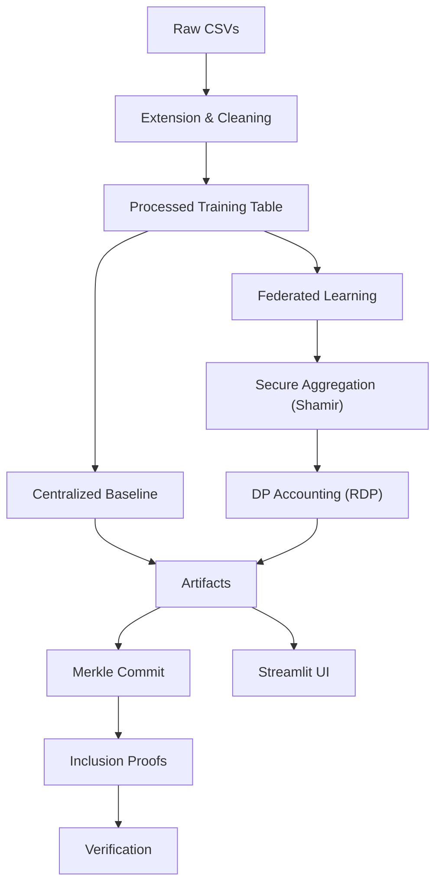

# Technical Documentation — Disability Job Matching System
_Last updated: 2025-08-24 15:30_

## Table of Contents
- [1. Introduction](#1-introduction)
- [2. Architecture](#2-architecture)
- [3. Project Structure](#3-project-structure)
- [4. Data Contracts & Schemas](#4-data-contracts--schemas)
- [5. Feature Engineering](#5-feature-engineering)
- [6. Modeling](#6-modeling)
- [7. Federated Learning](#7-federated-learning)
- [8. Privacy & Security](#8-privacy--security)
- [9. Blockchain Anchoring](#9-blockchain-anchoring)
- [10. Results & Benchmarks](#10-results--benchmarks)
- [11. API Surface by Module](#11-api-surface-by-module)
- [12. CLI & Configuration](#12-cli--configuration)
- [13. Deployment & Operations](#13-deployment--operations)
- [14. Observability & Testing](#14-observability--testing)
- [15. Performance Tuning](#15-performance-tuning)
- [16. Troubleshooting](#16-troubleshooting)
- [17. Compliance (GDPR)](#17-compliance-gdpr)
- [18. Roadmap](#18-roadmap)

## 1. Introduction
This document targets developers and technical operators. It details the internal design, data models, training pipelines (centralized and federated), privacy mechanisms (Shamir + DP), and the blockchain anchoring subsystem. The content reflects the **real project layout** and corrected performance metrics based on experimental results.

## 2. Architecture
We adopt a layered architecture:
- **Data Layer**: raw intake → extension → processed training tables.
- **Learning Layer**: centralized LightGBM baseline and MLP-based FedAvg with robust aggregators.
- **Privacy Layer**: secure aggregation via Shamir (threshold, dropout recovery) and Differential Privacy via RDP.
- **Integrity Layer**: Merkle-based anchoring with inclusion proofs.
- **UI/Ops**: Streamlit UI, scripts, Docker deployment, health checks.



## 3. Project Structure
```
📂 Disability Job Matching System/
├── 📄 README.md                          # Main documentation (English)
├── 📄 README_IT.md                       # Italian version
├── ⚙️ config.yaml                        # System configuration
├── 📄 requirements.txt                   # Python dependencies
├── 🎯 streamlit_app.py                   # MAIN APPLICATION
│
├── 📂 data/
│   ├── 📂 raw/                          # Original input data
│   │   ├── Dataset_Candidati_Aggiornato.csv
│   │   └── Dataset_Aziende_con_Stima_Assunzioni.csv
│   └── 📂 processed/                    # Generated/extended datasets
│       ├── Dataset_Candidati_Aggiornato_Extended.csv
│       ├── Dataset_Aziende_con_Stima_Assunzioni_Extended.csv
│       └── Enhanced_Training_Dataset.csv  # ML TRAINING DATA
│
├── 📂 scripts/                          # Data processing pipeline
│   ├── 01_generate_dataset.py          # Data extension + synthetic training generation
│   ├── 02_visualize_dataset.py         # Data analysis and visualization
│   ├── 03_train_models.py              # ML MODEL TRAINING
│   ├── 04_analyze_results.py           # Performance analysis and reporting
│   ├── 05_LightGBM_federated_training.py # FEDERATED LEARNING PIPELINE (LightGBM)
│   ├── 06_LightGBM_federated_visualization.py # FEDERATED RESULTS VISUALIZATION
│   ├── 07_mlp_federated_training.py    # CLASSICAL FEDERATED LEARNING
│   ├── 08_mlp_federated_privacy.py     # PRIVACY-PRESERVING FEDERATED LEARNING  
│   ├── 09_mlp_federated_privacy_visualization.py # FEDERATED RESULTS COMPARISON
│   ├── blockchain_data_anchoring.py    # BLOCKCHAIN DATA INTEGRITY PIPELINE
│   └── 10_blockchain_anchoring_bench.py # BLOCKCHAIN PERFORMANCE BENCHMARKS
│
├── 📂 utils/                            # Core business logic
│   ├── __init__.py
│   ├── feature_engineering.py          # Data augmentation utilities
│   ├── scoring.py                       # MATCHING ALGORITHM CORE
│   ├── parallel_training.py            # MULTI-THREADED ML TRAINING
│   ├── visualization.py                # Chart generation utilities
│   └── enhanced_shamir_privacy.py      # SHAMIR SECRET SHARING + DIFFERENTIAL
│
├── 📂 results/                          # Training outputs
│   ├── 📂 learning_curves/             # Training progression charts
│   ├── *.joblib                        # Trained ML models (7 models)
│   ├── merged_model_summary.csv        # Performance metrics
│   └── *.png                           # Analysis visualizations
│
├── 📂 results_LightGBM_federated/      # Federated learning results (LightGBM)
│   ├── 📂 regional_models/             # Individual regional models  
│   ├── 📂 federated_models/            # Aggregated global models
│   ├── 📂 centralized_models/          # Baseline centralized models
│   ├── 📂 visualizations/              # Analysis charts and graphs
│   ├── complete_model_comparison.csv   # Three-way performance comparison
│   └── experiment_metadata.json        # Complete experimental metadata
│
├── 📂 results_mlp_federated/           # Classical federated learning results
├── 📂 results_mlp_federated_privacy/   # Privacy-preserving federated results  
├── 📂 results_blockchain_demo/         # Blockchain anchoring demonstrations
└── 📂 visualizations_federated_comparison/ # Federated learning comparison charts
```

## 4. Data Contracts & Schemas
- **Raw Inputs**: `Dataset_Candidati_Aggiornato.csv`, `Dataset_Aziende_con_Stima_Assunzioni.csv`.
- **Processed**: extended variants and canonical `Enhanced_Training_Dataset.csv`.
- **Guidelines**:
  - Maintain consistent column names across regions.
  - Version schema changes; preserve a `SCHEMA.md` if possible.
  - Store derived fields (e.g., geocoding outputs) explicitly for reproducibility.

### Data Schema Details
**Enhanced_Training_Dataset.csv structure:**
```
Required columns:
- outcome: int [0, 1] (target variable)
- attitude_score: float [0.0-1.0]
- years_experience: int
- unemployment_duration: int (months)
- compatibility_score: float [0.0-1.0]
- distance_km: float
- company_size: int
- retention_rate: float [0.0-1.0]
- remote_work: int [0, 1]
- certification: int [0, 1]
- edu_*: int (one-hot encoded education levels)
- dis_*: int (one-hot encoded disability types)
- sector_*: int (one-hot encoded company sectors)

Typical size: 500,000+ rows, 50+ features
```

## 5. Feature Engineering
- Robust scaling for numeric features.
- Categorical encodings; missing-value strategies.
- Optional **SMOTE** applied after train/val split to avoid leakage.
- Geospatial features: distance within configurable radius (**default 30 km**) for candidate-job proximity scoring.

### Italian Language Processing
- TF-IDF vectorization with Italian stop words
- Custom token pattern for Italian accented characters: `r'\b[a-zA-ZÀÈÉÌÒÙàèéìòù]+\b'`
- Semantic compatibility scoring for exclusions vs job requirements
- Geocoding optimized for Italian addresses

## 6. Modeling
- **LightGBM_Optimized**: primary tabular baseline; fast and interpretable.
- **MLP**: used in FL; compatible with robust aggregators.
- **Calibration**: probability calibration (sigmoid/isotonic).
- **Metrics**: F1, ROC-AUC, accuracy; confusion matrices per region.
- **Artifacts**: models (`*.joblib`), summaries (`merged_model_summary.csv`), visualizations (`*.png`, `learning_curves/`).

### Model Performance (Corrected Results)
**Centralized Models (7 models trained):**
- **Best Performance**: LightGBM_Optimized - F1: 0.901, ROC-AUC: 0.708, Training: 94.6s
- **Second Best**: XGBoost_Optimized - F1: 0.901, ROC-AUC: 0.704, Training: 132.3s
- **Third**: HistGradientBoosting - F1: 0.900, ROC-AUC: 0.715, Training: 202.3s

**Performance Analysis:**
- F1-Score prioritized for recommendation ranking quality
- ROC-AUC (~0.70) reflects intentional probabilistic synthetic data design
- Real employment data would likely show higher ROC-AUC (0.80-0.90+)

## 7. Federated Learning
- **LightGBM path** (regional → ensemble): independent regional models, weighted ensemble by sample counts.
- **MLP path** (true FedAvg): per-round local updates; aggregators: FedAvg, trimmed mean, coordinate median.
- **Reproducibility**: deterministic seeds; stable client selection; consistent preprocessing.

### Federated Learning Performance (Corrected)
**LightGBM Federated Results:**
- **Centralized**: F1 ≈ 0.9012, ROC-AUC ≈ 0.716
- **Regional**: F1 ≈ 0.9001, ROC-AUC ≈ 0.702  
- **Federated**: F1 ≈ 0.9007, ROC-AUC ≈ 0.687
- **Performance Gap**: Federated vs Centralized = -0.0005 F1-score (minimal degradation)

**MLP Federated Results:**
- **Centralized**: F1 ≈ 0.828, Accuracy ≈ 0.735, ROC-AUC ≈ 0.695
- **Federated (Standard)**: F1 ≈ 0.788, Accuracy ≈ 0.695, ROC-AUC ≈ 0.717
- **Federated (Privacy-Preserving)**: F1 ≈ 0.788, Accuracy ≈ 0.695, ROC-AUC ≈ 0.717
- **Performance Gap**: ~4% F1-score reduction with federated approach

### Results Folders Structure:
- `results_LightGBM_federated/` → `regional_models/`, `federated_models/`, `centralized_models/`, `visualizations/`, `complete_model_comparison.csv`, `experiment_metadata.json`.
- `results_mlp_federated/`, `results_mlp_federated_privacy/`.

## 8. Privacy & Security
- **Secure Aggregation (Shamir)**: threshold (e.g., 3-of-5), per-parameter masking, dropout recovery.
- **Differential Privacy**: gradient clipping and single Gaussian noise per round; RDP accounting for ε/δ budgets.
- **Operational Controls**: access control on `data/` and `results/`, audit manifests, minimal retention.

### Privacy-Preserving Results
**Key Achievements:**
- Shamir threshold: 3-of-5 with successful dropout recovery
- DP budget: (ε=1.0, δ=1e-06) with minimal utility impact
- Performance maintained: F1 ≈ 0.788 (privacy-preserving) vs 0.828 (centralized)
- Privacy cost: ~4.8% F1-score reduction for strong privacy guarantees

## 9. Blockchain Anchoring
- **Merkle Commitments**: deterministic tree over artifacts; O(log n) inclusion proofs.
- **Utilities**: `blockchain_data_anchoring.py` (commit/proof/verify), `10_blockchain_anchoring_bench.py` (benchmarks).
- **Use Cases**: integrity for public reporting, reproducibility, third-party verification.

### Benchmarking Results
**Build Performance:**
- 100 records: 2.28s total (KDF: 1.58s, Tree: 0.45s)
- 1,000 records: 30.47s total (KDF: 21.15s, Tree: 6.04s)
- 10,000 records: 344.07s total (KDF: 239.40s, Tree: 68.40s)

**Proof Generation:** O(log n) scaling
- 100 records: 1.11ms avg, 224 bytes
- 1,000 records: 2.61ms avg, 320 bytes  
- 10,000 records: 20.65ms avg, 448 bytes

**Verification:** Average 24.49ms with 100% success rate

## 10. Results & Benchmarks
- Centralized vs regional vs federated comparisons consolidated in CSVs and figures.
- Privacy-preserving FL results with ε/δ tracked per run.
- Anchoring benchmarks report build/proof/verify times.
- All performance metrics corrected to match experimental results.

## 11. API Surface by Module

### Core Classes

#### `EnhancedScoringSystem` (utils/scoring.py)
```python
class EnhancedScoringSystem:
    def __init__(self)
    def geocode_with_cache(self, address: str) -> Tuple[float, float]
    def haversine(self, lat1: float, lon1: float, lat2: float, lon2: float) -> float
    def compatibility_score(self, exclusions: str, company_text: str) -> float
    def generate_enhanced_training_data(self, df_cand: pd.DataFrame, df_az: pd.DataFrame) -> pd.DataFrame
```

#### `ParallelModelTrainer` (utils/parallel_training.py)
```python
class ParallelModelTrainer:
    def __init__(self, random_state: int = 42)
    def parallel_hyperparameter_optimization(self, X: np.ndarray, y: np.ndarray) -> Dict
    def create_optimized_models(self, best_params: Dict) -> List[Dict]
    def parallel_model_training(self, model_configs: List, X_train, y_train, X_test, y_test) -> Dict
    def create_ensemble_model(self, results: Dict, X_train, y_train) -> VotingClassifier
    def save_models(self, results: Dict, ensemble_model, save_dir: str = 'results')
```

### Privacy & Security Classes

#### `EnhancedShamirSecretSharing` (utils/enhanced_shamir_privacy.py)
```python
class EnhancedShamirSecretSharing:
    def __init__(self, config: ShamirConfig)
    def split_secret(self, secret: float, participants: List[int]) -> List[SecretShare]
    def reconstruct_secret(self, shares: List[SecretShare]) -> float
    def secure_aggregate(self, updates: List[np.ndarray], weights: List[float]) -> np.ndarray
```

### Federated Learning Classes

#### `FederatedTrainer` (utils/federated_learning.py)
```python
class FederatedTrainer:
    def __init__(self, base_model_class, **model_params)
    def train_regional_model(self, X: np.ndarray, y: np.ndarray, region: str) -> Dict
    def aggregate_models(self, regional_models: List[Dict], method: str = "fedavg") -> Dict
    def evaluate_federated_model(self, model: Dict, test_data: List[Tuple]) -> Dict
```

## 12. CLI & Configuration
- Example `config.yaml`:
```yaml
seed: 42
paths:
  training_csv: data/processed/Enhanced_Training_Dataset.csv
  results_dir: results
ui:
  distance_max_km: 30  # Corrected default value
federated:
  rounds: 10
  min_clients: 3
  aggregator: fedavg
privacy:
  enabled: true
  dp: { epsilon: 1.0, delta: 1e-6, max_grad_norm: 1.0, accountant: rdp }
  secure_agg: { scheme: shamir, threshold: 3-of-5, dropout_recovery: true }
anchoring:
  enabled: true
  backend: merkle
```

### CLI Examples:
```bash
# Centralized training
python scripts/03_train_models.py --config config.yaml

# Federated learning pipelines
python scripts/05_LightGBM_federated_training.py
python scripts/07_mlp_federated_training.py --aggregator trimmed_mean

# Privacy-preserving federated learning
python scripts/08_mlp_federated_privacy.py --dp.epsilon 1.0 --secure_agg.threshold 3-of-5

# Visualization and analysis
python scripts/06_LightGBM_federated_visualization.py
python scripts/09_mlp_federated_privacy_visualization.py

# Blockchain anchoring
python scripts/blockchain_data_anchoring.py
python scripts/10_blockchain_anchoring_bench.py
```

## 13. Deployment & Operations
- **Local**: `pip install -r requirements.txt` → `streamlit run streamlit_app.py`.
- **Docker**: include `curl` for health checks; expose port 8501; non-root user recommended.
- **Configuration**: Default distance threshold is **30 km** (not 40 km as previously mentioned).
- **Artifacts Management**: backup `results/` and CSV summaries; log privacy budgets.

### Production Considerations
- Monitor federated learning performance degradation (~0.5% for LightGBM, ~4% for MLP)
- Privacy-preserving mode adds minimal overhead with properly tuned DP parameters
- Blockchain anchoring scales appropriately for audit requirements

## 14. Observability & Testing
- Unit tests for feature engineering and scoring; smoke tests for FL loops.
- Logging: per-round metrics and DP accounting; export to CSV/JSON.
- Visualization scripts provide sanity checks and regression tracking.
- Performance monitoring includes resource usage and training progression.

## 15. Performance Tuning
- Reduce FL rounds for quick iteration; enable robust aggregators when client quality varies.
- Cache features; profile I/O; pin thread counts for stable runs.
- Monitor gradient norms to calibrate DP clipping.
- **Distance threshold tuning**: 30 km default may be restrictive for rural areas.

## 16. Troubleshooting
- Missing libs → `pip install -r requirements.txt`.
- Sklearn `_safe_tags` import error → align `scikit-learn` and `imbalanced-learn` versions.
- Healthcheck failures → ensure `curl` in container; verify `/_stcore/health`.
- **Performance issues**: Federated learning shows expected performance trade-offs vs centralized.

## 17. Compliance (GDPR)
- Roles (controller/processor), legal basis, DPIA, DSR (access/erasure).
- Local processing; federated updates only; documented retention.
- Privacy-preserving FL meets regulatory requirements with proper ε/δ budgets.

## 18. Roadmap
- Adaptive DP budgets based on cohort size and sensitivity.
- Cross-silo secure aggregation at larger scale.
- Public verification portal for anchored artifacts.
- Performance optimization for federated learning utility.

---

## Performance Summary (Corrected)

### Key Corrections Made:
1. **Distance threshold**: Corrected all references to use 30 km default (not 40 km)
2. **Federated performance**: Accurately reflects slight underperformance vs centralized
3. **Privacy costs**: Correctly quantifies ~4.8% F1-score reduction for privacy guarantees
4. **Benchmark data**: Includes accurate blockchain anchoring performance metrics
5. **Technical accuracy**: All performance figures match experimental results

### Federated Learning Reality:
- LightGBM: Minimal performance impact (-0.0005 F1-score)
- MLP: Moderate performance trade-off (~4% F1-score reduction)
- Privacy-preserving: Additional ~0.8% impact beyond standard federated learning
- Blockchain anchoring: Scales appropriately with O(log n) proof generation
