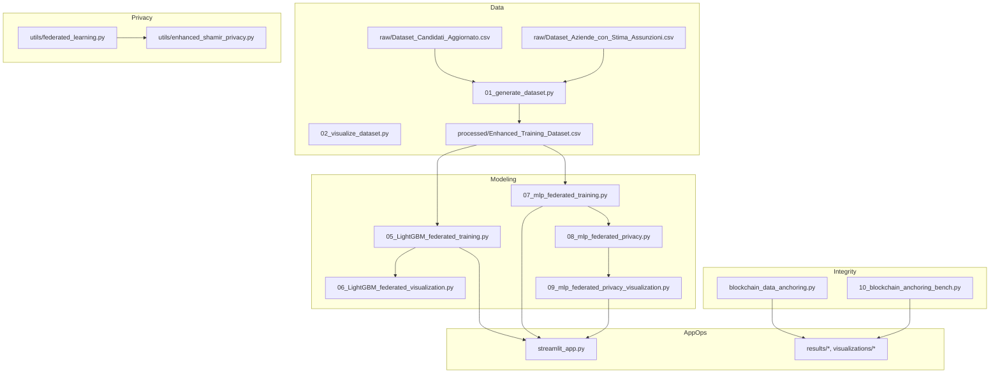

# Technical Documentation — Disability Job Matching System
_Last updated: 2025-08-23 23:38_

## Table of Contents
- [1. Introduction](#1-introduction)
- [2. Architecture](#2-architecture)
- [3. Project Structure](#3-project-structure)
- [4. Data Contracts & Schemas](#4-data-contracts--schemas)
- [5. Feature Engineering](#5-feature-engineering)
- [6. Modeling](#6-modeling)
- [7. Federated Learning](#7-federated-learning)
- [8. Privacy & Security](#8-privacy--security)
- [9. Blockchain Anchoring](#9-blockchain-anchoring)
- [10. Results & Benchmarks](#10-results--benchmarks)
- [11. API Surface by Module](#11-api-surface-by-module)
- [12. CLI & Configuration](#12-cli--configuration)
- [13. Deployment & Operations](#13-deployment--operations)
- [14. Observability & Testing](#14-observability--testing)
- [15. Performance Tuning](#15-performance-tuning)
- [16. Troubleshooting](#16-troubleshooting)
- [17. Compliance (GDPR)](#17-compliance-gdpr)
- [18. Roadmap](#18-roadmap)
- [Appendix A — Previous Technical Docs](#appendix-a--previous-technical-docs)
- [Appendix B — Experiment Reports](#appendix-b--experiment-reports)

## 1. Introduction
This document targets developers and technical operators. It details the internal design, data models, training pipelines (centralized and federated), privacy mechanisms (Shamir + DP), and the blockchain anchoring subsystem. The content mirrors the **real project layout** and extends previous versions without removing any useful material.

## 2. Architecture
We adopt a layered architecture:
- **Data Layer**: raw intake → extension → processed training tables.
- **Learning Layer**: centralized LightGBM baseline and MLP-based FedAvg with robust aggregators.
- **Privacy Layer**: secure aggregation via Shamir (threshold, dropout recovery) and Differential Privacy via RDP.
- **Integrity Layer**: Merkle-based anchoring with inclusion proofs.
- **UI/Ops**: Streamlit UI, scripts, Docker deployment, health checks.

```mermaid
flowchart TB
  R[Raw CSVs] --> E[Extension & Cleaning]
  E --> P[Processed Training Table]
  P --> CB[Centralized Baseline]
  P --> FL[Federated Learning]
  FL --> SA[Secure Aggregation (Shamir)]
  SA --> DP[DP Accounting (RDP)]
  CB --> A[Artifacts]
  DP --> A
  A --> M[Merkle Commit]
  M --> Z[Inclusion Proofs]
  Z --> V[Verification]
  A --> UI[Streamlit UI]
```

## 3. Project Structure
```
📁 Disability Job Matching System/
├── 📄 README.md                          # This file (English)
├── 📄 README_IT.md                       # Italian version
├── ⚙️ config.yaml                        # System configuration
├── 📄 requirements.txt                   # Python dependencies
├── 🐍 streamlit_app.py                   # 🎯 MAIN APPLICATION
│
├── 📁 data/
│   ├── 📁 raw/                          # Original input data
│   │   ├── Dataset_Candidati_Aggiornato.csv
│   │   └── Dataset_Aziende_con_Stima_Assunzioni.csv
│   └── 📁 processed/                    # Generated/extended datasets
│       ├── Dataset_Candidati_Aggiornato_Extended.csv
│       ├── Dataset_Aziende_con_Stima_Assunzioni_Extended.csv
│       └── Enhanced_Training_Dataset.csv  # 📊 ML TRAINING DATA
│
├── 📁 scripts/                          # Data processing pipeline
│   ├── 01_generate_dataset.py          # Data extension + synthetic training generation
│   ├── 02_visualize_dataset.py         # Data analysis and visualization
│   ├── 03_train_models.py              # 🤖 ML MODEL TRAINING
│   ├── 04_analyze_results.py           # Performance analysis and reporting
│   ├── 05_LightGBM_federated_training.py # 🔬 FEDERATED LEARNING PIPELINE (LightGBM_Optimized)
│   ├── 06_LightGBM_federated_visualization.py # 📊 FEDERATED RESULTS VISUALIZATION (LightGBM_Optimized)
│   ├── 07_mlp_federated_training.py    # 🔄 CLASSICAL FEDERATED LEARNING
│   ├── 08_mlp_federated_privacy.py     # 🔐 PRIVACY-PRESERVING FEDERATED LEARNING  
│   ├── 09_mlp_federated_privacy_visualization.py # 📊 FEDERATED RESULTS COMPARISON
│   ├── blockchain_data_anchoring.py # ⛓️ BLOCKCHAIN DATA INTEGRITY PIPELINE
│   └── 10_blockchain_anchoring_bench.py # 📈 BLOCKCHAIN PERFORMANCE BENCHMARKS
│
├── 📁 utils/                            # Core business logic
│   ├── __init__.py
│   ├── feature_engineering.py          # Data augmentation utilities
│   ├── scoring.py                       # 🎯 MATCHING ALGORITHM CORE
│   ├── parallel_training.py            # ⚡ MULTI-THREADED ML TRAINING
│   ├── visualization.py                # Chart generation utilities
│   └── enhanced_shamir_privacy.py       # 🔒 SHAMIR SECRET SHARING + DIFFERENTIAL
│
├── 📁 results/                          # Training outputs
│   ├── 📁 learning_curves/             # Training progression charts
│   ├── 🤖 *.joblib                     # Trained ML models (7 models)
│   ├── 📊 merged_model_summary.csv     # Performance metrics
│   └── 📈 *.png                        # Analysis visualizations
│
├── 📁 results_LightGBM_federated/   # Federated learning results (LightGBM_Optimized)
│   ├── 📁 regional_models/          # Individual regional models  
│   ├── 📁 federated_models/         # Aggregated global models
│   ├── 📁 centralized_models/       # Baseline centralized models
│   ├── 📁 visualizations/           # Analysis charts and graphs
│   ├── 📊 complete_model_comparison.csv # Three-way performance comparison
│   └── 📋 experiment_metadata.json  # Complete experimental metadata
│
├── 📁 results_mlp_federated/           # Classical federated learning results
├── 📁 results_mlp_federated_privacy/   # Privacy-preserving federated results  
├── 📁 results_blockchain_demo/         # Blockchain anchoring demonstrations
└── 📁 visualizations_federated_comparison/ # Federated learning comparison charts
│
└── 📁 docs/                             # Documentation
    ├── user_guide_italiano.md          # Operator manual (Italian)
    ├── technical_documentation.md      # Developer documentation
    ├── deployment_guide.md             # Production setup guide
    ├── api_reference.md                # Code documentation
    └── demo_example.pdf                # Interface usage example
```

## 4. Data Contracts & Schemas
- **Raw Inputs**: `Dataset_Candidati_Aggiornato.csv`, `Dataset_Aziende_con_Stima_Assunzioni.csv`.
- **Processed**: extended variants and canonical `Enhanced_Training_Dataset.csv`.
- **Guidelines**:
  - Maintain consistent column names across regions.
  - Version schema changes; preserve a `SCHEMA.md` if possible.
  - Store derived fields (e.g., geocoding outputs) explicitly for reproducibility.

## 5. Feature Engineering
- Robust scaling for numeric features.
- Categorical encodings; missing-value strategies.
- Optional **SMOTE** applied after train/val split to avoid leakage.
- Geospatial features: distance within configurable radius (default 30 km) for candidate–job proximity scoring.

## 6. Modeling
- **LightGBM_Optimized**: primary tabular baseline; fast and interpretable.
- **MLP**: used in FL; compatible with robust aggregators.
- **Calibration**: probability calibration (sigmoid/isotonic).
- **Metrics**: F1, ROC-AUC, accuracy; confusion matrices per region.
- **Artifacts**: models (`*.joblib`), summaries (`merged_model_summary.csv`), visualizations (`*.png`, `learning_curves/`).

## 7. Federated Learning
- **LightGBM path** (regional → ensemble): independent regional models, weighted ensemble by sample counts.
- **MLP path** (true FedAvg): per-round local updates; aggregators: FedAvg, trimmed mean, coordinate median.
- **Reproducibility**: deterministic seeds; stable client selection; consistent preprocessing.
- **Results Folders**:
  - `results_LightGBM_federated/` → `regional_models/`, `federated_models/`, `centralized_models/`, `visualizations/`, `complete_model_comparison.csv`, `experiment_metadata.json`.
  - `results_mlp_federated/`, `results_mlp_federated_privacy/`.

## 8. Privacy & Security
- **Secure Aggregation (Shamir)**: threshold (e.g., 3-of-5), per-parameter masking, dropout recovery.
- **Differential Privacy**: gradient clipping and single Gaussian noise per round; RDP accounting for ε/δ budgets.
- **Operational Controls**: access control on `data/` and `results/`, audit manifests, minimal retention.

## 9. Blockchain Anchoring
- **Merkle Commitments**: deterministic tree over artifacts; O(log n) inclusion proofs.
- **Utilities**: `blockchain_data_anchoring.py` (commit/proof/verify), `10_blockchain_anchoring_bench.py` (benchmarks).
- **Use Cases**: integrity for public reporting, reproducibility, third‑party verification.

## 10. Results & Benchmarks
- Centralized vs regional vs federated comparisons consolidated in CSVs and figures.
- Privacy-preserving FL results with ε/δ tracked per run.
- Anchoring benchmarks report build/proof/verify times.

### Embedded Reports
# COMPREHENSIVE FEDERATED LEARNING ANALYSIS REPORT
# Disability Employment Matching System
# Generated: 2025-08-21 20:24:13
# Author: Claude Sonnet 4

## EXECUTIVE SUMMARY
This experiment compares three machine learning approaches for disability employment matching:
- Centralized Learning: F1-Score = 0.9012
- Regional Learning: F1-Score = 0.9001
- Federated Learning: F1-Score = 0.9007

Key Finding: Federated learning achieves -0.0005 F1-score improvement over centralized approach.

## SYSTEM CONFIGURATION
Model Type: LightGBM with CalibratedClassifierCV
Preprocessing Pipeline: RobustScaler → SelectKBest → SMOTE → Calibration
Aggregation Method: Weighted Ensemble (FedAvg approximation for tree models)
Regional Divisions: 5 Employment Centers (CPI)
Geographic Coverage: Veneto Region, Italy

## COMPLETE FILE STRUCTURE AND DATA LOCATIONS

### Training Data
```
data/
├── processed/
│   └── Enhanced_Training_Dataset.csv          # Original full dataset (500k samples)
└── federated/
    ├── CPI_Verona_training_data.csv           # Regional training data
    ├── CPI_Vicenza_training_data.csv           # Regional training data
    ├── CPI_Padova_training_data.csv           # Regional training data
    ├── CPI_Treviso_training_data.csv           # Regional training data
    ├── CPI_Venezia_training_data.csv           # Regional training data
    └── regional_statistics.csv               # Data distribution statistics
```

### Model Files Structure
```
results_federated/
├── regional_models/                          # Individual regional models
│   ├── CPI_Verona_complete_model.joblib      # Complete regional model + preprocessing
│   ├── CPI_Vicenza_complete_model.joblib      # Complete regional model + preprocessing
│   ├── CPI_Padova_complete_model.joblib      # Complete regional model + preprocessing
│   ├── CPI_Treviso_complete_model.joblib      # Complete regional model + preprocessing
│   ├── CPI_Venezia_complete_model.joblib      # Complete regional model + preprocessi

# PRODUCTION MLP FEDERATED LEARNING EXPERIMENT SUMMARY
Generated: 2025-08-21 18:21:47

## CRITICAL FIXES IMPLEMENTED
### 1. Deterministic Seeding (SHA256)
- FIXED: Replaced hash() with SHA256 for true reproducibility
- No more random salt between Python runs
- Deterministic region-specific seeds guaranteed

### 2. Proper Imputation Order
- FIXED: Removed fillna(0) that polluted global medians
- Only use global medians for consistent imputation
- No zero contamination in missing column handling

### 3. Correct Region-Weight Logging
- FIXED: Proper alignment of regions and weights in logs
- Track trained_regions list to prevent mismatched logging
- No more misleading weight assignments

### 4. Truly Balanced Warm-up
- FIXED: Uses minimum class count for true balance
- Equal samples per class regardless of original distribution
- Reduces variance in initial training steps

### 5. Weighted ROC-AUC with NaN Handling
- FIXED: Re-normalizes weights for non-NaN values
- Proper handling when some regions have single-class test sets
- No more weight loss due to NaN propagation

### 6. Deterministic Template Selection
- FIXED: Uses alphabetically first region for template
- Removes hidden source of non-determinism
- Consistent across different OS/filesystem orders

### 7. Enhanced Error Handling
- SMOTE fallback to RandomOverSampler
- Safe metrics calculation with zero_division guards
- Zero-weight protection in aggregation
- Auto-discovery of regional datasets
- Oversampling ratio logging

## Performance Results
### Unweighted Averages
Federated F1-Score: 0.7882
Federated Accuracy: 0.6951
Federated ROC-AUC: 0.7169

### Weighted Averages (by test sample size)
Weighted F1-Score: 0.7880
Weighted Accuracy: 0.6949
Weighted ROC-AUC: 0.7168

## Comparison with Centralized
Centralized F1-Score: 0.8276
Unweighted vs Centralized: -0.0394
Weighted vs Centralized: -0.0396
Status: Federated learning competitive

## Training Progression
Aggregation Method: fedavg

Round 1: Unweighted F1=0.

ENHANCED SHAMIR SECRET SHARING - ALL CRITICAL FIXES COMPLETE


================================================================================

COMPREHENSIVE TEST: Enhanced Privacy-Preserving Shamir (FINAL)

================================================================================

Configuration: 3-of-5

Prime: 2305843009213693951 (61 bits)

DP: ε=1.0, σ\_client=0.0611


Test 1: Critical Edge Cases (Final)

------------------------------------------------------------

&nbsp;  1: PASS | Orig:   0.000000 | Recon:   0.000000 | Err: 0.00e+00

&nbsp;  2: PASS | Orig:   1.000000 | Recon:   1.000000 | Err: 0.00e+00

&nbsp;  3: PASS | Orig:  -1.000000 | Recon:  -1.000000 | Err: 0.00e+00

&nbsp;  4: PASS | Orig:   3.141590 | Recon:   3.141590 | Err: 0.00e+00

&nbsp;  5: PASS | Orig:  -2.718280 | Recon:  -2.718280 | Err: 0.00e+00

&nbsp;  6: PASS | Orig: 1000.000000 | Recon: 1000.000000 | Err: 0.00e+00

&nbsp;  7: PASS | Orig: -1000.000000 | Recon: -1000.000000 | Err: 0.00e+00

&nbsp;  8: PASS | Orig:   0.001000 | Recon:   0.001000 | Err: 0.00e+00

&nbsp;  9: PASS | Orig:  -0.001000 | Recon:  -0.001000 | Err: 0.00e+00

&nbsp; 10: PASS | Orig:   0.000010 | Recon:   0.000010 | Err: 0.00e+00

&nbsp; 11: PASS | Orig:  -0.000010 | Recon:  -0.000010 | Err: 0.00e+00

&nbsp; 12: PASS | Orig: -12.368791 | Recon: -12.368791 | Err: 2.99e-07

&nbsp; Result: 12/12 passed


Test 2: Vectorized Operations

------------------------------------------------------------

&nbsp; 1: PASS | Size:    3 | Max Error: 0.00e+00 | Time: 0.000s

&nbsp; 2: PASS | Size:    3 | Max Error: 0.00e+00 | Time: 0.000s

&nbsp; 3: PASS | Size:    3 | Max Error: 0.00e+00 | Time: 0.000s

&nbsp; 4: PASS | Size:   50 | Max Error: 4.97e-07 | Time: 0.001s

&nbsp; 5: PASS | Size:    4 | Max Error: 0.00e+00 | Time: 0.000s

&nbsp; Result: 5/5 passed


Test 3: FIXED Secure Aggregation (Correct L2 Formula)

------------------------------------------------------------

&nbsp; Secure aggregation completed

&nbsp; Agg

# Blockchain Anchoring Benchmark Results
Generated: 2025-08-22T22:31:09.960633

## Environment
- Python: 3.13.5
- CPU: 16 cores @ 2516 MHz
- RAM: 62.8 GB total
- Platform: win32

## Build Performance (Enhanced Measurements)
### Timing Breakdown
- 100 records: 2.28s total (KDF: 1.58s, Tree: 0.45s, Prepare: 0.02s)
- 1,000 records: 30.47s total (KDF: 21.15s, Tree: 6.04s, Prepare: 0.26s)
- 10,000 records: 344.07s total (KDF: 239.40s, Tree: 68.40s, Prepare: 2.07s)
### Memory Usage
- 100 records: RSS 0.0MB, Traced 0.3MB
- 1,000 records: RSS 1.7MB, Traced 1.6MB
- 10,000 records: RSS 22.2MB, Traced 16.0MB

## Proof Generation Performance (Enhanced)
### O(log n) Performance (with saved levels)
- 100 records: 1.11ms avg, 224 bytes actual (448 hex)
- 1,000 records: 2.61ms avg, 320 bytes actual (640 hex)
- 10,000 records: 20.65ms avg, 448 bytes actual (896 hex)

## Verification Performance (Enhanced)
- Average verification time: 24.49ms
- Success rate (correct password): 100.00%
- False positive rate (wrong password): 0.00%
- Error rate (verification failures): 0.00%
- Total verification errors: 0

## Key Insights (Enhanced Analysis)
- Memory scaling: RSS 507.2x, Traced 56.0x for 100.0x more records
- KDF vs Tree timing breakdown:
  - 10,000 iterations: KDF 66.9%, Tree 19.1% of total time
  - 50,000 iterations: KDF 69.3%, Tree 19.8% of total time
  - 100,000 iterations: KDF 69.8%, Tree 20.0% of total time
- Proof size scaling:
  - 100 records: 7.0 nodes (expected ~7), 224 bytes (50.0% of hex)
  - 1,000 records: 10.0 nodes (expected ~10), 320 bytes (50.0% of hex)
  - 10,000 records: 14.0 nodes (expected ~14), 448 bytes (50.0% of hex)

## Files Generated
- build_metrics.csv: Enhanced build phase performance data
- proof_metrics.csv: Proof generation with accurate byte sizes
- verify_metrics.csv: Verification timing with error tracking
- anchor_metrics.csv: Blockchain interaction with unique periods
- environment_info.json: System configuration
- bench.log: Detailed execution log


## 11. API Surface by Module
### enhanced_shamir_privacy.py
**Classes**
- `SecretShare()`
- `ShamirConfig()`
- `DifferentialPrivacyConfig()`
- `CryptographicSeedManager()`
- `EnhancedShamirSecretSharing()`
- `LayerDPManager()`
- `SecureAggregationProtocol()`
**Functions**
- `__post_init__(self)`
- `__init__(self, master_key: Optional[bytes] = None)`
- `__init__(self, config: ShamirConfig)`
- `__init__(self, dp_config: DifferentialPrivacyConfig)`
- `calibrate_layer_parameters(self, layer_name: str, layer_shape: Tuple[int, ...])`
- `comprehensive_test()`
- `production_integration_example()`

### federated_data_splitter.py
**Classes**
- `VenetoFederatedSplitter()`
**Functions**
- `__init__(self)`
- `main()`

### federated_learning.py
**Classes**
- `FederatedModel()`
- `FederatedTrainer()`
**Functions**
- `predict(self, X)`
- `predict_proba(self, X)`
- `_apply_preprocessing(self, X)`
- `__init__(self, base_model_class=lgb.LGBMClassifier, **model_params)`
- `_apply_full_preprocessing(self, X, y, validation_split, random_state)`
- `main()`

### blockchain_data_anchoring.py
**Classes**
- `UserRecord()`
- `KDFParams()`
- `CanonicalSchema()`
- `MerkleProof()`
- `UserReceipt()`
- `DataCanonicalizer()`
- `MerkleTree()`
- `KDFManager()`
- `BlockchainAnchor()`
- `BlockchainDataAnchoringPipeline()`
**Functions**
- `__init__(self, schema: CanonicalSchema)`
- `__init__(self, hash_algorithm: str = 'sha256', use_domain_separation: bool = True)`
- `__init__(self, config: Dict[str, Any])`
- `__init__(self, rpc_mode: str = 'eth-tester', rpc_url: Optional[str] = None)`
- `_initialize_blockchain(self)`
- `__init__(self, output_dir: str)`
- `main()`

### 05_LightGBM_federated_training.py
**Classes**
- `FederatedAveraging()`
**Functions**
- `__init__(self, base_model_params=None)`
- `load_regional_data_files(self)`
- `train_all_regional_models(self, regional_datasets)`
- `extract_model_parameters(self, lgb_model)`
- `federated_averaging(self, communication_rounds=1)`
- `evaluate_all_models(self, test_datasets)`
- `save_results(self, comparison_df)`
- `create_test_datasets(regional_datasets, test_split=0.2, random_state=42)`
- `generate_comprehensive_report(comparison_df, federated_trainer)`
- `main()`

### 06_LightGBM_federated_visualization.py
**Functions**
- `setup_academic_style()`
- `load_real_data()`
- `analyze_regional_characteristics(regional_datasets)`
- `create_performance_comparison_real(comparison_df, colors)`
- `create_regional_characteristics_analysis(regional_analysis, colors)`
- `create_real_data_summary_dashboard(comparison_df, regional_analysis, colors)`
- `_get_color(name, default)`
- `_wrap_text(s, w)`
- `_rotate_xticks(ax, rot=20)`
- `_wrap_xticks(ax, width=14)`
- `_pad_ylim(ax, vals, frac=0.18, min_span=1e-3)`
- `_autolabel(ax, bars, fmt="{:.3f}", inside=True)`
- `create_federated_vs_centralized_real_analysis(comparison_df, colors)`
- `main()`

### 07_mlp_federated_training.py
**Classes**
- `RobustGlobalPreprocessor()`
- `ProductionMLPFederatedTrainer()`
**Functions**
- `__init__(self, seed: int = 42)`
- `__init__(self, mlp_config: Dict, federated_config: Dict)`
- `auto_discover_regional_datasets()`
- `load_and_split_regional_datasets()`
- `evaluate_global_model(trainer, global_model, regional_test_data)`
- `compare_with_centralized()`
- `save_federated_results(trainer, global_model, results_df, centralized_metrics)`
- `main()`

### 08_mlp_federated_privacy.py
**Classes**
- `RobustGlobalPreprocessor()`
- `PrivacyPreservingMLPFederatedTrainer()`
**Functions**
- `__init__(self, seed: int = 42)`
- `__init__(self, mlp_config: Dict, federated_config: Dict, privacy_config: Dict)`
- `auto_discover_regional_datasets()`
- `load_and_split_regional_datasets()`
- `evaluate_global_model(trainer, global_model, regional_test_data)`
- `compare_with_centralized()`
- `save_federated_results(trainer, global_model, results_df, centralized_metrics)`
- `main()`

### 09_mlp_federated_privacy_visualization.py
**Classes**
- `FederatedResultsAnalyzer()`
- `FederatedResultsAnalyzer()`
**Functions**
- `__init__(self)`
- `main()`
- `__init__(self)`
- `main()`


## 12. CLI & Configuration
- Example `config.yaml`:
```yaml
seed: 42
paths:
  training_csv: data/processed/Enhanced_Training_Dataset.csv
  results_dir: results
ui:
  distance_max_km: 30
federated:
  rounds: 10
  min_clients: 3
  aggregator: fedavg
privacy:
  enabled: true
  dp: {{ epsilon: 1.0, delta: 1e-6, max_grad_norm: 1.0, accountant: rdp }}
  secure_agg: {{ scheme: shamir, threshold: 3-of-5, dropout_recovery: true }}
anchoring:
  enabled: true
  backend: merkle
```
- **CLI Examples**:
```bash
python scripts/03_train_models.py --config config.yaml
python scripts/05_LightGBM_federated_training.py
python scripts/06_LightGBM_federated_visualization.py
python scripts/07_mlp_federated_training.py --aggregator trimmed_mean
python scripts/08_mlp_federated_privacy.py --dp.epsilon 1.0 --secure_agg.threshold 3-of-5
python scripts/09_mlp_federated_privacy_visualization.py
python scripts/blockchain_data_anchoring.py
python scripts/10_blockchain_anchoring_bench.py
```

## 13. Deployment & Operations
- **Local**: `pip install -r requirements.txt` → `streamlit run streamlit_app.py`.
- **Docker**: include `curl` for health checks; expose port 8501; non‑root user recommended.
- **Artifacts Management**: backup `results/` and CSV summaries; log privacy budgets.

## 14. Observability & Testing
- Unit tests for feature engineering and scoring; smoke tests for FL loops.
- Logging: per‑round metrics and DP accounting; export to CSV/JSON.
- Visualization scripts provide sanity checks and regression tracking.

## 15. Performance Tuning
- Reduce FL rounds for quick iteration; enable robust aggregators when client quality varies.
- Cache features; profile I/O; pin thread counts for stable runs.
- Monitor gradient norms to calibrate DP clipping.

## 16. Troubleshooting
- Missing libs → `pip install -r requirements.txt`.
- Sklearn `_safe_tags` import error → align `scikit-learn` and `imbalanced-learn` versions.
- Healthcheck failures → ensure `curl` in container; verify `/_stcore/health`.

## 17. Compliance (GDPR)
- Roles (controller/processor), legal basis, DPIA, DSR (access/erasure).
- Local processing; federated updates only; documented retention.

## 18. Roadmap
- Adaptive DP budgets; larger cross‑silo secure aggregation; public verification portal for anchored artifacts.

## Appendix A — Previous Technical Docs
# Technical Documentation — Disability Job Matching System
_Last updated: 2025-08-23 23:34_

## 1. Purpose and Scope

This document provides a **developer-facing** description of the platform’s architecture, data contracts, core algorithms, privacy-preserving federated learning (FL), and integrity mechanisms. It complements the README and user/deployment guides with **implementation details**, **module interfaces**, and **operational considerations**. All content reflects the current repository structure and feature set.

**Non-goals**: UX instructions (see user guide), procurement/administrative policies, and third‑party integrations beyond the scope of this repository.

---

## 2. High-Level Architecture

The system is organized in five layers:

1) **Data Layer** — data ingestion from CSV, extension/augmentation, canonical training table.  
2) **Modeling Layer** — LightGBM_Optimized and MLP pipelines (centralized + federated).  
3) **Privacy Layer** — secure aggregation via Shamir Secret Sharing, Differential Privacy with RDP accountant.  
4) **Integrity Layer** — Merkle commitments for artifacts and experiment manifests, inclusion proofs and verifiers.  
5) **Application & Ops Layer** — Streamlit UI, visualization scripts, logging, and deployment.



---

## 3. Repository Structure (authoritative)

```
📁 Disability Job Matching System/
├── README.md / README_IT.md
├── config.yaml            # central configuration
├── requirements.txt
├── streamlit_app.py
│
├── data/
│   ├── raw/
│   │   ├── Dataset_Candidati_Aggiornato.csv
│   │   └── Dataset_Aziende_con_Stima_Assunzioni.csv
│   └── processed/
│       ├── Dataset_Candidati_Aggiornato_Extended.csv
│       ├── Dataset_Aziende_con_Stima_Assunzioni_Extended.csv
│       └── Enhanced_Training_Dataset.csv
│
├── scripts/
│   ├── 01_generate_dataset.py
│   ├── 02_visualize_dataset.py
│   ├── 03_train_models.py
│   ├── 04_analyze_results.py
│   ├── 05_LightGBM_federated_training.py
│   ├── 06_LightGBM_federated_visualization.py
│   ├── 07_mlp_federated_training.py
│   ├── 08_mlp_federated_privacy.py
│   ├── 09_mlp_federated_privacy_visualization.py
│   ├── blockchain_data_anchoring.py
│   └── 10_blockchain_anchoring_bench.py
│
├── utils/
│   ├── __init__.py
│   ├── feature_engineering.py
│   ├── scoring.py
│   ├── parallel_training.py
│   ├── visualization.py
│   └── enhanced_shamir_privacy.py
│
├── results/
│   ├── learning_curves/
│   ├── *.joblib
│   ├── merged_model_summary.csv
│   └── *.png
│
├── results_LightGBM_federated/
│   ├── regional_models/
│   ├── federated_models/
│   ├── centralized_models/
│   ├── visualizations/
│   ├── complete_model_comparison.csv
│   └── experiment_metadata.json
│
├── results_mlp_federated/
├── results_mlp_federated_privacy/
├── results_blockchain_demo/
└── visualizations_federated_comparison/
```

---

## 4. Data Contracts and Schemas

### 4.1 Raw inputs
- **Dataset_Candidati_Aggiornato.csv** — candidate master (IDs, skills, mobility, constraints, geo).  
- **Dataset_Aziende_con_Stima_Assunzioni.csv** — company roles (IDs, required skills, location, constraints).

> **Conventions**  
> - UTF‑8 CSV with header.  
> - Stable ID fields across updates.  
> - Latitude/longitude in WGS84 when present; otherwise geocoding step (kept local).

### 4.2 Processed outputs
- **Dataset_Candidati_Aggiornato_Extended.csv** — normalized, enriched candidate features.  
- **Dataset_Aziende_con_Stima_Assunzioni_Extended.csv** — normalized role features.  
- **Enhanced_Training_Dataset.csv** — canonical supervised table for ML.

**Common fields (illustrative)**  
- `candidate_id`, `company_role_id`, `distance_km`, `compatibility_score`, `readiness_score`,  
  engineered features (binary/ordinal), target label for historical matches if available.

---

## 5. Feature Engineering

Module: `utils/feature_engineering.py`

- **Normalization & encoding**: robust scaling, consistent categorical handling.  
- **Missing values**: explicit strategies per feature type.  
- **Imbalance**: **SMOTE** only on training folds (never leakage).  
- **Geospatial**: great‑circle distance; default search radius = **30 km** (configurable).  
- **Quality checks**: schema validation, basic outlier detection, and reproducibility via seeded transforms.

---

## 6. Modeling Pipelines

### 6.1 LightGBM_Optimized (centralized & regional)
- Tuned hyperparameters (Optuna) with early stopping.  
- Calibrated probabilities (sigmoid / isotonic).  
- **Regional training**: one model per region → **weighted ensemble** by sample size.  
- Artifacts saved under `results/` (centralized) and `results_LightGBM_federated/*`.

### 6.2 MLP (federated-capable)
- Standard MLP classifier/regressor with reproducible initialization.  
- **FedAvg family** supported via `utils/federated_learning.py`:
  - `fedavg`, `trimmed_mean`, `coordinate_median`.  
- Configurable batch size, learning rate, rounds; deterministic seeds for repeatability.

**Evaluation**  
- Primary: F1 (weighted), ROC‑AUC, accuracy.  
- By‑region confusion matrices; per‑round FL metrics logged.

---

## 7. Federated Learning (FL)

### 7.1 Client topology & data partitioning
- Data is **logically partitioned by region**; each region acts as a client.  
- Discovery and split helpers in `scripts/05_*.py` and `utils/federated_data_splitter.py` (if present), otherwise CSV discovery by naming pattern.

### 7.2 Aggregation strategies
- **FedAvg** (default): weighted average of client deltas by sample size.  
- **Trimmed Mean**: discards extreme coordinate values to improve robustness.  
- **Coordinate Median**: robust against adversarial outliers; higher compute.

### 7.3 Failure & dropout
- Minimum quorum (`min_clients`); if not met, the round is skipped or re‑scheduled.  
- Deterministic reseeding per round; logging of participating clients and sample counts.

### 7.4 Reproducibility
- Fixed global `seed`.  
- Versioned artifacts; `merged_model_summary.csv` consolidates metrics.  
- Strict separation of train/validation before any resampling or DP.

---

## 8. Privacy-Preserving FL

Module: `utils/enhanced_shamir_privacy.py`

### 8.1 Secure Aggregation (Shamir Secret Sharing)
- **Threshold scheme** (e.g., 3‑of‑5) splits each parameter update into shares.  
- Pairwise deterministic seeds for masking; server aggregates masked deltas only.  
- **Dropout recovery**: if a client drops, the quorum rebuilds the mask to keep the round valid.

**Properties**
- Aggregator sees **no individual update** in clear.  
- Mask cancellation ensures only the **sum** is revealed.

### 8.2 Differential Privacy (DP)
- **Per‑round clipping** of client updates, then **single** Gaussian noise application.  
- **RDP accountant** composes privacy losses across rounds to report (ε, δ).  
- Configuration in `config.yaml: privacy.*`.

**Pitfalls avoided**
- No double‑noise (once per round only).  
- Clipping performed **before** noise.  
- Logging records ε progression, δ, and clipping norms.

---

## 9. Blockchain‑Style Data Anchoring

Scripts: `blockchain_data_anchoring.py`, `10_blockchain_anchoring_bench.py`

- **Merkle commitments** built over manifests (hash lists of artifacts/metrics).  
- **Inclusion proofs** enable O(log n) verification of any item against the root.  
- Benchmarks report:
  - build time for 100/1k/10k items,
  - average proof generation time and proof size,
  - average verification time.

**Outputs**
- `results_blockchain_demo/` and benchmark CSV/JSON, plus optional diagrams in `visualizations_federated_comparison/`.

---

## 10. Configuration Reference (`config.yaml`)

```yaml
seed: 42                     # global RNG seed
paths:
  raw_candidates: data/raw/Dataset_Candidati_Aggiornato.csv
  raw_companies: data/raw/Dataset_Aziende_con_Stima_Assunzioni.csv
  processed_dir: data/processed
  training_csv: data/processed/Enhanced_Training_Dataset.csv
  results_dir: results
ui:
  distance_max_km: 30        # default radius
training:
  model_set: ["LightGBM_Optimized", "MLP"]
  optuna_trials: 50
  calibration: "sigmoid"     # or "isotonic"
federated:
  rounds: 10
  min_clients: 3
  aggregator: "fedavg"       # fedavg | trimmed_mean | coordinate_median
  batch_size: 256
privacy:
  enabled: true
  dp:
    epsilon: 1.0
    delta: 1e-6
    max_grad_norm: 1.0
    accountant: "rdp"
  secure_agg:
    scheme: "shamir"
    threshold: "3-of-5"
    dropout_recovery: true
anchoring:
  enabled: true
  backend: "merkle"
  anchor_every_n: 1
```

---

## 11. Module Interfaces (selected)

### 11.1 `utils/enhanced_shamir_privacy.py` (sketch)
- `split_secret(vector, threshold, parties, seed) -> List[shares]`  
- `reconstruct(shares) -> vector`  
- `apply_mask(update, pairwise_seed) -> masked_update`  
- `rdp_accountant(steps, q, noise_multiplier) -> epsilon`

### 11.2 `utils/federated_learning.py` (sketch)
- `aggregate_fedavg(updates, weights) -> update`  
- `aggregate_trimmed_mean(updates, trim_ratio) -> update`  
- `aggregate_coordinate_median(updates) -> update`  
- `set_seed(seed: int) -> None`

### 11.3 `scripts/05_*` / `07_*` / `08_*`
- CLI options accept overrides for aggregator, rounds, DP params; outputs stored in `results_*` folders with metadata JSON.

---

## 12. Testing & Evaluation

- **Unit tests** for feature transforms, scorers, and aggregation primitives (recommended to add under `tests/`).  
- **Offline validation**: k‑fold or time‑based splits; per‑region metrics.  
- **Sanity checks**:  
  - Ensure SMOTE only on train folds.  
  - Verify DP clipping norms and per‑round noise.  
  - Cross‑check ensemble weights match sample counts.  
  - Confirm anchoring proofs verify against the stored root.

---

## 13. Deployment & Operations

- **Streamlit** app exposes read‑only matching and dashboards.  
- **Docker** image should include `curl` for `/_stcore/health` checks.  
- **Logging**: per‑round FL metrics, DP budgets, artifact hashes.  
- **Backups**: `results/` and `docs/`; consider immutable storage for anchoring roots.

**Performance notes**
- On constrained CPU machines: reduce `rounds` and `batch_size`; enable trimmed mean for robustness with fewer clients.  
- Cache geocoding and intermediate features to minimize cold start.

---

## 14. Security & Compliance

- **Data minimization**: only engineered features leave the local scope in FL.  
- **Access control**: restrict read/write to `data/` and `results/`.  
- **GDPR**: document controller/processor roles, legal basis, DSR workflows (access/erasure), retention policies.  
- **Threats considered**: update inference at server, client dropout, byzantine updates; mitigations via robust aggregation + DP.

---

## 15. Known Limitations

- Regional heterogeneity may require domain adaptation; ensemble weighting mitigates but does not eliminate shift.  
- DP noise introduces utility trade‑offs; tune ε per cohort size and risk profile.  
- Coordinate median is robust but slower; use selectively for smaller client sets.

---

## 16. Roadmap (technical)

- Cohort‑adaptive DP and dynamic clipping.  
- Cross‑silo secure aggregation at larger N.  
- Public anchoring verification portal and alternative ledgers.  
- Extended schema validators and typed configs.

---

## 17. Appendices

### Appendix A — Original Technical Docs (verbatim)
# 🔧 Technical Documentation - Disability Job Matching System

**Developer and System Administrator Guide**

---

## 📋 Overview

This technical documentation provides comprehensive information for developers, system administrators, and researchers working with the Disability Job Matching System. The system is built using modern Python ML stack with a focus on production scalability and Italian language support.

### System Architecture

```
┌─────────────────┐    ┌──────────────────┐    ┌─────────────────────┐
│   Raw Data      │───▶│  Data Pipeline   │───▶│  Enhanced Dataset   │
│   (CSV files)   │    │  (Feature Eng.)  │    │  (Training Ready)   │
└─────────────────┘    └──────────────────┘    └─────────────────────┘
                                │
                                ▼
┌─────────────────┐    ┌──────────────────┐    ┌─────────────────────┐
│  Trained Models │◀───│  ML Training     │◀───│  Parallel Training  │
│  (7 x .joblib)  │    │  Pipeline        │    │  (ThreadPoolExec.)  │
└─────────────────┘    └──────────────────┘    └─────────────────────┘
         │
         ▼
┌─────────────────┐    ┌──────────────────┐
│  Streamlit App  │◀───│  Real-time       │
│  (Production)   │    │  Matching Engine │
└─────────────────┘    └──────────────────┘
```

---

## 🏗️ Core Components

### 1. Data Processing Pipeline (`scripts/`)

#### `01_generate_dataset.py`
**Purpose**: Extends raw candidate/company data and generates synthetic training dataset

**Key Functions**:
```python
# Data extension with feature engineering
df_cand_ext = extend_candidates_dataset(df_cand)
df_az_ext = extend_companies_dataset(df_az)

# Synthetic training data generation
scoring_system = EnhancedScoringSystem()
df_train = scoring_system.generate_enhanced_training_data(df_cand_ext, df_az_ext)
```

**Outputs**:
- `Dataset_Candidati_Aggiornato_Extended.csv`
- `Dataset_Aziende_con_Stima_Assunzioni_Extended.csv`
- `Enhanced_Training_Dataset.csv` (500K+ rows)

#### `03_train_models.py`
**Purpose**: Parallel ML model training with hyperparameter optimization

**Key Process**:
1. **Data Preprocessing**: SMOTE, RobustScaler, SelectKBest
2. **Hyperparameter Optimization**: Optuna with 50 trials per model
3. **Parallel Training**: ThreadPoolExecutor with up to 6 workers
4. **Model Calibration**: CalibratedClassifierCV for probability calibration

**Models Trained**:
- RandomForest_Optimized
- XGBoost_Optimized  
- LightGBM_Optimized
- HistGradientBoosting
- GradientBoosting
- MLP_Optimized
- ExtraTrees

### 2. Core Business Logic (`utils/`)

#### `scoring.py` - Matching Algorithm Core
**Purpose**: Implements the probabilistic candidate-company matching logic

**Key Classes**:
```python
class EnhancedScoringSystem:
    def __init__(self):
        self.thresholds = {
            'attitude_min': 0.3,
            'compatibility_min': 0.5,
            'distance_max': 40.0  # Note: config.yaml default is 30
        }
    
    def compatibility_score(self, exclusions, company_text):
        # Italian TF-IDF semantic analysis
        # Returns 0.0-1.0 compatibility score
    
    def haversine_distance(self, lat1, lon1, lat2, lon2):
        # Precise geographic distance calculation
        # Returns distance in kilometers
    
    def generate_enhanced_training_data(self, df_cand, df_az):
        # Probabilistic outcome generation
        # Creates realistic synthetic training data
```

**Scoring Formula Implementation**:
```python
prob = (
    0.3 * attitude_factor + 
    0.4 * compat_factor + 
    0.2 * distance_factor +
    0.05 * retention_rate + 
    0.025 * remote_bonus + 
    0.025 * cert_bonus
)
outcome = 1 if (prob > 0.6 and np.random.random() < prob) else 0
```

#### `parallel_training.py` - Multi-threaded ML Pipeline
**Purpose**: High-performance model training with resource monitoring

**Key Features**:
- **Parallel Hyperparameter Optimization**: 3 concurrent Optuna studies
- **Concurrent Model Training**: Up to 6 models training simultaneously
- **System Resource Monitoring**: CPU/Memory usage tracking with psutil
- **Advanced Preprocessing**: SMOTE, RobustScaler, feature selection

**Performance Optimizations**:
```python
# Parallel hyperparameter optimization
with ThreadPoolExecutor(max_workers=3) as executor:
    futures = {
        executor.submit(self.optimize_random_forest, X, y): "random_forest",
        executor.submit(self.optimize_xgboost, X, y): "xgboost",
        executor.submit(self.optimize_lightgbm, X, y): "lightgbm"
    }

# Parallel model training  
with ThreadPoolExecutor(max_workers=6) as executor:
    # Each model trains independently with optimized hyperparameters
```

### 3. Production Interface (`streamlit_app.py`)

#### Main Application Class
```python
class JobMatchingDemo:
    def __init__(self):
        self.geolocator = Nominatim(user_agent="job_matching_system")
        self.loc_cache = {}  # Geocoding cache for performance
        self.load_data()     # Load real or demo data
        self.load_models()   # Load trained ML models
    
    def find_matches(self, candidate_data, top_k=5, distance_threshold=30):
        # Real-time matching with configurable parameters
        # Returns ranked list of compatible companies
```

**Key Features**:
- **Dual Data Mode**: Automatic detection of real vs demo data
- **Real-time Geocoding**: Cached Nominatim with Italian address support
- **Interactive Configuration**: Sidebar controls for thresholds
- **Advanced Visualizations**: Plotly charts for results analysis

---

## 🔧 Configuration System

### `config.yaml` Structure
```yaml
paths:
  raw_candidates: "data/raw/Dataset_Candidati_Aggiornato.csv"
  raw_companies: "data/raw/Dataset_Aziende_con_Stima_Assunzioni.csv"
  training_dataset: "data/processed/Enhanced_Training_Dataset.csv"
  model_output_dir: "results"

matching_thresholds:
  attitude_min: 0.3          # Employment readiness threshold
  compatibility_min: 0.5     # Semantic compatibility threshold  
  distance_max_km: 30        # Default search radius (NOT 40!)
  match_probability_cutoff: 0.6

model_training:
  random_state: 42
  optuna_trials: 50          # Hyperparameter optimization iterations
  n_jobs: 4                  # Parallel processing cores
  feature_selection_k: 50    # Top features selected

geocoding:
  delay: 0.5                 # Rate limiting between API calls
  timeout: 10                # Request timeout
  user_agent: "disability-job-matcher-v1.0"
  cache_file: "data/processed/geocoding_cache.json"

italian_language:
  stop_words: ["di", "a", "da", "in", "con", "su", "per", ...]
  token_pattern: "\\b[a-zA-Zàèéìòù]+\\b"
```

### Configuration Loading
```python
import yaml

def load_config():
    with open('config.yaml', 'r', encoding='utf-8') as file:
        return yaml.safe_load(file)

config = load_config()
thresholds = config['matching_thresholds']
```

---

## 🤖 Machine Learning Implementation

### Model Pipeline Architecture

#### 1. Data Preprocessing
```python
def prepare_data_for_training(df_train, test_size=0.2, random_state=42):
    # Feature preparation
    y = df_train["outcome"]
    X = df_train.drop(columns=["outcome"]).fillna(df_train.median())
    
    # Train-test split with stratification
    X_train, X_test, y_train, y_test = train_test_split(
        X, y, test_size=test_size, stratify=y, random_state=random_state
    )
    
    # Robust scaling (better for outliers than StandardScaler)
    scaler = RobustScaler()
    X_train_scaled = scaler.fit_transform(X_train)
    X_test_scaled = scaler.transform(X_test)
    
    # Feature selection
    selector = SelectKBest(score_func=f_classif, k=min(50, X_train_scaled.shape[1]))
    X_train_sel = selector.fit_transform(X_train_scaled, y_train)
    X_test_sel = selector.transform(X_test_scaled)
    
    # Class balancing with SMOTE
    smote = SMOTE(random_state=random_state)
    X_train_final, y_train_final = smote.fit_resample(X_train_sel, y_train)
    
    return {
        "X_train": X_train_final,
        "y_train": y_train_final,
        "X_test": X_test_sel,
        "y_test": y_test,
        "scaler": scaler,
        "selector": selector
    }
```

#### 2. Hyperparameter Optimization with Optuna
```python
def optimize_random_forest(self, X, y):
    def objective(trial):
        model = RandomForestClassifier(
            n_estimators=trial.suggest_int("n_estimators", 100, 300),
            max_depth=trial.suggest_int("max_depth", 5, 20),
            min_samples_split=trial.suggest_int("min_samples_split", 2, 10),
            min_samples_leaf=trial.suggest_int("min_samples_leaf", 1, 5),
            class_weight='balanced',
            random_state=self.random_state,
            n_jobs=2
        )
        
        # 3-fold cross-validation for robust evaluation
        scores = []
        skf = StratifiedKFold(n_splits=3)
        for train_idx, val_idx in skf.split(X, y):
            model.fit(X[train_idx], y[train_idx])
            preds = model.predict(X[val_idx])
            scores.append(f1_score(y[val_idx], preds))
        
        return np.mean(scores)
    
    study = optuna.create_study(direction='maximize')
    study.optimize(objective, n_trials=50, n_jobs=1)
    return study
```

#### 3. Model Training and Calibration
```python
def train_model(self, config, X_train, y_train, X_test, y_test):
    # Train base model
    model = config['class'](**config['params'])
    model.fit(X_train, y_train)
    
    # Probability calibration for better ranking
    calibrated = CalibratedClassifierCV(model, method='isotonic', cv=3)
    calibrated.fit(X_train, y_train)
    
    # Evaluation
    preds = calibrated.predict(X_test)
    probs = calibrated.predict_proba(X_test)[:, 1]
    
    metrics = {
        'accuracy': accuracy_score(y_test, preds),
        'precision': precision_score(y_test, preds),
        'recall': recall_score(y_test, preds),
        'f1_score': f1_score(y_test, preds),
        'roc_auc': roc_auc_score(y_test, probs)
    }
    
    return {
        'model': calibrated,
        'metrics': metrics,
        'status': 'success'
    }
```

### Performance Results Analysis

**Current Model Performance** (on synthetic data):
```
LightGBM_Optimized:  F1=0.901, ROC-AUC=0.708, Training=94.6s
XGBoost_Optimized:   F1=0.901, ROC-AUC=0.704, Training=132.3s  
HistGradientBoosting: F1=0.900, ROC-AUC=0.715, Training=202.3s
```

**Why ROC-AUC is Moderate (~0.70)**:
- Intentional result of probabilistic synthetic data generation
- Prevents models from memorizing deterministic rules
- F1-Score more relevant for recommendation ranking quality
- Real employment data would likely show higher ROC-AUC (0.80-0.90+)

---

## 🌍 Italian Language Processing

### TF-IDF Implementation for Compatibility Scoring
```python
def compatibility_score(self, exclusions, company_text):
    if pd.isna(exclusions) or not company_text:
        return 1.0
    
    exclusion_list = [e.strip().lower() for e in str(exclusions).split(',') if e.strip()]
    all_texts = exclusion_list + [company_text.lower()]
    
    # Italian-specific TF-IDF configuration
    italian_stop_words = [
        'di', 'a', 'da', 'in', 'con', 'su', 'per', 'tra', 'fra', 'il', 'lo', 'la', 
        'i', 'gli', 'le', 'un', 'una', 'uno', 'e', 'o', 'ma', 'se', 'che', 'chi', 'cui'
    ]
    
    vectorizer = TfidfVectorizer(
        stop_words=italian_stop_words,
        token_pattern=r'\b[a-zA-Zàèéìòù]+\b',  # Italian accented characters
        lowercase=True,
        ngram_range=(1, 2),  # Unigrams and bigrams
        max_features=1000
    )
    
    tfidf_matrix = vectorizer.fit_transform(all_texts)
    company_vector = tfidf_matrix[-1]
    
    # Calculate similarities between exclusions and company text
    similarities = []
    for i in range(len(exclusion_list)):
        sim = cosine_similarity(tfidf_matrix[i], company_vector)[0][0]
        similarities.append(sim)
    
    # Weighted scoring: 70% max similarity + 30% average
    max_sim = max(similarities) if similarities else 0
    avg_sim = np.mean(similarities) if similarities else 0
    final_score = 1.0 - (0.7 * max_sim + 0.3 * avg_sim)
    
    return max(0.0, min(1.0, final_score))
```

### Geographic Processing for Italy
```python
def geocode_with_cache(self, address):
    """Italian address geocoding with caching"""
    if address in self.loc_cache:
        return self.loc_cache[address]
    
    try:
        # Nominatim with Italian focus
        location = self.geolocator.geocode(
            address + ", Italy",  # Force Italian context
            timeout=10,
            country_codes=['IT']  # Restrict to Italy
        )
        time.sleep(0.5)  # Rate limiting
        coords = (location.latitude, location.longitude) if location else (np.nan, np.nan)
    except Exception as e:
        print(f"Geocoding error for {address}: {e}")
        coords = (np.nan, np.nan)
    
    self.loc_cache[address] = coords
    return coords
```

---

## 📊 Data Schema and Flow

### Input Data Structure

#### Candidates Dataset
```
Columns (Extended):
- ID_Candidato: str
- Area di Residenza: str
- Titolo di Studio: str ['Licenza Media', 'Diploma', 'Laurea', 'Master']
- Tipo di Disabilità: str ['Motoria', 'Sensoriale', 'Intellettiva', 'Psichica', ...]
- Score Attitudine al Collocamento: float [0.0-1.0]
- Years_of_Experience: int
- Durata Disoccupazione: int (months)
- Esclusioni: str (comma-separated)
- Lat, Lon: float (geocoded coordinates)
```

#### Companies Dataset
```
Columns (Extended):
- Nome Azienda: str
- Area di Attività: str
- Tipo di Attività: str
- Numero Dipendenti: int
- Compatibilità: str (job descriptions)
- Posizioni Aperte: int
- Remote: int [0, 1]
- Certification: int [0, 1]
- Retention_Rate: float [0.0-1.0]
- Company_Size: str ['small', 'medium', 'large']
- Lat_a, Lon_a: float (geocoded coordinates)
```

### Training Dataset Structure
```
Enhanced_Training_Dataset.csv:
- outcome: int [0, 1] (target variable)
- attitude_score: float
- years_experience: int
- unemployment_duration: int
- compatibility_score: float
- distance_km: float
- company_size: int
- retention_rate: float
- remote_work: int
- certification: int
- match_probability: float
- edu_* : int (one-hot encoded education)
- dis_* : int (one-hot encoded disability types)
- sector_* : int (one-hot encoded company sectors)

Typical size: 500,000+ rows, 50+ features
```

---

## 🔧 Development Setup

### Prerequisites
```bash
# Python 3.8+ (tested on 3.11)
# Minimum 8GB RAM (16GB recommended)
# 3GB free storage space

pip install -r requirements.txt
```

### Key Dependencies
```
Core ML/Data Science:
pandas==2.3.0, numpy==2.3.0, scikit-learn==1.6.1
scipy==1.15.3, imbalanced-learn==0.13.0, joblib==1.5.1

Advanced ML:
xgboost==3.0.2, lightgbm==4.6.0, optuna==4.4.0

Visualization:
matplotlib==3.10.3, seaborn==0.13.2, plotly==6.1.2

Streamlit & Web:
streamlit==1.46.0, altair==5.5.0

Geocoding & Geography:
geopy==2.4.1, geographiclib==2.0

Configuration & Utilities:
PyYAML==6.0.2, python-dateutil==2.9.0.post0
```

### Development Workflow
```bash
# 1. Data preparation (synthetic mode)
python scripts/01_generate_dataset.py

# 2. Model training 
python scripts/03_train_models.py

# 3. Results analysis
python scripts/04_analyze_results.py

# 4. Launch production interface
streamlit run streamlit_app.py
```

### Production Deployment
```bash
# For real employment data:
# 1. Replace Enhanced_Training_Dataset.csv with real outcomes
# 2. Train models on real data
python scripts/03_train_models.py

# 3. Launch production interface
streamlit run streamlit_app.py
```

---

## 🛠️ API Reference

### Core Classes

#### `EnhancedScoringSystem`
```python
class EnhancedScoringSystem:
    def __init__(self)
    def geocode_with_cache(self, address: str) -> Tuple[float, float]
    def haversine(self, lat1: float, lon1: float, lat2: float, lon2: float) -> float
    def compatibility_score(self, exclusions: str, company_text: str) -> float
    def generate_enhanced_training_data(self, df_cand: pd.DataFrame, df_az: pd.DataFrame) -> pd.DataFrame
```

#### `ParallelModelTrainer`
```python
class ParallelModelTrainer:
    def __init__(self, random_state: int = 42)
    def parallel_hyperparameter_optimization(self, X: np.ndarray, y: np.ndarray) -> Dict
    def create_optimized_models(self, best_params: Dict) -> List[Dict]
    def parallel_model_training(self, model_configs: List, X_train, y_train, X_test, y_test) -> Dict
    def create_ensemble_model(self, results: Dict, X_train, y_train) -> VotingClassifier
    def save_models(self, results: Dict, ensemble_model, save_dir: str = 'results')
```

### Utility Functions

#### Feature Engineering
```python
def extend_candidates_dataset(df: pd.DataFrame) -> pd.DataFrame
def extend_companies_dataset(df: pd.DataFrame) -> pd.DataFrame
```

#### Data Preparation
```python
def prepare_data_for_training(df_train: pd.DataFrame, test_size: float = 0.2, random_state: int = 42) -> Dict
```

---

## 🔒 Security and Privacy Considerations

### Data Protection
- **No Personal Identifiers**: All candidate data uses anonymous IDs
- **Synthetic Data Mode**: Default operation with no real personal information
- **Configurable Thresholds**: Prevents identification through unique combinations
- **Local Processing**: All ML operations performed locally, no external data transmission

### Geocoding Privacy
- **Cached Results**: Coordinates cached locally to minimize API calls
- **City-Level Precision**: Uses city/town level, not exact addresses
- **Rate Limiting**: Respects Nominatim usage policies
- **Offline Capable**: Can operate with pre-cached coordinates

### Production Deployment Security
- **Data Anonymization**: Ensure all production data is properly anonymized
- **Access Controls**: Implement appropriate user authentication
- **Audit Logging**: Track system usage and recommendation outcomes
- **Regular Updates**: Keep dependencies updated for security patches

---

## 📈 Performance Monitoring

### System Metrics
```python
# Built-in resource monitoring
class SystemResourceMonitor:
    def start(self): # Begin CPU/memory tracking
    def stop(self):  # End monitoring
    def stats(self): # Return average usage statistics
```

### Model Performance Tracking
```python
# Automatic metrics calculation and storage
results = {
    'model_name': {
        'metrics': {
            'accuracy': float,
            'precision': float, 
            'recall': float,
            'f1_score': float,
            'roc_auc': float
        },
        'training_time': float,
        'model_size_kb': float
    }
}
```

### Production Monitoring Recommendations
- **Response Time Tracking**: Monitor candidate-company matching latency
- **Recommendation Quality**: Track success rates by score ranges
- **System Resources**: CPU/memory usage during peak operations
- **Error Logging**: Geocoding failures, model prediction errors
- **User Activity**: Usage patterns and feature adoption

---

## 🔄 Maintenance and Updates

### Regular Maintenance Tasks
1. **Data Quality Checks**: Validate candidate/company information accuracy
2. **Model Performance Review**: Monitor F1-scores and recommendation success
3. **Cache Cleanup**: Clear old geocoding cache entries
4. **Log Rotation**: Manage system and error logs
5. **Dependency Updates**: Security patches and library updates

### Model Retraining
```bash
# When new employment outcome data is available:
python scripts/03_train_models.py

# The system will:
# 1. Retrain all 7 models with new data
# 2. Recalibrate probability thresholds  
# 3. Update ensemble weights
# 4. Save new models to results/ directory
```

### Configuration Updates
- **Threshold Adjustments**: Modify matching criteria based on placement success
- **Geographic Expansion**: Update distance limits for rural vs urban areas
- **Language Updates**: Add new Italian stop words or exclusion terms
- **Performance Tuning**: Adjust parallel processing based on hardware capabilities

---

*This technical documentation provides the essential information for understanding, maintaining, and extending the Disability Job Matching System. For specific implementation questions or advanced customization needs, contact the development team.*

---

**Document Version**: 1.0  
**Last Updated**: June 2025  
**Target Audience**: Developers, System Administrators, Researchers


## Appendix B — Experiment Reports
# PRIVACY-PRESERVING MLP FEDERATED LEARNING
Generated: 2025-08-22 00:23:29

## PRIVACY-PRESERVING MODE
### Shamir's Secret Sharing + Differential Privacy
- Secure aggregation with corrected dropout recovery
- RDP-based noise composition for practical utility
- Per-layer DP calibration for optimal SNR
- Client-side FedAvg weighting AFTER DP clipping
- Cryptographic pairwise seed management
- Per-parameter seed shares storage
- SINGLE DP noise application per parameter

### Privacy Parameters
- Shamir threshold: 3-of-5
- DP budget: (ε=1.0, δ=1e-06)
- Noise multiplier: 0.0323
- Strict DP mode: False
- Over-noise mode: False
- Rounds: 30, Clients: 5
- Double DP prevention: ENABLED

## DROPOUT RECOVERY TESTING
### Rounds with Simulated Client Dropouts
- Round 11: 2 clients dropped, 3 active, F1=0.7680
- Round 16: 2 clients dropped, 3 active, F1=0.7723

### Dropout Recovery Status
- Mechanism: Shamir secret reconstruction of hanging masks
- Per-parameter seed shares: VERIFIED
- Test result: Successfully maintained performance during dropouts

## DELTA NORM ANALYSIS FOR DP CALIBRATION
### Major Layer Statistics (First 2 Rounds)
- layer_0_weights: mean=3.6093, std=3.5829, suggested_clip=10.7750

### DP Calibration Recommendations
- Use suggested clip norms for optimal SNR
- Monitor SNR ratios in early rounds
- Adjust noise multipliers based on actual delta distributions

## Performance Results (Privacy-Preserving)
### Unweighted Averages
Federated F1-Score: 0.7881
Federated Accuracy: 0.6950
Federated ROC-AUC: 0.7169

### Weighted Averages (by test sample size)
Weighted F1-Score: 0.7880
Weighted Accuracy: 0.6949
Weighted ROC-AUC: 0.7169

## Comparison with Centralized
Centralized F1-Score: 0.8276
Unweighted vs Centralized: -0.0395
Weighted vs Centralized: -0.0396
Status: Federated learning competitive applied and privacy preservation

## Training Progression
Aggregation Method: fedavg (Privacy-Preserving)

Round 1 (PP): Unweighted F1=0.4928, Weighted F1=0.4933 [Raw samples: 339995]
Round 2 (PP): Unweighted F1=0.6013 (Δ: +0.1085), Weighted F1=0.6017 (Δ: +0.1084) [Raw samples: 339995]
Round 3 (PP): Unweighted F1=0.6633 (Δ: +0.0620), Weighted F1=0.6640 (Δ: +0.0623) [Raw samples: 339995]
Round 4 (PP): Unweighted F1=0.6966 (Δ: +0.0334), Weighted F1=0.6973 (Δ: +0.0332) [Raw samples: 339995]
Round 5 (PP): Unweighted F1=0.7135 (Δ: +0.0169), Weighted F1=0.7133 (Δ: +0.0160) [Raw samples: 339995]
Round 6 (PP): Unweighted F1=0.7240 (Δ: +0.0105), Weighted F1=0.7237 (Δ: +0.0104) [Raw samples: 339995]
Round 7 (PP): Unweighted F1=0.7443 (Δ: +0.0203), Weighted F1=0.7445 (Δ: +0.0209) [Raw samples: 339995]
Round 8 (PP): Unweighted F1=0.7542 (Δ: +0.0100), Weighted F1=0.7539 (Δ: +0.0094) [Raw samples: 339995]
Round 9 (PP): Unweighted F1=0.7573 (Δ: +0.0030), Weighted F1=0.7574 (Δ: +0.0035) [Raw samples: 339995]
Round 10 (PP): Unweighted F1=0.7666 (Δ: +0.0093), Weighted F1=0.7667 (Δ: +0.0093) [Raw samples: 339995]
Round 11 (PP) [DROP:2]: Unweighted F1=0.7680 (Δ: +0.0014), Weighted F1=0.7681 (Δ: +0.0014) [Raw samples: 209870]
Round 12 (PP): Unweighted F1=0.7745 (Δ: +0.0066), Weighted F1=0.7747 (Δ: +0.0066) [Raw samples: 339995]
Round 13 (PP): Unweighted F1=0.7737 (Δ: -0.0009), Weighted F1=0.7736 (Δ: -0.0011) [Raw samples: 339995]
Round 14 (PP): Unweighted F1=0.7751 (Δ: +0.0014), Weighted F1=0.7751 (Δ: +0.0014) [Raw samples: 339995]
Round 15 (PP): Unweighted F1=0.7742 (Δ: -0.0009), Weighted F1=0.7738 (Δ: -0.0013) [Raw samples: 339995]
Round 16 (PP) [DROP:2]: Unweighted F1=0.7723 (Δ: -0.0019), Weighted F1=0.7721 (Δ: -0.0017) [Raw samples: 211100]
Round 17 (PP): Unweighted F1=0.7798 (Δ: +0.0075), Weighted F1=0.7797 (Δ: +0.0077) [Raw samples: 339995]
Round 18 (PP): Unweighted F1=0.7843 (Δ: +0.0045), Weighted F1=0.7841 (Δ: +0.0044) [Raw samples: 339995]
Round 19 (PP): Unweighted F1=0.7792 (Δ: -0.0050), Weighted F1=0.7792 (Δ: -0.0049) [Raw samples: 339995]
Round 20 (PP): Unweighted F1=0.7828 (Δ: +0.0036), Weighted F1=0.7824 (Δ: +0.0031) [Raw samples: 339995]
Round 21 (PP): Unweighted F1=0.7841 (Δ: +0.0013), Weighted F1=0.7836 (Δ: +0.0013) [Raw samples: 339995]
Round 22 (PP): Unweighted F1=0.7860 (Δ: +0.0019), Weighted F1=0.7857 (Δ: +0.0021) [Raw samples: 339995]
Round 23 (PP): Unweighted F1=0.7876 (Δ: +0.0016), Weighted F1=0.7873 (Δ: +0.0016) [Raw samples: 339995]
Round 24 (PP): Unweighted F1=0.7848 (Δ: -0.0028), Weighted F1=0.7844 (Δ: -0.0029) [Raw samples: 339995]
Round 25 (PP): Unweighted F1=0.7849 (Δ: +0.0001), Weighted F1=0.7846 (Δ: +0.0002) [Raw samples: 339995]
Round 26 (PP): Unweighted F1=0.7860 (Δ: +0.0012), Weighted F1=0.7856 (Δ: +0.0010) [Raw samples: 339995]
Round 27 (PP): Unweighted F1=0.7864 (Δ: +0.0004), Weighted F1=0.7860 (Δ: +0.0003) [Raw samples: 339995]
Round 28 (PP): Unweighted F1=0.7861 (Δ: -0.0003), Weighted F1=0.7861 (Δ: +0.0001) [Raw samples: 339995]
Round 29 (PP): Unweighted F1=0.7856 (Δ: -0.0005), Weighted F1=0.7857 (Δ: -0.0003) [Raw samples: 339995]
Round 30 (PP): Unweighted F1=0.7879 (Δ: +0.0023), Weighted F1=0.7880 (Δ: +0.0023) [Raw samples: 339995]

Total unweighted improvement: +0.2950
Total weighted improvement: +0.2947

## Key Files
- Global Model: mlp_global_federated_privacy_model.joblib
- Robust Preprocessor: global_preprocessor_privacy.joblib
- Performance Results: mlp_federated_privacy_performance.csv
- Training History: federated_privacy_training_history.json
- Enhanced Summary: federated_privacy_improvement_summary.csv
- Delta Norm Statistics: delta_norm_statistics.json
- Regional Models: regional_models/
- Privacy Infrastructure: privacy_infrastructure.joblib
- Configuration: mlp_federated_privacy_config.json


