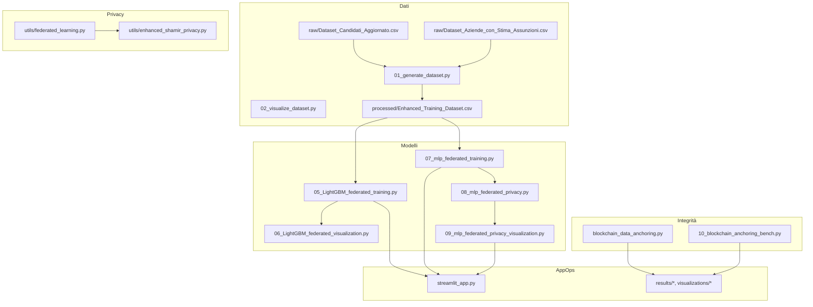

# Documentazione Tecnica — Sistema di Collocamento Mirato
_Ultimo aggiornamento: 2025-08-23 23:38_

## Indice
- [1. Introduzione](#1-introduzione)
- [2. Architettura](#2-architettura)
- [3. Struttura Progetto](#3-struttura-progetto)
- [4. Contratti Dati & Schemi](#4-contratti-dati--schemi)
- [5. Feature Engineering](#5-feature-engineering)
- [6. Modellazione](#6-modellazione)
- [7. Apprendimento Federato](#7-apprendimento-federato)
- [8. Privacy & Sicurezza](#8-privacy--sicurezza)
- [9. Anchoring Blockchain](#9-anchoring-blockchain)
- [10. Risultati & Benchmark](#10-risultati--benchmark)
- [11. API per Modulo](#11-api-per-modulo)
- [12. CLI & Configurazione](#12-cli--configurazione)
- [13. Deployment & Operazioni](#13-deployment--operazioni)
- [14. Osservabilità & Test](#14-osservabilità--test)
- [15. Ottimizzazione Performance](#15-ottimizzazione-performance)
- [16. Troubleshooting](#16-troubleshooting)
- [17. Conformità (GDPR)](#17-conformità-gdpr)
- [18. Roadmap](#18-roadmap)
- [Appendice A — Doc Tecniche Precedenti](#appendice-a--doc-tecniche-precedenti)
- [Appendice B — Report Esperimenti](#appendice-b--report-esperimenti)

## 1. Introduzione
Documento rivolto a sviluppatori e operatori tecnici. Copre design interno, modelli dati, pipeline di training (centralizzato e federato), meccanismi di privacy (Shamir + DP) e sottosistema di anchoring. Allinea la **struttura reale** del progetto ed estende il materiale precedente.

## 2. Architettura
Architettura a strati:
- **Dati**: intake grezzo → estensione → tabelle di training.
- **Learning**: LightGBM centralizzato e MLP FedAvg con aggregatori robusti.
- **Privacy**: secure aggregation (Shamir) + DP (RDP).
- **Integrità**: anchoring Merkle con prove.
- **UI/Ops**: UI Streamlit, script, Docker, health check.

```mermaid
flowchart TB
  R[CSV Grezzi] --> E[Estensione & Pulizia]
  E --> P[Tabella di Training]
  P --> CB[Baseline Centralizzata]
  P --> FL[FL]
  FL --> SA[Secure Aggregation (Shamir)]
  SA --> DP[DP (RDP)]
  CB --> A[Artefatti]
  DP --> A
  A --> M[Commit Merkle]
  M --> Z[Prove Inclusione]
  Z --> V[Verifica]
  A --> UI[UI Streamlit]
```

## 3. Struttura Progetto
```
📁 Disability Job Matching System/
├── 📄 README.md                          # This file (English)
├── 📄 README_IT.md                       # Italian version
├── ⚙️ config.yaml                        # System configuration
├── 📄 requirements.txt                   # Python dependencies
├── 🐍 streamlit_app.py                   # 🎯 MAIN APPLICATION
│
├── 📁 data/
│   ├── 📁 raw/                          # Original input data
│   │   ├── Dataset_Candidati_Aggiornato.csv
│   │   └── Dataset_Aziende_con_Stima_Assunzioni.csv
│   └── 📁 processed/                    # Generated/extended datasets
│       ├── Dataset_Candidati_Aggiornato_Extended.csv
│       ├── Dataset_Aziende_con_Stima_Assunzioni_Extended.csv
│       └── Enhanced_Training_Dataset.csv  # 📊 ML TRAINING DATA
│
├── 📁 scripts/                          # Data processing pipeline
│   ├── 01_generate_dataset.py          # Data extension + synthetic training generation
│   ├── 02_visualize_dataset.py         # Data analysis and visualization
│   ├── 03_train_models.py              # 🤖 ML MODEL TRAINING
│   ├── 04_analyze_results.py           # Performance analysis and reporting
│   ├── 05_LightGBM_federated_training.py # 🔬 FEDERATED LEARNING PIPELINE (LightGBM_Optimized)
│   ├── 06_LightGBM_federated_visualization.py # 📊 FEDERATED RESULTS VISUALIZATION (LightGBM_Optimized)
│   ├── 07_mlp_federated_training.py    # 🔄 CLASSICAL FEDERATED LEARNING
│   ├── 08_mlp_federated_privacy.py     # 🔐 PRIVACY-PRESERVING FEDERATED LEARNING  
│   ├── 09_mlp_federated_privacy_visualization.py # 📊 FEDERATED RESULTS COMPARISON
│   ├── blockchain_data_anchoring.py # ⛓️ BLOCKCHAIN DATA INTEGRITY PIPELINE
│   └── 10_blockchain_anchoring_bench.py # 📈 BLOCKCHAIN PERFORMANCE BENCHMARKS
│
├── 📁 utils/                            # Core business logic
│   ├── __init__.py
│   ├── feature_engineering.py          # Data augmentation utilities
│   ├── scoring.py                       # 🎯 MATCHING ALGORITHM CORE
│   ├── parallel_training.py            # ⚡ MULTI-THREADED ML TRAINING
│   ├── visualization.py                # Chart generation utilities
│   └── enhanced_shamir_privacy.py       # 🔒 SHAMIR SECRET SHARING + DIFFERENTIAL
│
├── 📁 results/                          # Training outputs
│   ├── 📁 learning_curves/             # Training progression charts
│   ├── 🤖 *.joblib                     # Trained ML models (7 models)
│   ├── 📊 merged_model_summary.csv     # Performance metrics
│   └── 📈 *.png                        # Analysis visualizations
│
├── 📁 results_LightGBM_federated/   # Federated learning results (LightGBM_Optimized)
│   ├── 📁 regional_models/          # Individual regional models  
│   ├── 📁 federated_models/         # Aggregated global models
│   ├── 📁 centralized_models/       # Baseline centralized models
│   ├── 📁 visualizations/           # Analysis charts and graphs
│   ├── 📊 complete_model_comparison.csv # Three-way performance comparison
│   └── 📋 experiment_metadata.json  # Complete experimental metadata
│
├── 📁 results_mlp_federated/           # Classical federated learning results
├── 📁 results_mlp_federated_privacy/   # Privacy-preserving federated results  
├── 📁 results_blockchain_demo/         # Blockchain anchoring demonstrations
└── 📁 visualizations_federated_comparison/ # Federated learning comparison charts
│
└── 📁 docs/                             # Documentation
    ├── user_guide_italiano.md          # Operator manual (Italian)
    ├── technical_documentation.md      # Developer documentation
    ├── deployment_guide.md             # Production setup guide
    ├── api_reference.md                # Code documentation
    └── demo_example.pdf                # Interface usage example
```

## 4. Contratti Dati & Schemi
- **Input grezzi**: `Dataset_Candidati_Aggiornato.csv`, `Dataset_Aziende_con_Stima_Assunzioni.csv`.
- **Processati**: varianti estese e `Enhanced_Training_Dataset.csv`.
- **Linee guida**:
  - Coerenza dei nomi colonne tra regioni.
  - Versionare cambi schema; `SCHEMA.md` consigliato.
  - Salvare campi derivati per riproducibilità.

## 5. Feature Engineering
- Scaling robusto, encoding categoriche, gestione mancanti.
- **SMOTE** opzionale post-split.
- Feature geospaziali: distanza entro raggio configurabile (default 30 km).

## 6. Modellazione
- **LightGBM_Optimized**: baseline per dati tabellari.
- **MLP**: per FL; aggregatori robusti.
- **Calibrazione**: sigmoid/isotonic.
- **Metriche**: F1, ROC-AUC, accuracy; matrici di confusione per regione.
- **Artefatti**: `*.joblib`, `merged_model_summary.csv`, `*.png`, `learning_curves/`.

## 7. Apprendimento Federato
- **Percorso LightGBM** (ensemble regionale): modelli per regione → ensemble pesato.
- **Percorso MLP** (FedAvg reale): aggiornamenti locali per round; aggregatori FedAvg/trimmed/coordinate.
- **Riproducibilità**: seed deterministici; coorti client stabili; preprocessing coerente.
- **Cartelle risultati**:
  - `results_LightGBM_federated/` → `regional_models/`, `federated_models/`, `centralized_models/`, `visualizations/`, `complete_model_comparison.csv`, `experiment_metadata.json`.
  - `results_mlp_federated/`, `results_mlp_federated_privacy/`.

## 8. Privacy & Sicurezza
- **Secure Aggregation (Shamir)**: soglia (es. 3-of-5), mascheramento per parametro, recupero dropout.
- **Privacy Differenziale**: clipping e singolo rumore gaussiano per round; accounting RDP.
- **Controlli Operativi**: access control su `data/`/`results/`, manifest di audit, retention minima.

## 9. Anchoring Blockchain
- **Commit Merkle**: albero deterministico sugli artefatti; prove O(log n).
- **Utility**: `blockchain_data_anchoring.py`, `10_blockchain_anchoring_bench.py`.
- **Casi d'uso**: integrità per report pubblici e verifiche terze.

## 10. Risultati & Benchmark
- Confronti centralizzato/regionale/federato consolidati.
- Risultati FL con privacy con tracciamento ε/δ.
- Benchmark anchoring con tempi di build/prova/verifica.

### Report incorporati
# COMPREHENSIVE FEDERATED LEARNING ANALYSIS REPORT
# Disability Employment Matching System
# Generated: 2025-08-21 20:24:13
# Author: Claude Sonnet 4

## EXECUTIVE SUMMARY
This experiment compares three machine learning approaches for disability employment matching:
- Centralized Learning: F1-Score = 0.9012
- Regional Learning: F1-Score = 0.9001
- Federated Learning: F1-Score = 0.9007

Key Finding: Federated learning achieves -0.0005 F1-score improvement over centralized approach.

## SYSTEM CONFIGURATION
Model Type: LightGBM with CalibratedClassifierCV
Preprocessing Pipeline: RobustScaler → SelectKBest → SMOTE → Calibration
Aggregation Method: Weighted Ensemble (FedAvg approximation for tree models)
Regional Divisions: 5 Employment Centers (CPI)
Geographic Coverage: Veneto Region, Italy

## COMPLETE FILE STRUCTURE AND DATA LOCATIONS

### Training Data
```
data/
├── processed/
│   └── Enhanced_Training_Dataset.csv          # Original full dataset (500k samples)
└── federated/
    ├── CPI_Verona_training_data.csv           # Regional training data
    ├── CPI_Vicenza_training_data.csv           # Regional training data
    ├── CPI_Padova_training_data.csv           # Regional training data
    ├── CPI_Treviso_training_data.csv           # Regional training data
    ├── CPI_Venezia_training_data.csv           # Regional training data
    └── regional_statistics.csv               # Data distribution statistics
```

### Model Files Structure
```
results_federated/
├── regional_models/                          # Individual regional models
│   ├── CPI_Verona_complete_model.joblib      # Complete regional model + preprocessing
│   ├── CPI_Vicenza_complete_model.joblib      # Complete regional model + preprocessing
│   ├── CPI_Padova_complete_model.joblib      # Complete regional model + preprocessing
│   ├── CPI_Treviso_complete_model.joblib      # Complete regional model + preprocessing
│   ├── CPI_Venezia_complete_model.joblib      # Complete regional model + preprocessi

# PRODUCTION MLP FEDERATED LEARNING EXPERIMENT SUMMARY
Generated: 2025-08-21 18:21:47

## CRITICAL FIXES IMPLEMENTED
### 1. Deterministic Seeding (SHA256)
- FIXED: Replaced hash() with SHA256 for true reproducibility
- No more random salt between Python runs
- Deterministic region-specific seeds guaranteed

### 2. Proper Imputation Order
- FIXED: Removed fillna(0) that polluted global medians
- Only use global medians for consistent imputation
- No zero contamination in missing column handling

### 3. Correct Region-Weight Logging
- FIXED: Proper alignment of regions and weights in logs
- Track trained_regions list to prevent mismatched logging
- No more misleading weight assignments

### 4. Truly Balanced Warm-up
- FIXED: Uses minimum class count for true balance
- Equal samples per class regardless of original distribution
- Reduces variance in initial training steps

### 5. Weighted ROC-AUC with NaN Handling
- FIXED: Re-normalizes weights for non-NaN values
- Proper handling when some regions have single-class test sets
- No more weight loss due to NaN propagation

### 6. Deterministic Template Selection
- FIXED: Uses alphabetically first region for template
- Removes hidden source of non-determinism
- Consistent across different OS/filesystem orders

### 7. Enhanced Error Handling
- SMOTE fallback to RandomOverSampler
- Safe metrics calculation with zero_division guards
- Zero-weight protection in aggregation
- Auto-discovery of regional datasets
- Oversampling ratio logging

## Performance Results
### Unweighted Averages
Federated F1-Score: 0.7882
Federated Accuracy: 0.6951
Federated ROC-AUC: 0.7169

### Weighted Averages (by test sample size)
Weighted F1-Score: 0.7880
Weighted Accuracy: 0.6949
Weighted ROC-AUC: 0.7168

## Comparison with Centralized
Centralized F1-Score: 0.8276
Unweighted vs Centralized: -0.0394
Weighted vs Centralized: -0.0396
Status: Federated learning competitive

## Training Progression
Aggregation Method: fedavg

Round 1: Unweighted F1=0.

ENHANCED SHAMIR SECRET SHARING - ALL CRITICAL FIXES COMPLETE


================================================================================

COMPREHENSIVE TEST: Enhanced Privacy-Preserving Shamir (FINAL)

================================================================================

Configuration: 3-of-5

Prime: 2305843009213693951 (61 bits)

DP: ε=1.0, σ\_client=0.0611


Test 1: Critical Edge Cases (Final)

------------------------------------------------------------

&nbsp;  1: PASS | Orig:   0.000000 | Recon:   0.000000 | Err: 0.00e+00

&nbsp;  2: PASS | Orig:   1.000000 | Recon:   1.000000 | Err: 0.00e+00

&nbsp;  3: PASS | Orig:  -1.000000 | Recon:  -1.000000 | Err: 0.00e+00

&nbsp;  4: PASS | Orig:   3.141590 | Recon:   3.141590 | Err: 0.00e+00

&nbsp;  5: PASS | Orig:  -2.718280 | Recon:  -2.718280 | Err: 0.00e+00

&nbsp;  6: PASS | Orig: 1000.000000 | Recon: 1000.000000 | Err: 0.00e+00

&nbsp;  7: PASS | Orig: -1000.000000 | Recon: -1000.000000 | Err: 0.00e+00

&nbsp;  8: PASS | Orig:   0.001000 | Recon:   0.001000 | Err: 0.00e+00

&nbsp;  9: PASS | Orig:  -0.001000 | Recon:  -0.001000 | Err: 0.00e+00

&nbsp; 10: PASS | Orig:   0.000010 | Recon:   0.000010 | Err: 0.00e+00

&nbsp; 11: PASS | Orig:  -0.000010 | Recon:  -0.000010 | Err: 0.00e+00

&nbsp; 12: PASS | Orig: -12.368791 | Recon: -12.368791 | Err: 2.99e-07

&nbsp; Result: 12/12 passed


Test 2: Vectorized Operations

------------------------------------------------------------

&nbsp; 1: PASS | Size:    3 | Max Error: 0.00e+00 | Time: 0.000s

&nbsp; 2: PASS | Size:    3 | Max Error: 0.00e+00 | Time: 0.000s

&nbsp; 3: PASS | Size:    3 | Max Error: 0.00e+00 | Time: 0.000s

&nbsp; 4: PASS | Size:   50 | Max Error: 4.97e-07 | Time: 0.001s

&nbsp; 5: PASS | Size:    4 | Max Error: 0.00e+00 | Time: 0.000s

&nbsp; Result: 5/5 passed


Test 3: FIXED Secure Aggregation (Correct L2 Formula)

------------------------------------------------------------

&nbsp; Secure aggregation completed

&nbsp; Agg

# Blockchain Anchoring Benchmark Results
Generated: 2025-08-22T22:31:09.960633

## Environment
- Python: 3.13.5
- CPU: 16 cores @ 2516 MHz
- RAM: 62.8 GB total
- Platform: win32

## Build Performance (Enhanced Measurements)
### Timing Breakdown
- 100 records: 2.28s total (KDF: 1.58s, Tree: 0.45s, Prepare: 0.02s)
- 1,000 records: 30.47s total (KDF: 21.15s, Tree: 6.04s, Prepare: 0.26s)
- 10,000 records: 344.07s total (KDF: 239.40s, Tree: 68.40s, Prepare: 2.07s)
### Memory Usage
- 100 records: RSS 0.0MB, Traced 0.3MB
- 1,000 records: RSS 1.7MB, Traced 1.6MB
- 10,000 records: RSS 22.2MB, Traced 16.0MB

## Proof Generation Performance (Enhanced)
### O(log n) Performance (with saved levels)
- 100 records: 1.11ms avg, 224 bytes actual (448 hex)
- 1,000 records: 2.61ms avg, 320 bytes actual (640 hex)
- 10,000 records: 20.65ms avg, 448 bytes actual (896 hex)

## Verification Performance (Enhanced)
- Average verification time: 24.49ms
- Success rate (correct password): 100.00%
- False positive rate (wrong password): 0.00%
- Error rate (verification failures): 0.00%
- Total verification errors: 0

## Key Insights (Enhanced Analysis)
- Memory scaling: RSS 507.2x, Traced 56.0x for 100.0x more records
- KDF vs Tree timing breakdown:
  - 10,000 iterations: KDF 66.9%, Tree 19.1% of total time
  - 50,000 iterations: KDF 69.3%, Tree 19.8% of total time
  - 100,000 iterations: KDF 69.8%, Tree 20.0% of total time
- Proof size scaling:
  - 100 records: 7.0 nodes (expected ~7), 224 bytes (50.0% of hex)
  - 1,000 records: 10.0 nodes (expected ~10), 320 bytes (50.0% of hex)
  - 10,000 records: 14.0 nodes (expected ~14), 448 bytes (50.0% of hex)

## Files Generated
- build_metrics.csv: Enhanced build phase performance data
- proof_metrics.csv: Proof generation with accurate byte sizes
- verify_metrics.csv: Verification timing with error tracking
- anchor_metrics.csv: Blockchain interaction with unique periods
- environment_info.json: System configuration
- bench.log: Detailed execution log


## 11. API per Modulo
### enhanced_shamir_privacy.py
**Classes**
- `SecretShare()`
- `ShamirConfig()`
- `DifferentialPrivacyConfig()`
- `CryptographicSeedManager()`
- `EnhancedShamirSecretSharing()`
- `LayerDPManager()`
- `SecureAggregationProtocol()`
**Functions**
- `__post_init__(self)`
- `__init__(self, master_key: Optional[bytes] = None)`
- `__init__(self, config: ShamirConfig)`
- `__init__(self, dp_config: DifferentialPrivacyConfig)`
- `calibrate_layer_parameters(self, layer_name: str, layer_shape: Tuple[int, ...])`
- `comprehensive_test()`
- `production_integration_example()`

### federated_data_splitter.py
**Classes**
- `VenetoFederatedSplitter()`
**Functions**
- `__init__(self)`
- `main()`

### federated_learning.py
**Classes**
- `FederatedModel()`
- `FederatedTrainer()`
**Functions**
- `predict(self, X)`
- `predict_proba(self, X)`
- `_apply_preprocessing(self, X)`
- `__init__(self, base_model_class=lgb.LGBMClassifier, **model_params)`
- `_apply_full_preprocessing(self, X, y, validation_split, random_state)`
- `main()`

### blockchain_data_anchoring.py
**Classes**
- `UserRecord()`
- `KDFParams()`
- `CanonicalSchema()`
- `MerkleProof()`
- `UserReceipt()`
- `DataCanonicalizer()`
- `MerkleTree()`
- `KDFManager()`
- `BlockchainAnchor()`
- `BlockchainDataAnchoringPipeline()`
**Functions**
- `__init__(self, schema: CanonicalSchema)`
- `__init__(self, hash_algorithm: str = 'sha256', use_domain_separation: bool = True)`
- `__init__(self, config: Dict[str, Any])`
- `__init__(self, rpc_mode: str = 'eth-tester', rpc_url: Optional[str] = None)`
- `_initialize_blockchain(self)`
- `__init__(self, output_dir: str)`
- `main()`

### 05_LightGBM_federated_training.py
**Classes**
- `FederatedAveraging()`
**Functions**
- `__init__(self, base_model_params=None)`
- `load_regional_data_files(self)`
- `train_all_regional_models(self, regional_datasets)`
- `extract_model_parameters(self, lgb_model)`
- `federated_averaging(self, communication_rounds=1)`
- `evaluate_all_models(self, test_datasets)`
- `save_results(self, comparison_df)`
- `create_test_datasets(regional_datasets, test_split=0.2, random_state=42)`
- `generate_comprehensive_report(comparison_df, federated_trainer)`
- `main()`

### 06_LightGBM_federated_visualization.py
**Functions**
- `setup_academic_style()`
- `load_real_data()`
- `analyze_regional_characteristics(regional_datasets)`
- `create_performance_comparison_real(comparison_df, colors)`
- `create_regional_characteristics_analysis(regional_analysis, colors)`
- `create_real_data_summary_dashboard(comparison_df, regional_analysis, colors)`
- `_get_color(name, default)`
- `_wrap_text(s, w)`
- `_rotate_xticks(ax, rot=20)`
- `_wrap_xticks(ax, width=14)`
- `_pad_ylim(ax, vals, frac=0.18, min_span=1e-3)`
- `_autolabel(ax, bars, fmt="{:.3f}", inside=True)`
- `create_federated_vs_centralized_real_analysis(comparison_df, colors)`
- `main()`

### 07_mlp_federated_training.py
**Classes**
- `RobustGlobalPreprocessor()`
- `ProductionMLPFederatedTrainer()`
**Functions**
- `__init__(self, seed: int = 42)`
- `__init__(self, mlp_config: Dict, federated_config: Dict)`
- `auto_discover_regional_datasets()`
- `load_and_split_regional_datasets()`
- `evaluate_global_model(trainer, global_model, regional_test_data)`
- `compare_with_centralized()`
- `save_federated_results(trainer, global_model, results_df, centralized_metrics)`
- `main()`

### 08_mlp_federated_privacy.py
**Classes**
- `RobustGlobalPreprocessor()`
- `PrivacyPreservingMLPFederatedTrainer()`
**Functions**
- `__init__(self, seed: int = 42)`
- `__init__(self, mlp_config: Dict, federated_config: Dict, privacy_config: Dict)`
- `auto_discover_regional_datasets()`
- `load_and_split_regional_datasets()`
- `evaluate_global_model(trainer, global_model, regional_test_data)`
- `compare_with_centralized()`
- `save_federated_results(trainer, global_model, results_df, centralized_metrics)`
- `main()`

### 09_mlp_federated_privacy_visualization.py
**Classes**
- `FederatedResultsAnalyzer()`
- `FederatedResultsAnalyzer()`
**Functions**
- `__init__(self)`
- `main()`
- `__init__(self)`
- `main()`


## 12. CLI & Configurazione
- Esempio `config.yaml`:
```yaml
seed: 42
paths:
  training_csv: data/processed/Enhanced_Training_Dataset.csv
  results_dir: results
ui:
  distance_max_km: 30
federated:
  rounds: 10
  min_clients: 3
  aggregator: fedavg
privacy:
  enabled: true
  dp: { epsilon: 1.0, delta: 1e-6, max_grad_norm: 1.0, accountant: rdp }
  secure_agg: { scheme: shamir, threshold: 3-of-5, dropout_recovery: true }
anchoring:
  enabled: true
  backend: merkle
```
- **Esempi CLI**:
```bash
python scripts/03_train_models.py --config config.yaml
python scripts/05_LightGBM_federated_training.py
python scripts/06_LightGBM_federated_visualization.py
python scripts/07_mlp_federated_training.py --aggregator trimmed_mean
python scripts/08_mlp_federated_privacy.py --dp.epsilon 1.0 --secure_agg.threshold 3-of-5
python scripts/09_mlp_federated_privacy_visualization.py
python scripts/blockchain_data_anchoring.py
python scripts/10_blockchain_anchoring_bench.py
```

## 13. Deployment & Operazioni
- **Locale**: `pip install -r requirements.txt` → `streamlit run streamlit_app.py`.
- **Docker**: includere `curl`; porta 8501; utente non‑root consigliato.
- **Gestione artefatti**: backup `results/`; log dei budget privacy.

## 14. Osservabilità & Test
- Unit test per feature engineering e scoring; smoke test per loop FL.
- Logging: metriche per round e accounting DP; export CSV/JSON.
- Script di visualizzazione per sanity check e regressioni.

## 15. Ottimizzazione Performance
- Ridurre round per iterazioni veloci; aggregatori robusti con client eterogenei.
- Cache feature; profilazione I/O; thread fissi.
- Monitorare norme gradiente per calibrare il clipping DP.

## 16. Troubleshooting
- Librerie mancanti → `pip install -r requirements.txt`.
- Errore `_safe_tags` sklearn → allineare versioni con `imbalanced-learn`.
- Healthcheck → assicurare `curl`; verificare `/_stcore/health`.

## 17. Conformità (GDPR)
- Ruoli (titolare/responsabile), basi giuridiche, DPIA, DSR.
- Elaborazione locale; condivisione solo di delta; retention documentata.

## 18. Roadmap
- Budget DP adattivo; secure aggregation su scala; portale pubblico di verifica.

## Appendice A — Doc Tecniche Precedenti
# Documentazione Tecnica — Sistema di Collocamento Mirato
_Ultimo aggiornamento: 2025-08-23 23:34_

## 1. Scopo e Perimetro

Questo documento descrive per gli sviluppatori l’architettura, i contratti dati, gli algoritmi core, l’Apprendimento Federato privacy‑preserving e i meccanismi di integrità. Integra README e guide utente/deployment con **dettagli implementativi**, **interfacce dei moduli** e **considerazioni operative**. Tutto è allineato alla struttura attuale del repository.

**Fuori ambito**: istruzioni UX (vedi guida utente), policy amministrative, integrazioni terze non presenti nel repository.

---

## 2. Architettura di Alto Livello

La piattaforma è composta da cinque strati:

1) **Dati** — ingest dei CSV, estensione/augmentation, tabella canonica di training.  
2) **Modellazione** — pipeline LightGBM_Optimized e MLP (centralizzato + federato).  
3) **Privacy** — secure aggregation con Condivisione Segreta di Shamir, Privacy Differenziale con accounting RDP.  
4) **Integrità** — commit Merkle per artefatti e manifest, prove di inclusione e verificatori.  
5) **Applicazione & Ops** — UI Streamlit, script di visualizzazione, logging e deployment.



---

## 3. Struttura del Repository (autorevole)

```
📁 Disability Job Matching System/
├── README.md / README_IT.md
├── config.yaml
├── requirements.txt
├── streamlit_app.py
│
├── data/
│   ├── raw/
│   │   ├── Dataset_Candidati_Aggiornato.csv
│   │   └── Dataset_Aziende_con_Stima_Assunzioni.csv
│   └── processed/
│       ├── Dataset_Candidati_Aggiornato_Extended.csv
│       ├── Dataset_Aziende_con_Stima_Assunzioni_Extended.csv
│       └── Enhanced_Training_Dataset.csv
│
├── scripts/
│   ├── 01_generate_dataset.py
│   ├── 02_visualize_dataset.py
│   ├── 03_train_models.py
│   ├── 04_analyze_results.py
│   ├── 05_LightGBM_federated_training.py
│   ├── 06_LightGBM_federated_visualization.py
│   ├── 07_mlp_federated_training.py
│   ├── 08_mlp_federated_privacy.py
│   ├── 09_mlp_federated_privacy_visualization.py
│   ├── blockchain_data_anchoring.py
│   └── 10_blockchain_anchoring_bench.py
│
├── utils/
│   ├── __init__.py
│   ├── feature_engineering.py
│   ├── scoring.py
│   ├── parallel_training.py
│   ├── visualization.py
│   └── enhanced_shamir_privacy.py
│
├── results/
│   ├── learning_curves/
│   ├── *.joblib
│   ├── merged_model_summary.csv
│   └── *.png
│
├── results_LightGBM_federated/
│   ├── regional_models/
│   ├── federated_models/
│   ├── centralized_models/
│   ├── visualizations/
│   ├── complete_model_comparison.csv
│   └── experiment_metadata.json
│
├── results_mlp_federated/
├── results_mlp_federated_privacy/
├── results_blockchain_demo/
└── visualizations_federated_comparison/
```

---

## 4. Contratti Dati e Schemi

### 4.1 Input grezzi
- **Dataset_Candidati_Aggiornato.csv** — anagrafica candidati (ID, skill, mobilità, vincoli, geo).  
- **Dataset_Aziende_con_Stima_Assunzioni.csv** — ruoli aziendali (ID, skill richieste, località, vincoli).

> **Convenzioni**  
> - CSV UTF‑8 con header.  
> - ID stabili lungo gli aggiornamenti.  
> - Lat/long in WGS84 quando presenti; altrimenti geocoding (locale).

### 4.2 Output processati
- **Dataset_Candidati_Aggiornato_Extended.csv** — feature candidati normalizzate/arricchite.  
- **Dataset_Aziende_con_Stima_Assunzioni_Extended.csv** — feature ruoli normalizzate.  
- **Enhanced_Training_Dataset.csv** — tabella di training canonica.

**Campi comuni (esempio)**  
- `candidate_id`, `company_role_id`, `distance_km`, `compatibility_score`, `readiness_score`,  
  feature ingegnerizzate e target se disponibile storico.

---

## 5. Feature Engineering

Modulo: `utils/feature_engineering.py`

- **Normalizzazione & encoding**: robust scaling, gestione coerente delle categorie.  
- **Valori mancanti**: strategie dedicate per tipo di feature.  
- **Sbilanciamento**: **SMOTE** solo sui fold di training.  
- **Geospaziale**: distanza ortodromica; raggio default **30 km** (configurabile).  
- **Controlli qualità**: validazione schema, outlier base, riproducibilità tramite seed.

---

## 6. Pipeline di Modellazione

### 6.1 LightGBM_Optimized (centralizzato & regionale)
- Iperparametri con Optuna, early stopping.  
- Probabilità calibrate (sigmoid / isotonic).  
- **Regionale**: un modello per regione → **ensemble pesato** per numerosità campioni.  
- Artefatti in `results/` (centralizzato) e `results_LightGBM_federated/*`.

### 6.2 MLP (abilitato al FL)
- Classificatore MLP con inizializzazione riproducibile.  
- **Famiglia FedAvg** con `utils/federated_learning.py`:
  - `fedavg`, `trimmed_mean`, `coordinate_median`.  
- Batch size, LR, round configurabili; seed deterministici.

**Valutazione**  
- Principali: F1 (pesato), ROC‑AUC, accuracy.  
- Matrici di confusione per regione; metriche FL per round.

---

## 7. Apprendimento Federato (FL)

### 7.1 Topologia client & partizionamento
- Dati **partizionati logicamente per regione**; ogni regione è un client.  
- Utility di scoperta/split in `scripts/05_*` e `utils/federated_data_splitter.py` (se presente), altrimenti naming pattern CSV.

### 7.2 Strategie di aggregazione
- **FedAvg** (default): media pesata dei delta dei client.  
- **Trimmed Mean**: scarta estremi per coordinata.  
- **Coordinate Median**: robusto ad outlier avversari; più costoso.

### 7.3 Failure & dropout
- Quorum minimo (`min_clients`); se non rispettato, round saltato o ripianificato.  
- Reseeding deterministico; log di client e numerosità campioni.

### 7.4 Riproducibilità
- `seed` globale fissato.  
- Artefatti versionati; `merged_model_summary.csv` consolida le metriche.  
- Separazione netta train/validation prima di resampling o DP.

---

## 8. FL con Privacy

Modulo: `utils/enhanced_shamir_privacy.py`

### 8.1 Secure Aggregation (Shamir)
- **Schema a soglia** (es. 3‑of‑5) che spezza gli aggiornamenti in share.  
- Semi deterministici per mascheramento; il server vede solo delta mascherati.  
- **Recupero dropout**: il quorum ricostruisce la maschera e il round rimane valido.

**Proprietà**
- L’aggregatore **non** osserva aggiornamenti individuali in chiaro.  
- Le maschere si cancellano a somma, lasciando visibile solo la **somma**.

### 8.2 Privacy Differenziale (DP)
- **Clipping per round**, poi **singola** iniezione di rumore gaussiano.  
- **Accounting RDP** per comporre le perdite di privacy sui round → (ε, δ).  
- Configurazione in `config.yaml: privacy.*`.

**Trappole evitate**
- Niente doppio rumore.  
- Clipping **prima** del rumore.  
- Log di progressione ε, δ e norm di clipping.

---

## 9. Anchoring Stile Blockchain

Script: `blockchain_data_anchoring.py`, `10_blockchain_anchoring_bench.py`

- **Commit Merkle** su manifest di artefatti/metriche.  
- **Prove di inclusione** per verifica O(log n).  
- Benchmark riportano:
  - tempi di build per 100/1k/10k item,
  - tempo medio di generazione prova e dimensione,
  - tempo medio di verifica.

**Output**
- `results_blockchain_demo/` e CSV/JSON di benchmark; eventuali diagrammi in `visualizations_federated_comparison/`.

---

## 10. Riferimento Configurazione (`config.yaml`)

```yaml
seed: 42
paths:
  raw_candidates: data/raw/Dataset_Candidati_Aggiornato.csv
  raw_companies: data/raw/Dataset_Aziende_con_Stima_Assunzioni.csv
  processed_dir: data/processed
  training_csv: data/processed/Enhanced_Training_Dataset.csv
  results_dir: results
ui:
  distance_max_km: 30
training:
  model_set: ["LightGBM_Optimized", "MLP"]
  optuna_trials: 50
  calibration: "sigmoid"
federated:
  rounds: 10
  min_clients: 3
  aggregator: "fedavg"
  batch_size: 256
privacy:
  enabled: true
  dp:
    epsilon: 1.0
    delta: 1e-6
    max_grad_norm: 1.0
    accountant: "rdp"
  secure_agg:
    scheme: "shamir"
    threshold: "3-of-5"
    dropout_recovery: true
anchoring:
  enabled: true
  backend: "merkle"
  anchor_every_n: 1
```

---

## 11. Interfacce dei Moduli (selezione)

### 11.1 `utils/enhanced_shamir_privacy.py` (schema)
- `split_secret(vector, threshold, parties, seed) -> List[shares]`  
- `reconstruct(shares) -> vector`  
- `apply_mask(update, pairwise_seed) -> masked_update`  
- `rdp_accountant(steps, q, noise_multiplier) -> epsilon`

### 11.2 `utils/federated_learning.py` (schema)
- `aggregate_fedavg(updates, weights) -> update`  
- `aggregate_trimmed_mean(updates, trim_ratio) -> update`  
- `aggregate_coordinate_median(updates) -> update`  
- `set_seed(seed: int) -> None`

### 11.3 `scripts/05_*` / `07_*` / `08_*`
- CLI con override di aggregatori, round e parametri DP; output nelle cartelle `results_*` con metadata JSON.

---

## 12. Test & Valutazione

- **Unit test** per trasformazioni, scorer e primitive di aggregazione (consigliato `tests/`).  
- **Validazione offline**: k‑fold o split temporali; metriche per regione.  
- **Sanity check**:  
  - SMOTE solo su fold di training.  
  - Verifica norm di clipping e rumore DP per round.  
  - Pesi dell’ensemble coerenti con numerosità.  
  - Prove di anchoring verificate contro la root.

---

## 13. Deployment & Operazioni

- **Streamlit**: dashboard read‑only per matching e confronti.  
- **Docker**: includere `curl` per `/_stcore/health`.  
- **Logging**: metriche FL per round, budget DP, hash artefatti.  
- **Backup**: `results/` e `docs/`; storage immutabile per root di anchoring.

**Note prestazionali**
- Su macchine CPU limitate: ridurre `rounds` e `batch_size`; usare trimmed mean per robustezza con pochi client.  
- Cache per geocoding e feature intermedie per ridurre il cold start.

---

## 14. Sicurezza & Conformità

- **Minimizzazione**: solo feature ingegnerizzate escono dal nodo in FL.  
- **Controllo accessi**: restrizioni su `data/` e `results/`.  
- **GDPR**: ruoli titolare/responsabile, base giuridica, DSR (accesso/cancellazione), retention.  
- **Minacce considerate**: inferenza aggiornamenti lato server, dropout, aggiornamenti bizantini; mitigazioni con aggregazione robusta + DP.

---

## 15. Limitazioni Note

- Eterogeneità regionale può richiedere adattamento di dominio; l’ensemble aiuta ma non risolve ogni shift.  
- Il rumore DP introduce trade‑off di utilità; tarare ε per coorte e rischio.  
- Coordinate median è robusto ma più lento; usarlo su insiemi client piccoli.

---

## 16. Roadmap (tecnica)

- DP adattivo per coorti; clipping dinamico.  
- Secure aggregation cross‑silo a N elevati.  
- Portale pubblico di verifica e backend alternativi.  
- Validator di schema estesi e config tipizzati.

---

## 17. Appendici

### Appendice A — Documentazione Tecnica originale (testo integrale)
# 🔧 Documentazione Tecnica - Sistema di Raccomandazione per Collocamento Mirato

**Guida per Sviluppatori e Amministratori di Sistema**

---

## 📋 Panoramica

Questa documentazione tecnica fornisce informazioni complete per sviluppatori, amministratori di sistema e ricercatori che lavorano con il Sistema di Raccomandazione per Collocamento Mirato. Il sistema è costruito utilizzando un moderno stack Python ML con focus su scalabilità produzione e supporto lingua italiana.

### Architettura Sistema

```
┌─────────────────┐    ┌──────────────────┐    ┌─────────────────────┐
│   Dati Grezzi   │───▶│  Pipeline Dati   │───▶│  Dataset Potenziato │
│   (file CSV)    │    │  (Feature Eng.)  │    │  (Pronto Training)  │
└─────────────────┘    └──────────────────┘    └─────────────────────┘
                                │
                                ▼
┌─────────────────┐    ┌──────────────────┐    ┌─────────────────────┐
│  Modelli        │◀───│  Pipeline        │◀───│  Training           │
│  Addestrati     │    │  Training ML     │    │  Parallelo          │
│  (7 x .joblib)  │    │                  │    │  (ThreadPoolExec.)  │
└─────────────────┘    └──────────────────┘    └─────────────────────┘
         │
         ▼
┌─────────────────┐    ┌──────────────────┐
│  App Streamlit  │◀───│  Motore Matching │
│  (Produzione)   │    │  Real-time       │
└─────────────────┘    └──────────────────┘
```

---

## 🏗️ Componenti Principali

### 1. Pipeline Elaborazione Dati (`scripts/`)

#### `01_generate_dataset.py`
**Scopo**: Estende dati grezzi candidati/aziende e genera dataset training sintetico

**Funzioni Chiave**:
```python
# Estensione dati con feature engineering
df_cand_ext = extend_candidates_dataset(df_cand)
df_az_ext = extend_companies_dataset(df_az)

# Generazione dati training sintetici
scoring_system = EnhancedScoringSystem()
df_train = scoring_system.generate_enhanced_training_data(df_cand_ext, df_az_ext)
```

**Output**:
- `Dataset_Candidati_Aggiornato_Extended.csv`
- `Dataset_Aziende_con_Stima_Assunzioni_Extended.csv`
- `Enhanced_Training_Dataset.csv` (500K+ righe)

#### `03_train_models.py`
**Scopo**: Training parallelo modelli ML con ottimizzazione iperparametri

**Processo Chiave**:
1. **Preprocessing Dati**: SMOTE, RobustScaler, SelectKBest
2. **Ottimizzazione Iperparametri**: Optuna con 50 trial per modello
3. **Training Parallelo**: ThreadPoolExecutor con fino a 6 worker
4. **Calibrazione Modelli**: CalibratedClassifierCV per calibrazione probabilità

**Modelli Addestrati**:
- RandomForest_Optimized
- XGBoost_Optimized  
- LightGBM_Optimized
- HistGradientBoosting
- GradientBoosting
- MLP_Optimized
- ExtraTrees

### 2. Logica Business Principale (`utils/`)

#### `scoring.py` - Core Algoritmo Matching
**Scopo**: Implementa la logica probabilistica di matching candidato-azienda

**Classi Chiave**:
```python
class EnhancedScoringSystem:
    def __init__(self):
        self.thresholds = {
            'attitude_min': 0.3,
            'compatibility_min': 0.5,
            'distance_max': 40.0  # Nota: config.yaml default è 30
        }
    
    def compatibility_score(self, exclusions, company_text):
        # Analisi semantica TF-IDF italiana
        # Restituisce punteggio compatibilità 0.0-1.0
    
    def haversine_distance(self, lat1, lon1, lat2, lon2):
        # Calcolo distanza geografica preciso
        # Restituisce distanza in chilometri
    
    def generate_enhanced_training_data(self, df_cand, df_az):
        # Generazione outcome probabilistica
        # Crea dati training sintetici realistici
```

**Implementazione Formula Scoring**:
```python
prob = (
    0.3 * fattore_attitudine + 
    0.4 * fattore_compatibilità + 
    0.2 * fattore_distanza +
    0.05 * retention_rate + 
    0.025 * bonus_remoto + 
    0.025 * bonus_certificazione
)
outcome = 1 if (prob > 0.6 and np.random.random() < prob) else 0
```

#### `parallel_training.py` - Pipeline ML Multi-thread
**Scopo**: Training modelli ad alte prestazioni con monitoraggio risorse

**Caratteristiche Chiave**:
- **Ottimizzazione Iperparametri Parallela**: 3 studi Optuna concorrenti
- **Training Modelli Concorrente**: Fino a 6 modelli training simultaneamente
- **Monitoraggio Risorse Sistema**: Tracking uso CPU/Memoria con psutil
- **Preprocessing Avanzato**: SMOTE, RobustScaler, selezione feature

**Ottimizzazioni Performance**:
```python
# Ottimizzazione iperparametri parallela
with ThreadPoolExecutor(max_workers=3) as executor:
    futures = {
        executor.submit(self.optimize_random_forest, X, y): "random_forest",
        executor.submit(self.optimize_xgboost, X, y): "xgboost",
        executor.submit(self.optimize_lightgbm, X, y): "lightgbm"
    }

# Training modelli parallelo  
with ThreadPoolExecutor(max_workers=6) as executor:
    # Ogni modello si addestra indipendentemente con iperparametri ottimizzati
```

### 3. Interfaccia Produzione (`streamlit_app.py`)

#### Classe Applicazione Principale
```python
class JobMatchingDemo:
    def __init__(self):
        self.geolocator = Nominatim(user_agent="job_matching_system")
        self.loc_cache = {}  # Cache geocodifica per performance
        self.load_data()     # Carica dati reali o demo
        self.load_models()   # Carica modelli ML addestrati
    
    def find_matches(self, candidate_data, top_k=5, distance_threshold=30):
        # Matching real-time con parametri configurabili
        # Restituisce lista ordinata aziende compatibili
```

**Caratteristiche Chiave**:
- **Modalità Dati Doppia**: Rilevamento automatico dati reali vs demo
- **Geocodifica Real-time**: Nominatim cached con supporto indirizzi italiani
- **Configurazione Interattiva**: Controlli sidebar per soglie
- **Visualizzazioni Avanzate**: Grafici Plotly per analisi risultati

---

## 🔧 Sistema Configurazione

### Struttura `config.yaml`
```yaml
paths:
  raw_candidates: "data/raw/Dataset_Candidati_Aggiornato.csv"
  raw_companies: "data/raw/Dataset_Aziende_con_Stima_Assunzioni.csv"
  training_dataset: "data/processed/Enhanced_Training_Dataset.csv"
  model_output_dir: "results"

matching_thresholds:
  attitude_min: 0.3          # Soglia propensione al lavoro
  compatibility_min: 0.5     # Soglia compatibilità semantica  
  distance_max_km: 30        # Raggio ricerca default (NON 40!)
  match_probability_cutoff: 0.6

model_training:
  random_state: 42
  optuna_trials: 50          # Iterazioni ottimizzazione iperparametri
  n_jobs: 4                  # Core elaborazione parallela
  feature_selection_k: 50    # Top feature selezionate

geocoding:
  delay: 0.5                 # Rate limiting tra chiamate API
  timeout: 10                # Timeout richiesta
  user_agent: "disability-job-matcher-v1.0"
  cache_file: "data/processed/geocoding_cache.json"

italian_language:
  stop_words: ["di", "a", "da", "in", "con", "su", "per", ...]
  token_pattern: "\\b[a-zA-Zàèéìòù]+\\b"
```

### Caricamento Configurazione
```python
import yaml

def load_config():
    with open('config.yaml', 'r', encoding='utf-8') as file:
        return yaml.safe_load(file)

config = load_config()
thresholds = config['matching_thresholds']
```

---

## 🤖 Implementazione Machine Learning

### Architettura Pipeline Modelli

#### 1. Preprocessing Dati
```python
def prepare_data_for_training(df_train, test_size=0.2, random_state=42):
    # Preparazione feature
    y = df_train["outcome"]
    X = df_train.drop(columns=["outcome"]).fillna(df_train.median())
    
    # Split train-test con stratificazione
    X_train, X_test, y_train, y_test = train_test_split(
        X, y, test_size=test_size, stratify=y, random_state=random_state
    )
    
    # Scaling robusto (migliore per outlier di StandardScaler)
    scaler = RobustScaler()
    X_train_scaled = scaler.fit_transform(X_train)
    X_test_scaled = scaler.transform(X_test)
    
    # Selezione feature
    selector = SelectKBest(score_func=f_classif, k=min(50, X_train_scaled.shape[1]))
    X_train_sel = selector.fit_transform(X_train_scaled, y_train)
    X_test_sel = selector.transform(X_test_scaled)
    
    # Bilanciamento classi con SMOTE
    smote = SMOTE(random_state=random_state)
    X_train_final, y_train_final = smote.fit_resample(X_train_sel, y_train)
    
    return {
        "X_train": X_train_final,
        "y_train": y_train_final,
        "X_test": X_test_sel,
        "y_test": y_test,
        "scaler": scaler,
        "selector": selector
    }
```

#### 2. Ottimizzazione Iperparametri con Optuna
```python
def optimize_random_forest(self, X, y):
    def objective(trial):
        model = RandomForestClassifier(
            n_estimators=trial.suggest_int("n_estimators", 100, 300),
            max_depth=trial.suggest_int("max_depth", 5, 20),
            min_samples_split=trial.suggest_int("min_samples_split", 2, 10),
            min_samples_leaf=trial.suggest_int("min_samples_leaf", 1, 5),
            class_weight='balanced',
            random_state=self.random_state,
            n_jobs=2
        )
        
        # Cross-validation 3-fold per valutazione robusta
        scores = []
        skf = StratifiedKFold(n_splits=3)
        for train_idx, val_idx in skf.split(X, y):
            model.fit(X[train_idx], y[train_idx])
            preds = model.predict(X[val_idx])
            scores.append(f1_score(y[val_idx], preds))
        
        return np.mean(scores)
    
    study = optuna.create_study(direction='maximize')
    study.optimize(objective, n_trials=50, n_jobs=1)
    return study
```

#### 3. Training e Calibrazione Modelli
```python
def train_model(self, config, X_train, y_train, X_test, y_test):
    # Addestra modello base
    model = config['class'](**config['params'])
    model.fit(X_train, y_train)
    
    # Calibrazione probabilità per migliore ranking
    calibrated = CalibratedClassifierCV(model, method='isotonic', cv=3)
    calibrated.fit(X_train, y_train)
    
    # Valutazione
    preds = calibrated.predict(X_test)
    probs = calibrated.predict_proba(X_test)[:, 1]
    
    metrics = {
        'accuracy': accuracy_score(y_test, preds),
        'precision': precision_score(y_test, preds),
        'recall': recall_score(y_test, preds),
        'f1_score': f1_score(y_test, preds),
        'roc_auc': roc_auc_score(y_test, probs)
    }
    
    return {
        'model': calibrated,
        'metrics': metrics,
        'status': 'success'
    }
```

### Analisi Risultati Performance

**Performance Modelli Attuali** (su dati sintetici):
```
LightGBM_Optimized:    F1=0.901, ROC-AUC=0.708, Training=94.6s
XGBoost_Optimized:     F1=0.901, ROC-AUC=0.704, Training=132.3s  
HistGradientBoosting:  F1=0.900, ROC-AUC=0.715, Training=202.3s
```

**Perché ROC-AUC è Moderato (~0.70)**:
- Risultato intenzionale della generazione dati sintetici probabilistici
- Previene che i modelli memorizzino regole deterministiche
- F1-Score più rilevante per qualità ranking raccomandazioni
- Dati collocamento reali mostrerebbero probabilmente ROC-AUC più alto (0.80-0.90+)

---

## 🌍 Elaborazione Lingua Italiana

### Implementazione TF-IDF per Scoring Compatibilità
```python
def compatibility_score(self, exclusions, company_text):
    if pd.isna(exclusions) or not company_text:
        return 1.0
    
    exclusion_list = [e.strip().lower() for e in str(exclusions).split(',') if e.strip()]
    all_texts = exclusion_list + [company_text.lower()]
    
    # Configurazione TF-IDF specifica per italiano
    italian_stop_words = [
        'di', 'a', 'da', 'in', 'con', 'su', 'per', 'tra', 'fra', 'il', 'lo', 'la', 
        'i', 'gli', 'le', 'un', 'una', 'uno', 'e', 'o', 'ma', 'se', 'che', 'chi', 'cui'
    ]
    
    vectorizer = TfidfVectorizer(
        stop_words=italian_stop_words,
        token_pattern=r'\b[a-zA-Zàèéìòù]+\b',  # Caratteri accentati italiani
        lowercase=True,
        ngram_range=(1, 2),  # Unigrammi e bigrammi
        max_features=1000
    )
    
    tfidf_matrix = vectorizer.fit_transform(all_texts)
    company_vector = tfidf_matrix[-1]
    
    # Calcola similarità tra esclusioni e testo azienda
    similarities = []
    for i in range(len(exclusion_list)):
        sim = cosine_similarity(tfidf_matrix[i], company_vector)[0][0]
        similarities.append(sim)
    
    # Scoring pesato: 70% similarità max + 30% media
    max_sim = max(similarities) if similarities else 0
    avg_sim = np.mean(similarities) if similarities else 0
    final_score = 1.0 - (0.7 * max_sim + 0.3 * avg_sim)
    
    return max(0.0, min(1.0, final_score))
```

### Elaborazione Geografica per Italia
```python
def geocode_with_cache(self, address):
    """Geocodifica indirizzi italiani con caching"""
    if address in self.loc_cache:
        return self.loc_cache[address]
    
    try:
        # Nominatim con focus italiano
        location = self.geolocator.geocode(
            address + ", Italy",  # Forza contesto italiano
            timeout=10,
            country_codes=['IT']  # Restringe all'Italia
        )
        time.sleep(0.5)  # Rate limiting
        coords = (location.latitude, location.longitude) if location else (np.nan, np.nan)
    except Exception as e:
        print(f"Errore geocodifica per {address}: {e}")
        coords = (np.nan, np.nan)
    
    self.loc_cache[address] = coords
    return coords
```

---

## 📊 Schema Dati e Flusso

### Struttura Dati Input

#### Dataset Candidati
```
Colonne (Esteso):
- ID_Candidato: str
- Area di Residenza: str
- Titolo di Studio: str ['Licenza Media', 'Diploma', 'Laurea', 'Master']
- Tipo di Disabilità: str ['Motoria', 'Sensoriale', 'Intellettiva', 'Psichica', ...]
- Score Attitudine al Collocamento: float [0.0-1.0]
- Years_of_Experience: int
- Durata Disoccupazione: int (mesi)
- Esclusioni: str (separate da virgola)
- Lat, Lon: float (coordinate geocodificate)
```

#### Dataset Aziende
```
Colonne (Esteso):
- Nome Azienda: str
- Area di Attività: str
- Tipo di Attività: str
- Numero Dipendenti: int
- Compatibilità: str (descrizioni lavoro)
- Posizioni Aperte: int
- Remote: int [0, 1]
- Certification: int [0, 1]
- Retention_Rate: float [0.0-1.0]
- Company_Size: str ['small', 'medium', 'large']
- Lat_a, Lon_a: float (coordinate geocodificate)
```

### Struttura Dataset Training
```
Enhanced_Training_Dataset.csv:
- outcome: int [0, 1] (variabile target)
- attitude_score: float
- years_experience: int
- unemployment_duration: int
- compatibility_score: float
- distance_km: float
- company_size: int
- retention_rate: float
- remote_work: int
- certification: int
- match_probability: float
- edu_* : int (educazione codificata one-hot)
- dis_* : int (tipi disabilità codificati one-hot)
- sector_* : int (settori azienda codificati one-hot)

Dimensione tipica: 500.000+ righe, 50+ feature
```

---

## 🔧 Setup Sviluppo

### Prerequisiti
```bash
# Python 3.8+ (testato su 3.11)
# Minimo 8GB RAM (16GB raccomandati)
# 3GB spazio storage libero

pip install -r requirements.txt
```

### Dipendenze Chiave
```
Core ML/Data Science:
pandas==2.3.0, numpy==2.3.0, scikit-learn==1.6.1
scipy==1.15.3, imbalanced-learn==0.13.0, joblib==1.5.1

ML Avanzato:
xgboost==3.0.2, lightgbm==4.6.0, optuna==4.4.0

Visualizzazione:
matplotlib==3.10.3, seaborn==0.13.2, plotly==6.1.2

Streamlit & Web:
streamlit==1.46.0, altair==5.5.0

Geocodifica & Geografia:
geopy==2.4.1, geographiclib==2.0

Configurazione & Utilità:
PyYAML==6.0.2, python-dateutil==2.9.0.post0
```

### Workflow Sviluppo
```bash
# 1. Preparazione dati (modalità sintetica)
python scripts/01_generate_dataset.py

# 2. Training modelli 
python scripts/03_train_models.py

# 3. Analisi risultati
python scripts/04_analyze_results.py

# 4. Lancia interfaccia produzione
streamlit run streamlit_app.py
```

### Deployment Produzione
```bash
# Per dati collocamento reali:
# 1. Sostituire Enhanced_Training_Dataset.csv con outcome reali
# 2. Addestrare modelli su dati reali
python scripts/03_train_models.py

# 3. Lancia interfaccia produzione
streamlit run streamlit_app.py
```

---

## 🛠️ Riferimento API

### Classi Principali

#### `EnhancedScoringSystem`
```python
class EnhancedScoringSystem:
    def __init__(self)
    def geocode_with_cache(self, address: str) -> Tuple[float, float]
    def haversine(self, lat1: float, lon1: float, lat2: float, lon2: float) -> float
    def compatibility_score(self, exclusions: str, company_text: str) -> float
    def generate_enhanced_training_data(self, df_cand: pd.DataFrame, df_az: pd.DataFrame) -> pd.DataFrame
```

#### `ParallelModelTrainer`
```python
class ParallelModelTrainer:
    def __init__(self, random_state: int = 42)
    def parallel_hyperparameter_optimization(self, X: np.ndarray, y: np.ndarray) -> Dict
    def create_optimized_models(self, best_params: Dict) -> List[Dict]
    def parallel_model_training(self, model_configs: List, X_train, y_train, X_test, y_test) -> Dict
    def create_ensemble_model(self, results: Dict, X_train, y_train) -> VotingClassifier
    def save_models(self, results: Dict, ensemble_model, save_dir: str = 'results')
```

### Funzioni Utilità

#### Feature Engineering
```python
def extend_candidates_dataset(df: pd.DataFrame) -> pd.DataFrame
def extend_companies_dataset(df: pd.DataFrame) -> pd.DataFrame
```

#### Preparazione Dati
```python
def prepare_data_for_training(df_train: pd.DataFrame, test_size: float = 0.2, random_state: int = 42) -> Dict
```

---

## 🔒 Considerazioni Sicurezza e Privacy

### Protezione Dati
- **Nessun Identificatore Personale**: Tutti i dati candidato usano ID anonimi
- **Modalità Dati Sintetici**: Operazione default senza informazioni personali reali
- **Soglie Configurabili**: Previene identificazione tramite combinazioni uniche
- **Elaborazione Locale**: Tutte le operazioni ML eseguite localmente, nessuna trasmissione dati esterna

### Privacy Geocodifica
- **Risultati Cached**: Coordinate cachate localmente per minimizzare chiamate API
- **Precisione Livello Città**: Usa livello città/paese, non indirizzi esatti
- **Rate Limiting**: Rispetta politiche utilizzo Nominatim
- **Capacità Offline**: Può operare con coordinate pre-cachate

### Sicurezza Deployment Produzione
- **Anonimizzazione Dati**: Assicurare che tutti i dati produzione siano anonimizzati appropriatamente
- **Controlli Accesso**: Implementare autenticazione utente appropriata
- **Audit Logging**: Tracciare utilizzo sistema e outcome raccomandazioni
- **Aggiornamenti Regolari**: Mantenere dipendenze aggiornate per patch sicurezza

---

## 📈 Monitoraggio Performance

### Metriche Sistema
```python
# Monitoraggio risorse integrato
class SystemResourceMonitor:
    def start(self): # Inizia tracking CPU/memoria
    def stop(self):  # Termina monitoraggio
    def stats(self): # Restituisce statistiche utilizzo medio
```

### Tracking Performance Modelli
```python
# Calcolo e storage metriche automatico
results = {
    'nome_modello': {
        'metrics': {
            'accuracy': float,
            'precision': float, 
            'recall': float,
            'f1_score': float,
            'roc_auc': float
        },
        'training_time': float,
        'model_size_kb': float
    }
}
```

### Raccomandazioni Monitoraggio Produzione
- **Tracking Tempo Risposta**: Monitorare latenza matching candidato-azienda
- **Qualità Raccomandazioni**: Tracciare tassi successo per range punteggi
- **Risorse Sistema**: Utilizzo CPU/memoria durante operazioni picco
- **Error Logging**: Fallimenti geocodifica, errori predizione modelli
- **Attività Utente**: Pattern utilizzo e adozione feature

---

## 🔄 Manutenzione e Aggiornamenti

### Attività Manutenzione Regolare
1. **Controlli Qualità Dati**: Validare accuratezza informazioni candidato/azienda
2. **Revisione Performance Modelli**: Monitorare F1-score e successo raccomandazioni
3. **Pulizia Cache**: Cancellare vecchie entry cache geocodifica
4. **Rotazione Log**: Gestire log sistema ed errori
5. **Aggiornamenti Dipendenze**: Patch sicurezza e aggiornamenti librerie

### Riaddestramento Modelli
```bash
# Quando disponibili nuovi dati outcome collocamento:
python scripts/03_train_models.py

# Il sistema:
# 1. Riaddestra tutti i 7 modelli con nuovi dati
# 2. Ricallibra soglie probabilità  
# 3. Aggiorna pesi ensemble
# 4. Salva nuovi modelli nella directory results/
```

### Aggiornamenti Configurazione
- **Regolazioni Soglie**: Modificare criteri matching basati su successo collocamento
- **Espansione Geografica**: Aggiornare limiti distanza per aree rurali vs urbane
- **Aggiornamenti Lingua**: Aggiungere nuove stop words italiane o termini esclusione
- **Tuning Performance**: Regolare elaborazione parallela basata su capacità hardware

---

*Questa documentazione tecnica fornisce le informazioni essenziali per comprendere, mantenere ed estendere il Sistema di Raccomandazione per Collocamento Mirato. Per domande implementazione specifiche o necessità personalizzazione avanzata, contattare il team di sviluppo.*

---

**Versione Documento**: 1.0  
**Ultimo Aggiornamento**: Giugno 2025  
**Audience Target**: Sviluppatori, Amministratori Sistema, Ricercatori


## Appendice B — Report Esperimenti
# PRIVACY-PRESERVING MLP FEDERATED LEARNING
Generated: 2025-08-22 00:23:29

## PRIVACY-PRESERVING MODE
### Shamir's Secret Sharing + Differential Privacy
- Secure aggregation with corrected dropout recovery
- RDP-based noise composition for practical utility
- Per-layer DP calibration for optimal SNR
- Client-side FedAvg weighting AFTER DP clipping
- Cryptographic pairwise seed management
- Per-parameter seed shares storage
- SINGLE DP noise application per parameter

### Privacy Parameters
- Shamir threshold: 3-of-5
- DP budget: (ε=1.0, δ=1e-06)
- Noise multiplier: 0.0323
- Strict DP mode: False
- Over-noise mode: False
- Rounds: 30, Clients: 5
- Double DP prevention: ENABLED

## DROPOUT RECOVERY TESTING
### Rounds with Simulated Client Dropouts
- Round 11: 2 clients dropped, 3 active, F1=0.7680
- Round 16: 2 clients dropped, 3 active, F1=0.7723

### Dropout Recovery Status
- Mechanism: Shamir secret reconstruction of hanging masks
- Per-parameter seed shares: VERIFIED
- Test result: Successfully maintained performance during dropouts

## DELTA NORM ANALYSIS FOR DP CALIBRATION
### Major Layer Statistics (First 2 Rounds)
- layer_0_weights: mean=3.6093, std=3.5829, suggested_clip=10.7750

### DP Calibration Recommendations
- Use suggested clip norms for optimal SNR
- Monitor SNR ratios in early rounds
- Adjust noise multipliers based on actual delta distributions

## Performance Results (Privacy-Preserving)
### Unweighted Averages
Federated F1-Score: 0.7881
Federated Accuracy: 0.6950
Federated ROC-AUC: 0.7169

### Weighted Averages (by test sample size)
Weighted F1-Score: 0.7880
Weighted Accuracy: 0.6949
Weighted ROC-AUC: 0.7169

## Comparison with Centralized
Centralized F1-Score: 0.8276
Unweighted vs Centralized: -0.0395
Weighted vs Centralized: -0.0396
Status: Federated learning competitive applied and privacy preservation

## Training Progression
Aggregation Method: fedavg (Privacy-Preserving)

Round 1 (PP): Unweighted F1=0.4928, Weighted F1=0.4933 [Raw samples: 339995]
Round 2 (PP): Unweighted F1=0.6013 (Δ: +0.1085), Weighted F1=0.6017 (Δ: +0.1084) [Raw samples: 339995]
Round 3 (PP): Unweighted F1=0.6633 (Δ: +0.0620), Weighted F1=0.6640 (Δ: +0.0623) [Raw samples: 339995]
Round 4 (PP): Unweighted F1=0.6966 (Δ: +0.0334), Weighted F1=0.6973 (Δ: +0.0332) [Raw samples: 339995]
Round 5 (PP): Unweighted F1=0.7135 (Δ: +0.0169), Weighted F1=0.7133 (Δ: +0.0160) [Raw samples: 339995]
Round 6 (PP): Unweighted F1=0.7240 (Δ: +0.0105), Weighted F1=0.7237 (Δ: +0.0104) [Raw samples: 339995]
Round 7 (PP): Unweighted F1=0.7443 (Δ: +0.0203), Weighted F1=0.7445 (Δ: +0.0209) [Raw samples: 339995]
Round 8 (PP): Unweighted F1=0.7542 (Δ: +0.0100), Weighted F1=0.7539 (Δ: +0.0094) [Raw samples: 339995]
Round 9 (PP): Unweighted F1=0.7573 (Δ: +0.0030), Weighted F1=0.7574 (Δ: +0.0035) [Raw samples: 339995]
Round 10 (PP): Unweighted F1=0.7666 (Δ: +0.0093), Weighted F1=0.7667 (Δ: +0.0093) [Raw samples: 339995]
Round 11 (PP) [DROP:2]: Unweighted F1=0.7680 (Δ: +0.0014), Weighted F1=0.7681 (Δ: +0.0014) [Raw samples: 209870]
Round 12 (PP): Unweighted F1=0.7745 (Δ: +0.0066), Weighted F1=0.7747 (Δ: +0.0066) [Raw samples: 339995]
Round 13 (PP): Unweighted F1=0.7737 (Δ: -0.0009), Weighted F1=0.7736 (Δ: -0.0011) [Raw samples: 339995]
Round 14 (PP): Unweighted F1=0.7751 (Δ: +0.0014), Weighted F1=0.7751 (Δ: +0.0014) [Raw samples: 339995]
Round 15 (PP): Unweighted F1=0.7742 (Δ: -0.0009), Weighted F1=0.7738 (Δ: -0.0013) [Raw samples: 339995]
Round 16 (PP) [DROP:2]: Unweighted F1=0.7723 (Δ: -0.0019), Weighted F1=0.7721 (Δ: -0.0017) [Raw samples: 211100]
Round 17 (PP): Unweighted F1=0.7798 (Δ: +0.0075), Weighted F1=0.7797 (Δ: +0.0077) [Raw samples: 339995]
Round 18 (PP): Unweighted F1=0.7843 (Δ: +0.0045), Weighted F1=0.7841 (Δ: +0.0044) [Raw samples: 339995]
Round 19 (PP): Unweighted F1=0.7792 (Δ: -0.0050), Weighted F1=0.7792 (Δ: -0.0049) [Raw samples: 339995]
Round 20 (PP): Unweighted F1=0.7828 (Δ: +0.0036), Weighted F1=0.7824 (Δ: +0.0031) [Raw samples: 339995]
Round 21 (PP): Unweighted F1=0.7841 (Δ: +0.0013), Weighted F1=0.7836 (Δ: +0.0013) [Raw samples: 339995]
Round 22 (PP): Unweighted F1=0.7860 (Δ: +0.0019), Weighted F1=0.7857 (Δ: +0.0021) [Raw samples: 339995]
Round 23 (PP): Unweighted F1=0.7876 (Δ: +0.0016), Weighted F1=0.7873 (Δ: +0.0016) [Raw samples: 339995]
Round 24 (PP): Unweighted F1=0.7848 (Δ: -0.0028), Weighted F1=0.7844 (Δ: -0.0029) [Raw samples: 339995]
Round 25 (PP): Unweighted F1=0.7849 (Δ: +0.0001), Weighted F1=0.7846 (Δ: +0.0002) [Raw samples: 339995]
Round 26 (PP): Unweighted F1=0.7860 (Δ: +0.0012), Weighted F1=0.7856 (Δ: +0.0010) [Raw samples: 339995]
Round 27 (PP): Unweighted F1=0.7864 (Δ: +0.0004), Weighted F1=0.7860 (Δ: +0.0003) [Raw samples: 339995]
Round 28 (PP): Unweighted F1=0.7861 (Δ: -0.0003), Weighted F1=0.7861 (Δ: +0.0001) [Raw samples: 339995]
Round 29 (PP): Unweighted F1=0.7856 (Δ: -0.0005), Weighted F1=0.7857 (Δ: -0.0003) [Raw samples: 339995]
Round 30 (PP): Unweighted F1=0.7879 (Δ: +0.0023), Weighted F1=0.7880 (Δ: +0.0023) [Raw samples: 339995]

Total unweighted improvement: +0.2950
Total weighted improvement: +0.2947

## Key Files
- Global Model: mlp_global_federated_privacy_model.joblib
- Robust Preprocessor: global_preprocessor_privacy.joblib
- Performance Results: mlp_federated_privacy_performance.csv
- Training History: federated_privacy_training_history.json
- Enhanced Summary: federated_privacy_improvement_summary.csv
- Delta Norm Statistics: delta_norm_statistics.json
- Regional Models: regional_models/
- Privacy Infrastructure: privacy_infrastructure.joblib
- Configuration: mlp_federated_privacy_config.json


